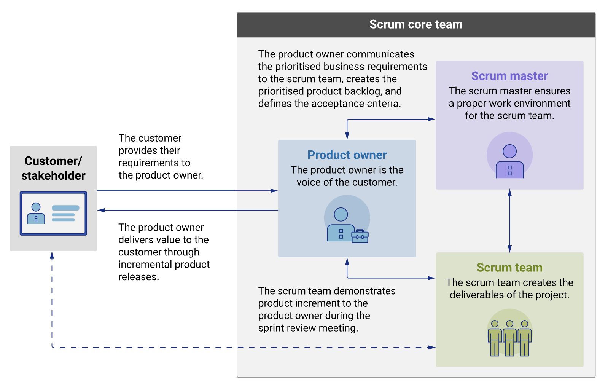
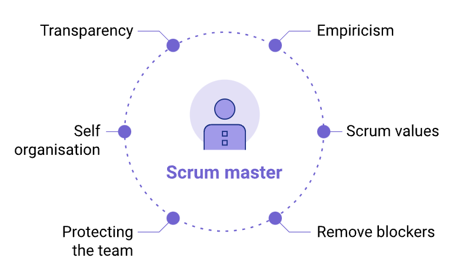
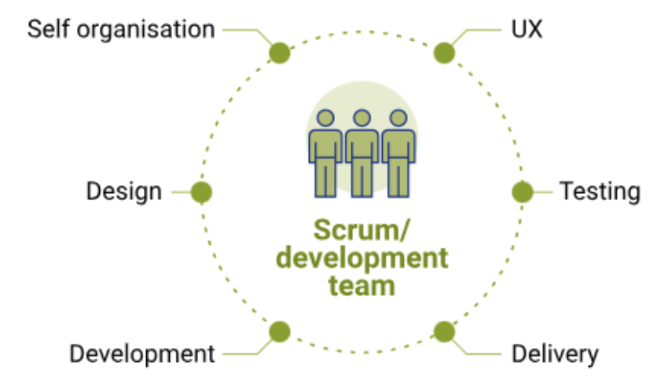

### 1. Three main roles

Within an Agile Scrum software development team, there are three main roles.

### 2. The product owner: Setting clear direction

The product owner (PO) is undoubtedly the 'voice of the customer'. The PO owns the product end to end and is responsible for the overall product delivery. As explained by the Scrum Guide:  

> _The product owner is a scrum development role for a person who represents the business or user community and is responsible for working with the user group to determine what features will be in the product release._
> 
> — (West n.d.)

Product owners understand the customer and business requirements, and create and manage the product backlog based on those requirements. Since Agile teams are, by design, flexible and responsive, it is the responsibility of the PO to ensure that they are delivering the most value. The business is represented by the PO who tells the developers what is important to deliver. Trust between these two roles is crucial. 

The product owner should not only understand the customer but also have a vision for the value the scrum team is delivering to the customer. The PO also balances the needs of other stakeholders in the organisation. This means the PO must take all these inputs and prioritise the work. This is probably their most important responsibility because conflicting priorities and unclear directions will not only reduce the effectiveness of the team, but also could break the trust in the relationship between the business and the development team. 

Agile teams are designed to inspect and adapt. That means a change in priority may lead to a massive change to the team structure, work products, as well as the end result. Therefore, it is crucial for scrum teams to be successful and that only one person sets the priority. That person is the product owner. 

Let's take a look at how the Scrum Guide defines the product owners responsibilities:

**Managing the scrum backlog**

This does not mean that they are the only one putting in new product backlog items into the backlog. Ultimately though, POs are responsible for the backlog that the development team pulls to deliver from. That means the PO should know about everything that is in the backlog and other people that add items to the product backlog should ensure that they communicate with the PO. We even offer a free scrum template that makes it easy to get your backlog up and running.

**Release management**

The sprint is not a release cycle, but instead a planning cycle. That means that scrum teams can deliver at any time. Ideally, they would deliver frequently throughout the sprint allowing the sprint review to review real customer usage and feedback. However continuous delivery is not always possible and other release models are required. It is important for the PO to know when things can and should be released.

**Stakeholder management**

Any product will have many stakeholders involved ranging from users, customers, governance and organisational leadership. The PO will have to work with all these people to effectively ensure that the development team is delivering value. This can mean a large amount of stakeholder management and communication.

### 3. The scrum master: Holding it all together

The scrum master is the role responsible for gluing everything together and ensuring that a scrum is being done well. In practical terms, that means they help the PO define value, the development team deliver the value, and the scrum team to get better. The scrum master is a service leader which not only describes a supportive style of leadership but describes what they do on a day-to-day basis.

They serve the PO by helping them better understand and communicate value, manage the backlog, help plan the work within the team and break down that work to deliver the most effective learning. Serving the development team, the scrum master helps them self-organise, focus on outcomes, get to a 'done increment' and manage blockers. The scrum master also serves the organisation at large, helping them understand the scrums and create an environment that supports these methods.

> _Scrum myth: 'The scrum master has to run the daily scrum. In fact, the scrum master does not run any of the events; just ensures they happen and that they are successful'._

The scrum master focuses on:

**Transparency**
To effectively inspect and adapt it is important that the right people can see what is going on. But this is actually much harder than it looks. The scrum master is tasked with ensuring that the scrum team works in a transparent way. Examples include creating story maps and updating Confluence pages with retrospective ideas.

**Empiricism**
A fundamental for scrum and agile approaches the idea that the best way of planning is to do work and learn from it. The empirical process is not easy and requires the scrum master to coach the scrum team on breaking down work, describing clear outcomes, and reviewing those outcomes.

**Self-organisation**
Telling a development team they can self-organise does mean that the team will self-organise. In fact, self-organisation builds over time and requires help and support. The scrum master will encourage team members to step outside their comfort zone and try different things and use practices such as ‘delegation poker’ to expose and challenge predefined ideas about role boundaries and responsibilities.

**Values**
Scrum defines five values of courage, focus, commitment, respect, and openness as these values create an environment of physiological safety and trust. This environment is necessary for agility to thrive. Following the values is the responsibility of everyone in the scrum team, but the scrum master takes an active role in encouraging and reminding everyone of the importance of those values.

The scrum master serves the PO in sprint planning and sprint reviews, ensuring that value is clearly being described and direction set. They serve the development team in the daily scrum by ensuring that work is happening and that blockers are being removed. They also take responsibility for blockers that are outside of the team's ability to resolve. The scrum master ensures that every opportunity to improve is made transparent to the scrum team and the retrospective has a clear set of outcomes that can be executed.

### 4. The scrum/development team: Redefining 'developer'

The development team should be able to self-organise so they can make decisions to get work done. Think of a development team as similar to a production support team that is called in during the night because something has gone wrong. The development team, like the production support team, can make decisions and deliver the fix/value for the problem at hand. Self-organisation isn’t about disrespecting the organisation, but rather about empowering the people closest to the work to do what’s needed to solve the problem. 

The development team’s responsibilities include: 

- Delivering the work through the sprint. 
- To ensure transparency during the sprint, they meet daily at the daily scrum (sometimes called a standup). The daily scrum provides transparency to the work and provides a dedicated place for team members to seek help, talk about success and highlight issues and blockers. The scrum master might facilitate the daily scrum, but ultimately it is the responsibility of the development team to run this meeting. This meeting helps them, as a group, to inspect and adapt the work they are doing and work in a more effective way.