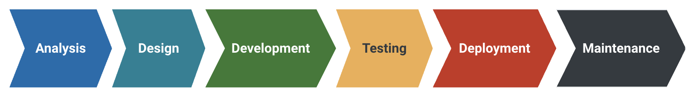

---
aliases:
  - SLDC
---
### 1. What is the Software Development Life Cycle?

The Software Development Life Cycle (SDLC) is a systematic process that outlines the different stages of software development, from conception to maintenance. 

It provides a well-defined structure that guides software engineers through the various phases of creating software, ensuring that the end product is efficient, reliable, and meets user requirements. 

Embracing SDLC is essential for both beginners and advanced developers, as it helps in managing complex projects and minimising risks.

### 2. The Six Phases of the SDLC

The SDLC consists of several phases, each with its unique set of tasks and objectives. **Select** each phase to explore their significance: 

### Analysis

This phase involves gathering and analysing user requirements to create a clear understanding of the software's objectives. Software engineers work closely with stakeholders to define the scope, features, and functionality of the software. 

**Personnel**:

- Product owner
- Project manager
- Business analyst
- CTO.

### Design

In the design phase, software engineers create a blueprint for the software that outlines its architecture, components, and data flow. This stage involves designing the user interface, selecting appropriate algorithms, and defining the system's overall structure. 

**Personnel**:

- System architect
- UX/UI designer.

### Development

During the development phase, developers write the code for the software using programming languages and frameworks. The design specifications from the previous phase serve as a guide to ensure the code is efficient, modular, and maintainable. 

**Personnel**: 

- Front-end developer
- Back-end developer.

### Testing

In the testing phase, the software is rigorously tested to identify and fix any bugs or issues. This ensures that the software meets the defined requirements and provides a seamless user experience. Various testing techniques, such as unit testing, integration testing, and system testing, are employed.

**Personnel**:

- Solutions architect
- QA engineer
- Tester
- DevOps.
### Deployment

Once the software has been thoroughly tested and deemed ready for release, it is deployed to the end-users. This can involve distributing the software through app stores, websites, or other distribution channels. 

**Personnel**:

- Data administrator
- DevOps.
### Maintenance

The maintenance phase involves continuously monitoring, updating, and improving the software. This includes fixing bugs, adding new features, and making any necessary changes to ensure the software remains relevant and functional.

**Personnel**:

- Users
- Testers
- Support managers

### 3. Benefits of the SDLC

Implementing the SDLC in your software development process offers numerous benefits, including: 

- **Higher quality software**: The structured approach of the SDLC helps ensure that the software meets user requirements and is reliable, efficient, and secure. 
- **Better collaboration**: The SDLC provides a common framework for developers, designers, and other stakeholders to work together effectively. 
- **Improved project management**: By breaking down the development process into manageable phases, the SDLC makes it easier to plan, track, and control the progress of a project. 
- **Reduced risks**: The SDLC helps identify and address potential issues and risks early in the development process, minimising their impact on the project. 

As you progress through the learning modules, you'll continue to learn more about the various aspects of software engineering, including different software development methodologies and best practices.