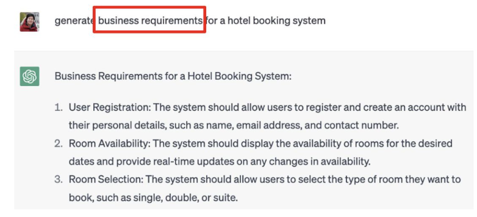
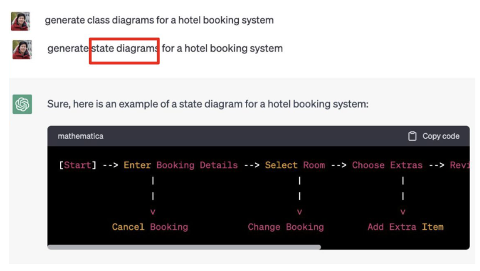
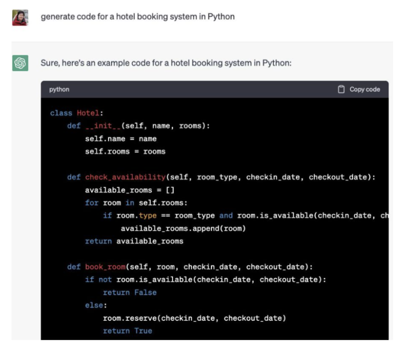
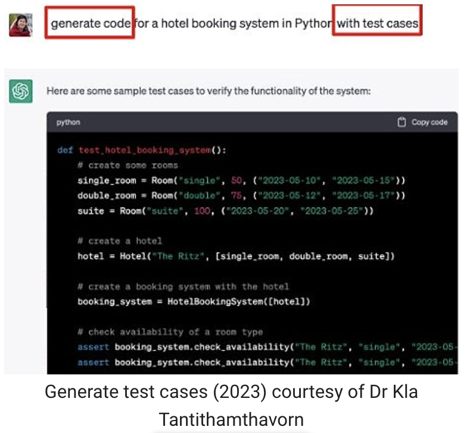

### 1. What is Generative AI?

**Generative AI** is a type of artificial intelligence that is capable of creating original and unique content, such as images, videos, music, or text. It works by learning patterns and styles from existing data and generating new content. In the context of software engineering, generative AI can be applied to various tasks such as code generation, automated bug detection, and optimisation. For example, a generative AI model trained on a large codebase could be capable of autonomously generating code snippets or even entire programs based on a given input or specification. An example of Generative AI for software engineering includes GitHub’s CoPilot, Amazon CodeWhisperer, and ChatGPT.

### 2. How ChatGPT can assist with software engineering

**ChatGPT** (an application of Generative AI) has rapidly gained popularity due to its remarkable ability in language understanding and human-like responses. ChatGPT, based on GPT-3.5 architecture, has shown great promise for revolutionising various research fields, including code generation, testing, bug fixing, improving efficiency, enhancing creativity, and reducing costs. ChatGPT can assist with a variety of software engineering tasks, providing support, guidance, and information across different stages of the development process.

In the following pages, you will delve deeper into some of the tasks introduced in the slide deck, in particular how it can help with the following software development tasks: 

1. Requirement gathering.
2. Software design.
3. Code generation.
4. Test case generation.

### 2. How ChatGPT can assist with software engineering

#### 2.1. Requirement gathering

Requirement gathering is a crucial phase in the software development process where the needs and expectations of stakeholders are identified and documented. The goal is to gather comprehensive and clear specifications for a software system or application. This process involves interacting with various stakeholders, such as clients, end-users, and subject matter experts, to understand their goals, expectations, constraints, and preferences.

ChatGPT can be a valuable tool in the requirement gathering process in several ways:

- **Interviews and surveys**: ChatGPT can assist in conducting virtual interviews or surveys to collect information from stakeholders. It can engage in conversation, ask relevant questions, and gather detailed responses to understand the requirements.
- **Clarifying ambiguities**: Stakeholders might not always provide clear and unambiguous requirements. ChatGPT can help by asking follow-up questions to clarify ambiguous statements and ensure that the gathered information is precise.
- **Documentation assistance**: After gathering requirements, documentation is essential. ChatGPT can aid in drafting and organising the gathered information into a coherent and structured document, ensuring that key points are captured and presented effectively.
- **Brainstorming sessions**: ChatGPT can participate in brainstorming sessions to explore different ideas and potential features. It can generate suggestions based on the input it receives, helping stakeholders consider various options and possibilities.
- **Quick prototyping**: In some cases, ChatGPT can be used to quickly prototype or simulate a user interface or system behaviour. This can provide stakeholders with a more tangible understanding of the requirements and how the system might function.
- **Knowledge repository**: ChatGPT has access to a vast amount of general information, which can be beneficial for understanding industry best practices, standards, and regulations relevant to the project. It can provide context and information that aids in aligning requirements with industry standards.
- **Refining user stories**: If you have a set of user stories but need help refining or improving them, ChatGPT can provide suggestions and enhancements.

##### Warning

While ChatGPT can be a useful tool in the requirement gathering process, it's important to note that it should complement human interactions rather than replace them entirely. Effective communication with stakeholders, understanding the context, and interpreting non-verbal cues are aspects where human involvement remains crucial. Additionally, it's essential to validate and verify the gathered requirements through ongoing collaboration and feedback loops with stakeholders.

### 2. How ChatGPT can assist with software engineering

#### 2.2. Software design

Software design is the process of defining the architecture, components, modules, interfaces, and data for a software system to satisfy specified requirements. It is a crucial step in software development that involves creating a blueprint or plan for the construction of a software application. Object-oriented programming (OOP) is a popular paradigm in software design that structures code around objects, which are instances of classes. A class is a blueprint for creating objects, defining their attributes (data members) and behaviours (methods). Class diagrams are a visual representation of the classes in a system, their relationships, and the interactions among them. These diagrams are part of the Unified Modeling Language (UML), which is widely used in software design to communicate and document the structure of a system.

ChatGPT can assist with various aspects of software design, including OOP and class diagrams, in the following ways:

- **Conceptual understanding**: ChatGPT can provide explanations and examples to help you understand OOP principles, such as encapsulation, inheritance, and polymorphism. It can clarify the purpose of class diagrams and how they represent the structure of a software system.
- **Problem-solving**: If you're facing challenges in designing software or creating class diagrams, you can describe your problem, and ChatGPT can provide guidance on possible solutions or alternative approaches.
- **Best practices**: ChatGPT can share best practices in software design, OOP, and class diagram creation to help you create more maintainable and scalable software.

### 2. How ChatGPT can assist with software engineering

#### 2.3. Code generation

Code generation refers to the process of automatically producing source code or executable code based on a set of predefined rules, templates, or specifications. It can be applied in various contexts, such as software development, where code is generated to perform specific tasks, or in the context of compilers, where high-level code is translated into machine code.

ChatGPT, being a language model, can assist in code generation in several ways:

- **Code completion**: ChatGPT can help developers by suggesting code completions as they write, saving time and reducing the likelihood of syntax errors.
- **Code refactoring**: Developers can ask ChatGPT for suggestions on how to improve or refactor their code to make it more efficient, readable, or maintainable.
- **Code examples**: ChatGPT can provide code snippets or examples based on a given problem statement or description, helping developers understand how to implement specific functionalities

### 2. How ChatGPT can assist with software engineering

#### 2.4. Test case generation

Test case generation is a process in software testing where test cases are designed and created to evaluate the functionality of a software application. The goal is to ensure that the software behaves as expected and meets the specified requirements. Test cases are typically derived from test scenarios, which represent a set of conditions or actions that need to be tested. 

For test case generation, you can provide ChatGPT with specific scenarios or requirements, and it can help generate test cases by exploring various inputs, conditions, and expected outcomes. It can simulate different user interactions and responses, helping you identify potential test cases. 

The image is an example of test case generation by ChatGPT.