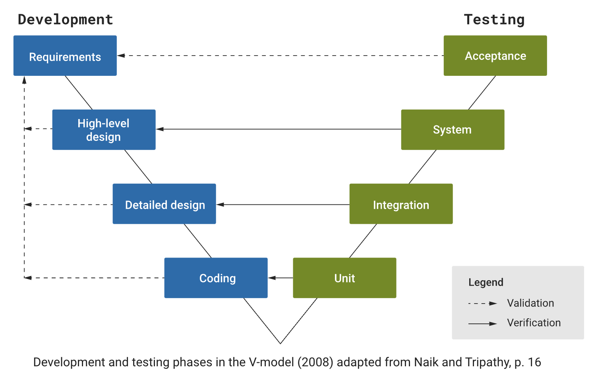
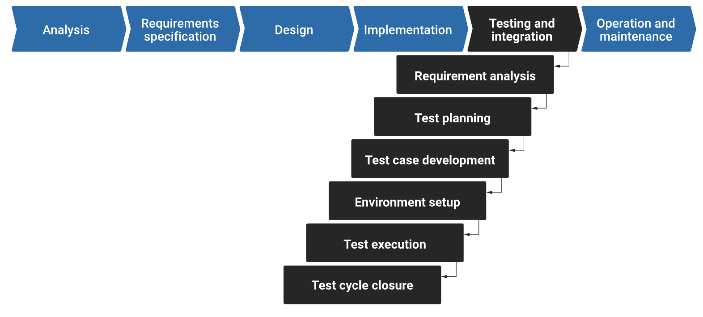
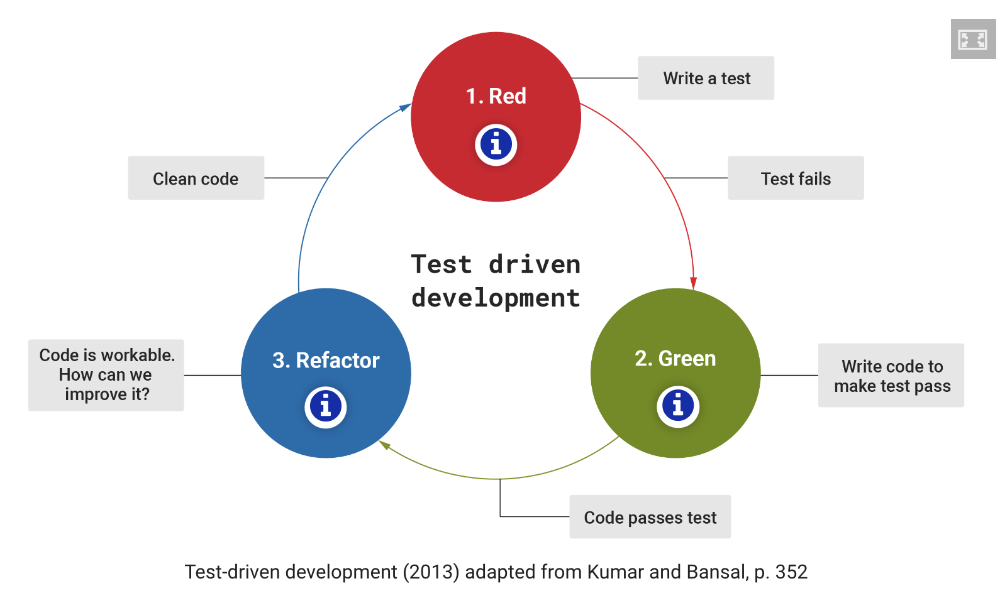

In this topic book, you will cover the following:

- Software verification and validation (aka the V-model)
- Waterfall-style software quality assurance
- Test-driven development.

### 1. Software verification and validation (aka the V-model)

Software quality assurance (SQA) approaches are strategies and methodologies used to ensure that software products meet the specified quality standards and requirements throughout the software development life cycle. Software verification is used to ensure that the product is being built correctly, while software validation is used to ensure the right product is being built. See the following table to compare the difference between the two.

|Software verification  Are we building the product right?|Software validation  Are we building the right product?|
|---|---|
|The process of evaluating a system or component during or at the end of the development process to determine whether it satisfies the specified requirements. The primary goal of verification is to ensure that the software is being built correctly and that each phase of the development process adheres to the predefined specifications. Software verification involves activities such as reviews, inspections and testing to check that the software has been designed and implemented correctly.|The process of evaluating a system or component during or at the end of the development process to determine whether it satisfies the specified requirements. The goal of software validation is to ensure that the software meets its intended purpose and functions correctly in its intended environment. It involves activities such as system testing, user acceptance testing and performance testing to ensure that the software behaves as intended in the real-world environment.|

Software verification and software validation has been illustrated in the form of what is called the V-model in the following diagram.

### 2. Waterfall-style software quality assurance

The Waterfall model is a traditional software development and testing life cycle model that follows a linear and sequential approach. In the context of software testing, the software Waterfall testing life cycle involves the following phases which are also shown in the accompanying diagram.

1. Requirement analysis
2. Test planning
3. Test case development
4. Environment setup
5. Test execution
6. Test cycle closure

#### Key characteristics

Key characteristics of the waterfall model are:

- **Sequential flow**: Each phase must be completed before the next one begins.
- **Document-driven**: Emphasis is placed on extensive documentation at each phase.
- **Rigid and linear**: Changes are difficult to accommodate once a phase is completed.
- **Well-suited for stable requirements**: Works best when the requirements are well-understood and unlikely to change.

### 3. Test-driven development

Test-driven development (TDD) is a software development methodology that revolves around a simple iterative process: write a test, write the minimum amount of code to make that test pass, refactor the code, and repeat. The cycle is often referred to as the 'Red-Green-Refactor' cycle.

Red

Write a test that defines a function or improvements of a function, which should fail initially because the function or feature isn't implemented yet. The 'Red' phase indicates that the test is failing.

Green

Write the minimum amount of code necessary to make the test pass. The goal is not to write perfect or complete code at this point but to make the test pass.

Refactor

Clean up the code while keeping it functional. Refactoring involves improving the structure of the code without changing its behaviour. After refactoring, the tests are run again to ensure that the code still works as expected.

#### Benefits of TDD

TDD has several benefits:

- **Early bug detection**: Since tests are written before the code, any bugs are identified early in the development process.
- **Improved code quality**: TDD encourages modular and loosely coupled code, making it easier to maintain and extend.
- **Documentation**: Tests serve as documentation for the code, providing examples of how it should be used and what behaviour is expected.
- **Confidence in code changes**: Developers can make changes to the code with confidence, knowing that if they break something, the tests will catch it.

However, TDD is not a silver bullet and may not be suitable for all projects or developers. It requires a mindset shift and discipline to follow the process rigorously. Additionally, it may not be the best fit for exploratory or highly creative phases of development where requirements are not well defined.