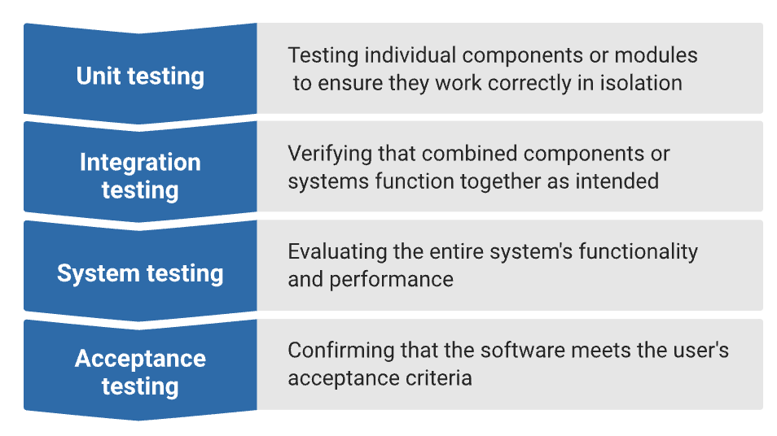
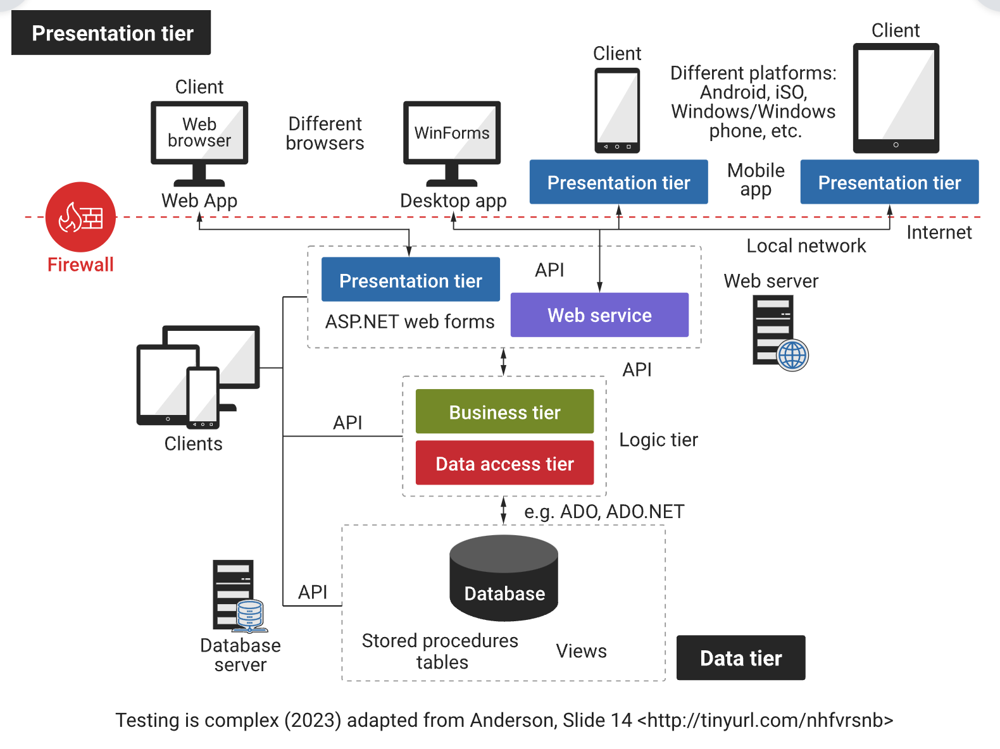

### 1. What is software testing?

Software testing is a process of evaluating and verifying that a computer program or system functions as intended. The goal of software testing is to identify errors, bugs or defects in the software and ensure that it meets the specified requirements. Testing is an essential part of the software development life cycle and helps in delivering high-quality software.

#### Key objectives

Key objectives of software testing include:

- **Verification**: Ensuring that the software meets the specified requirements and design.
- **Validation**: Confirming that the software meets the customer's expectations and needs.
- **Reliability**: Assessing the stability and reliability of the software under different conditions.
- **Error detection**: Identifying and fixing errors, bugs or defects in the software.
- **Quality assurance**: Ensuring that the software development and testing processes adhere to established standards and best practices.

#### Various levels of testing

Software testing can be performed at various levels of the development process, including:

### 2. Large-scale complex software system

In a real-world large-scale complex software system, testing is hard and complex, as seen in the following diagram. A systematic approach is needed.

Some reasons why software testing is a challenging and difficult task, and why a systematic approach is needed include:

- Software is complex!
- Requirements are subject to change.
- Small changes can have huge repercussions.
- Time and resources are limited, including expert human resources.
- Lack of access to real-world environments.
- Difficulty in reproducing errors.
- Some quality requirements are difficult to specify in an unambiguous way.

[Return to Module 4](https://learning.monash.edu/course/view.php?id=19936&section=9)

[Previous](https://learning.monash.edu/mod/book/view.php?id=2735834&chapterid=458536)

