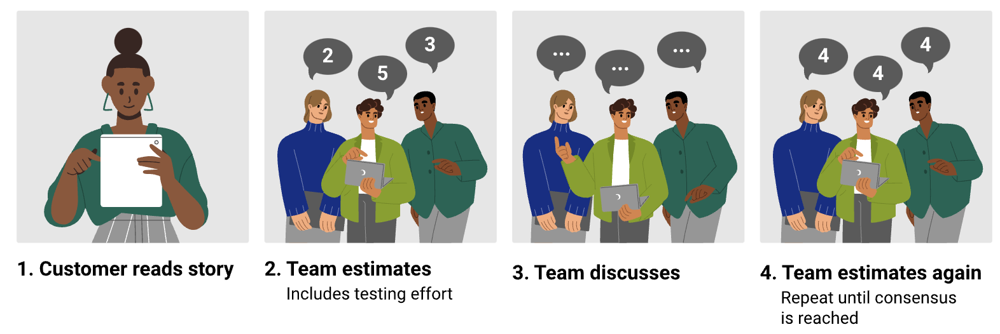
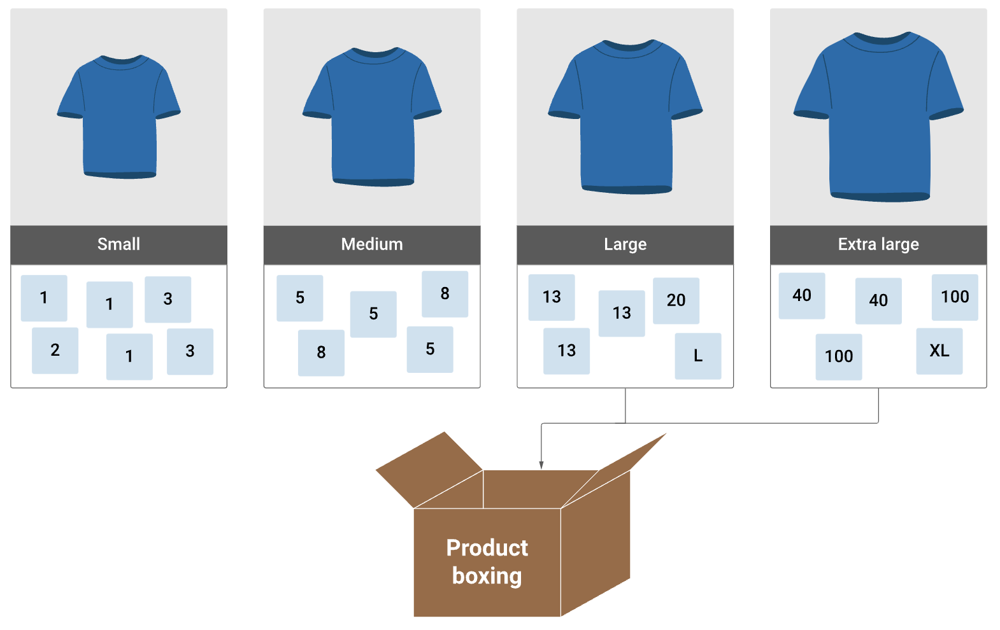
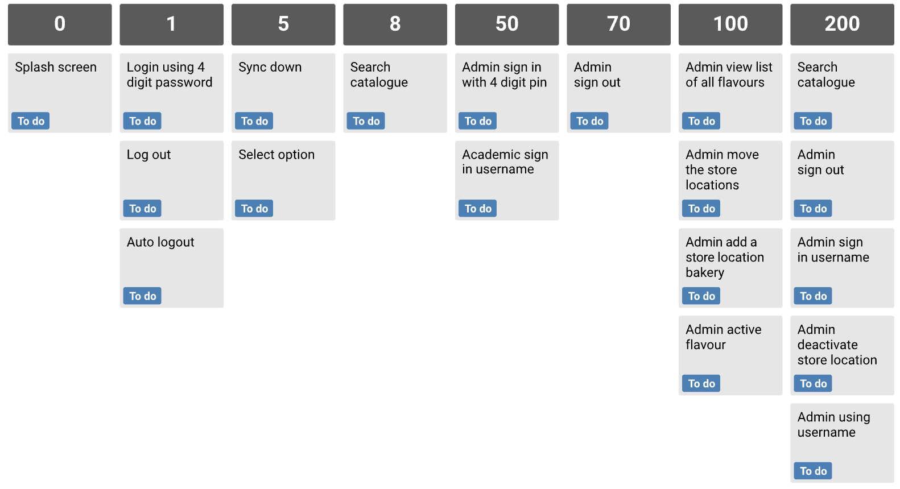

### 1. Story point estimation

Story point estimation is a technique used in Agile development to estimate the relative effort or complexity of user stories. Story points are a unitless measure used to reflect the effort and complexity of a user story. Story point estimation is a way to assign a numerical value to the amount of work involved in completing a particular task.

Following are the three most popular story point estimation techniques.

#### Planning poker

This technique uses the Fibonacci sequence where user story point values are presented as 0, 1, 2, 3, 5, 8, 13, 21, 34, 55, 89, etc on playing cards, associated with different levels of complexity. The product owner or scrum master describes the user story, and each team member will secretly select a card number for the estimate. Then, everyone reveals their cards. The number that gets the most votes will be the final estimation for the task. Planning poker helps development teams establish a mutual understanding of the project and is particularly useful for estimating a small number of work items.

#### T-shirt size estimation

This technique involves assigning each user story a T-shirt size (e.g. S, M, L.) The process helps team members achieve a big-picture understanding of the requirements.

The technique produces a quick and rough estimate for the time and work required and is particularly useful for managing a large backlog. It’s also useful for early-stage estimation to get a bird’s-eye view quickly.

#### Bucket system

Start the estimation process by setting up a row of cards (i.e. buckets) with values in the Fibonacci sequence (i.e. 0, 1, 2, 3, 4, 5, 8, 13, 21, 34, 55). Then, team members will discuss a work item and place the user story in an appropriate bucket.

This agile-estimation technique is suitable for estimating a large number of items or long-term projects. Development teams can make quick estimations, while the method is easy for those new to agile.