---
aliases:
  - Signal protocol
  - KDF Chain
---
[[The X3DH Key Agreement Protocol]]

Alice and Bob use X3DH to each set up a sending chain and a receiving chain

KDF Chain
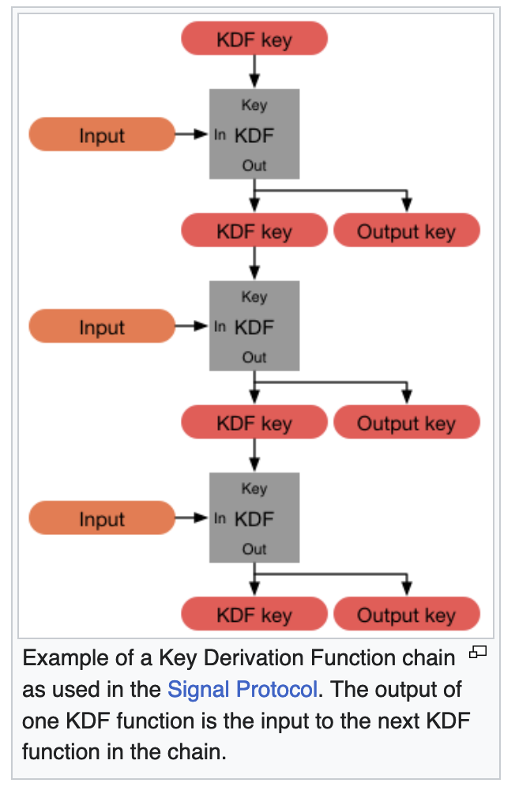 (diagram is found on page 4)

Uses the [[HMAC-based Extract-and-Expand Key Derivation Function (HKDF)|HKDF]] algorithm

# Paper
## 1. Introduction 
The Double Ratchet algorithm is used by two parties to exchange encrypted messages based on a shared secret key. Typically ==the parties will use some key agreement protocol (such as [[The X3DH Key Agreement Protocol|X3DH]] [1]) to agree on the shared secret key==. Following this, the parties will use the Double Ratchet to send and receive encrypted messages. The parties derive new keys for every Double Ratchet message so that [[Forward secrecy|earlier keys cannot be calculated from later ones]]. The parties also send ==Diffie-Hellman public values== attached to their messages. The results of Diffie-Hellman calculations are mixed into the derived keys so that [[Post-compromise security|later keys cannot be calculated from earlier ones]]. These properties gives some protection to earlier or later encrypted messages in case of a compromise of a party’s keys. The Double Ratchet and its header encryption variant are presented below, and their security properties are discussed. 
## 2. Overview 
### 2.1. KDF chains 
A KDF chain is a core concept in the Double Ratchet algorithm. We define a KDF as a cryptographic function that takes a secret and random KDF key and some input data and returns output data. The output data is indistinguishable from random provided the key isn’t known (i.e. a KDF satisfies the requirements of a cryptographic “[[Pseudorandom Generator|PRF]]”). If the key is not secret and random, the KDF should still provide a secure cryptographic hash of its key and input data. The HMAC and [[HMAC-based Extract-and-Expand Key Derivation Function (HKDF)|HKDF]] constructions, when instantiated with a secure hash algorithm, meet the KDF definition [2], [3]. We use the term KDF chain when ==some of the output from a KDF is used as an output key and some is used to replace the KDF key==, which can then be used with another input. The below diagram represents a KDF chain processing three inputs and producing three output keys:
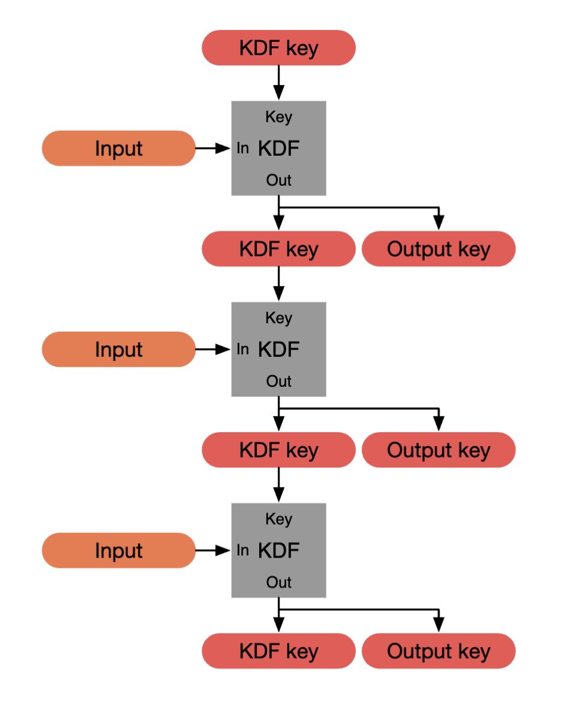
A KDF chain has the following properties (using terminology adapted from [4]): 
- Resilience: The output keys appear random to an adversary without knowledge of the KDF keys. This is true even if the adversary can control the KDF inputs. 
- [[Forward secrecy|Forward security]]: Output keys from the past appear random to an adversary who learns the KDF key at some point in time. 
- [[Post-compromise security|Break-in recovery]]: Future output keys appear random to an adversary who learns the KDF key at some point in time, provided that future inputs have added sufficient entropy. 
==In a Double Ratchet session between Alice and Bob each party stores a KDF key for three chains: a root chain, a sending chain, and a receiving chain (Alice’s sending chain matches Bob’s receiving chain, and vice versa).== 

As Alice and Bob exchange messages ==they also exchange new Diffie-Hellman public keys, and the Diffie-Hellman output secrets become the inputs to the root chain. The output keys from the root chain become new KDF keys for the sending and receiving chains. This is called the **Diffie-Hellman ratchet**.== 

The sending and receiving chains advance as each message is sent and received. Their output keys are used to encrypt and decrypt messages. This is called the **symmetric-key ratchet**.

The next sections explain the symmetric-key and Diffie-Hellman ratchets in more detail, then show how they are combined into the Double Ratchet. 

### 2.2. Symmetric-key ratchet 
Every message sent or received is encrypted with a unique message key. The message keys are output keys from the sending and receiving KDF chains. The KDF keys for these chains will be called **chain keys**. 

The KDF inputs for the sending and receiving chains are ==constant==, so these chains don’t provide break-in recovery. ==The sending and receiving chains just ensure that each message is encrypted with a unique key that can be deleted after encryption or decryption.== Calculating the next chain key and message key from a given chain key is a single ratchet step in the symmetric-key ratchet. The below diagram shows two steps:
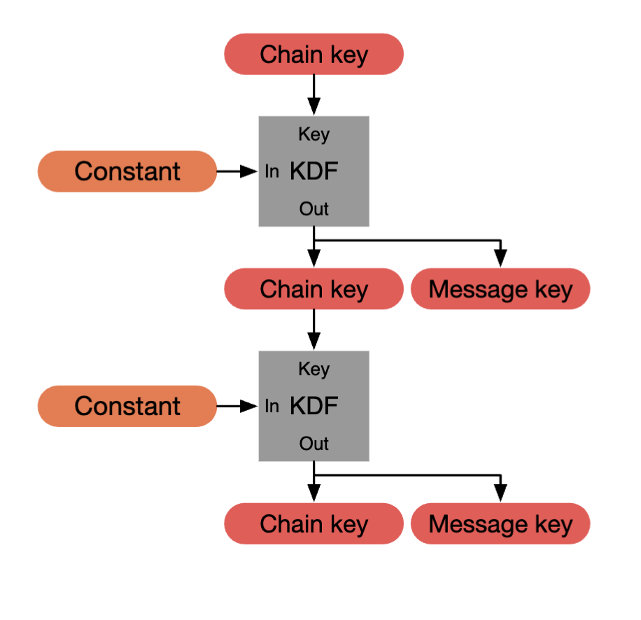
Because message keys aren’t used to derive any other keys, message keys may be stored without affecting the security of other message keys. This is useful for handling lost or out-of-order messages (see Section 2.6). 

### 2.3. Diffie-Hellman ratchet 
If an attacker steals one party’s sending and receiving chain keys, the attacker can compute all future message keys and decrypt all future messages. To prevent this, the Double Ratchet combines the symmetric-key ratchet with a DH ratchet which ==updates chain keys based on Diffie-Hellman outputs.== 

To implement the DH ratchet, each party generates a DH key pair (a [[Diffie-Hellman key exchange|Diffie-Hellman]] public key and private key) which becomes their current ratchet key pair. ==Every message from either party begins with a header which contains the sender’s current ratchet public key==. When a new ratchet public key is received from the remote party, a DH ratchet step is performed which replaces the local party’s current ratchet key pair with a new key pair. 

This results in a “ping-pong” behavior as the parties take turns replacing ratchet key pairs. An eavesdropper who briefly compromises one of the parties might learn the value of a current ratchet private key, but that private key will eventually be replaced with an uncompromised one. At that point, the Diffie-Hellman calculation between ratchet key pairs will define a DH output unknown to the attacker.

The following diagrams show how the DH ratchet derives a shared sequence of DH outputs. 

==Alice is initialized with Bob’s ratchet public key==. Alice’s ratchet public key isn’t yet known to Bob. As part of initialization Alice performs a DH calculation between her ratchet private key and Bob’s ratchet public key:

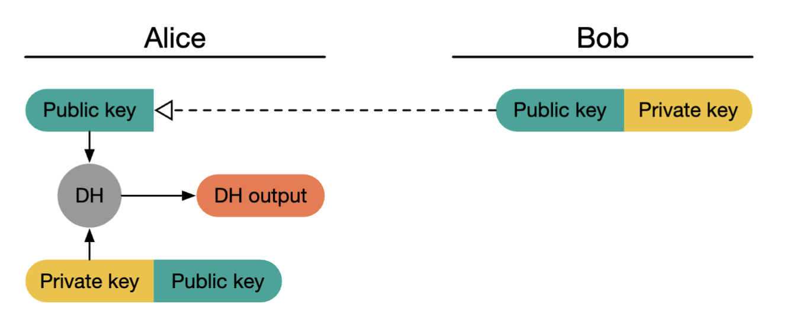

> Meri: *the 'DH output' is a shared secret*

Alice’s initial messages advertise her ratchet public key. Once Bob receives one of these messages, Bob performs ==a DH ratchet step: He calculates the DH output between Alice’s ratchet public key and his ratchet private key, which equals Alice’s initial DH output. Bob then replaces his ratchet key pair and calculates a new DH output:== 

> *Meri: does the new key pair depend on some particular 'public parameters'? / does it matter how the new key pair is generated?*

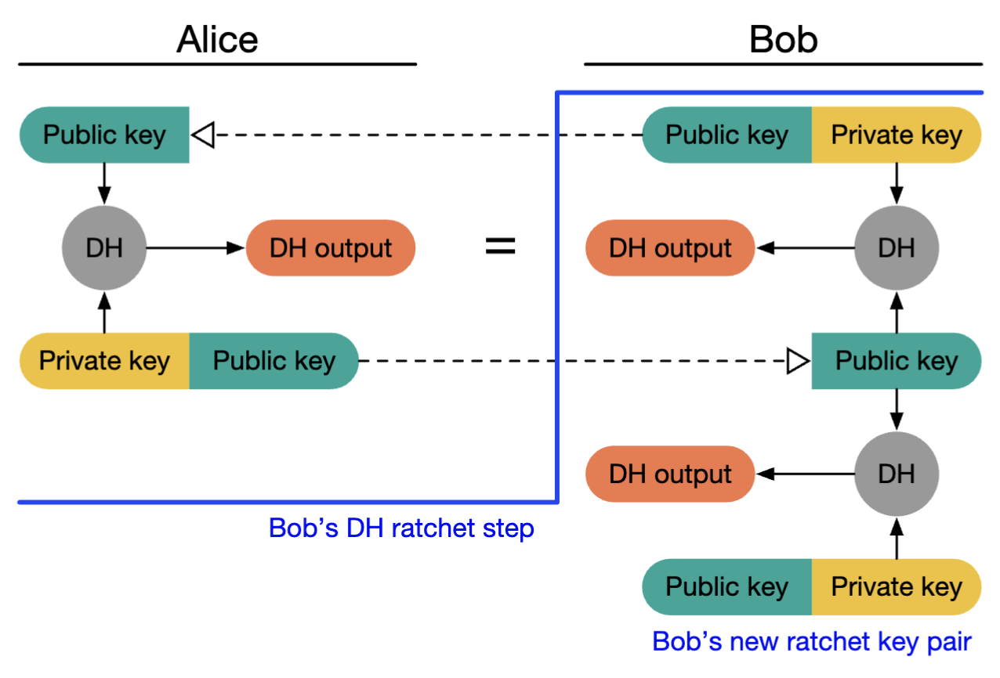
Messages sent by Bob advertise his new public key. Eventually, Alice will receive one of Bob’s messages and perform a DH ratchet step, replacing her ratchet key pair and deriving two DH outputs, one that matches Bob’s latest and a new one:

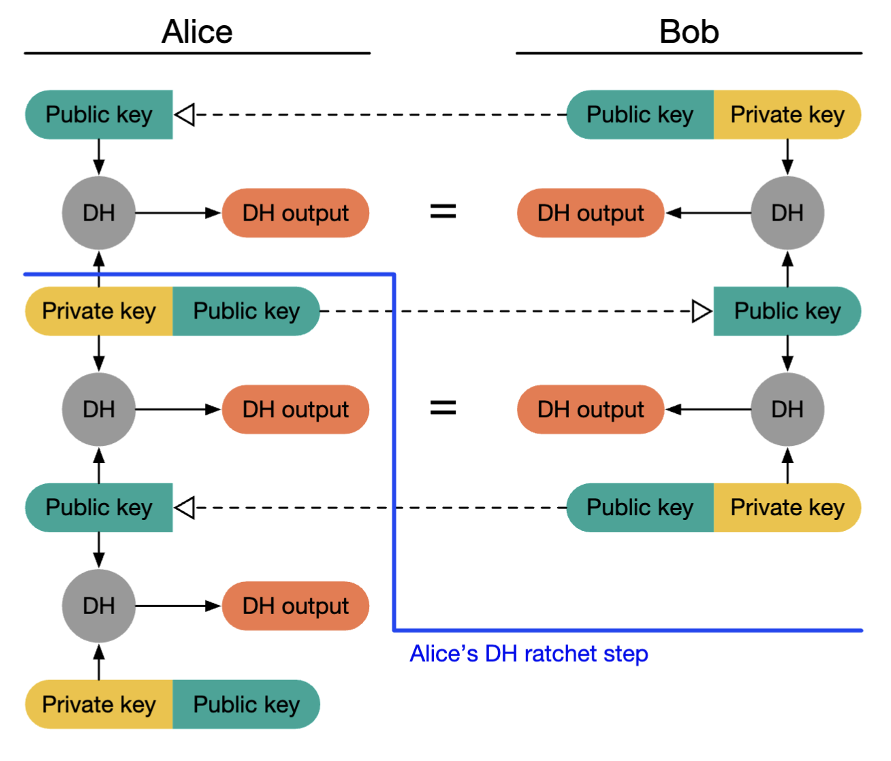
Messages sent by Alice advertise her new public key. Eventually, Bob will receive one of these messages and perform a second DH ratchet step, and so on:
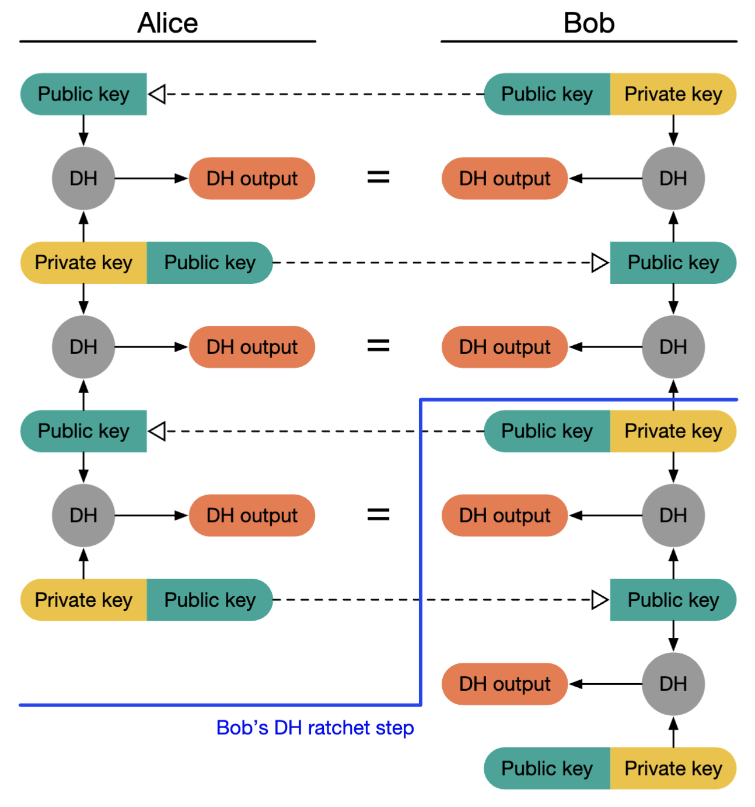

==The DH outputs generated during each DH ratchet step are used to derive new sending and receiving chain keys.== The below diagram revisits Bob’s first ratchet step. ==Bob uses his first DH output to derive a receiving chain that matches Alice’s sending chain. Bob uses the second DH output to derive a new sending chain:==
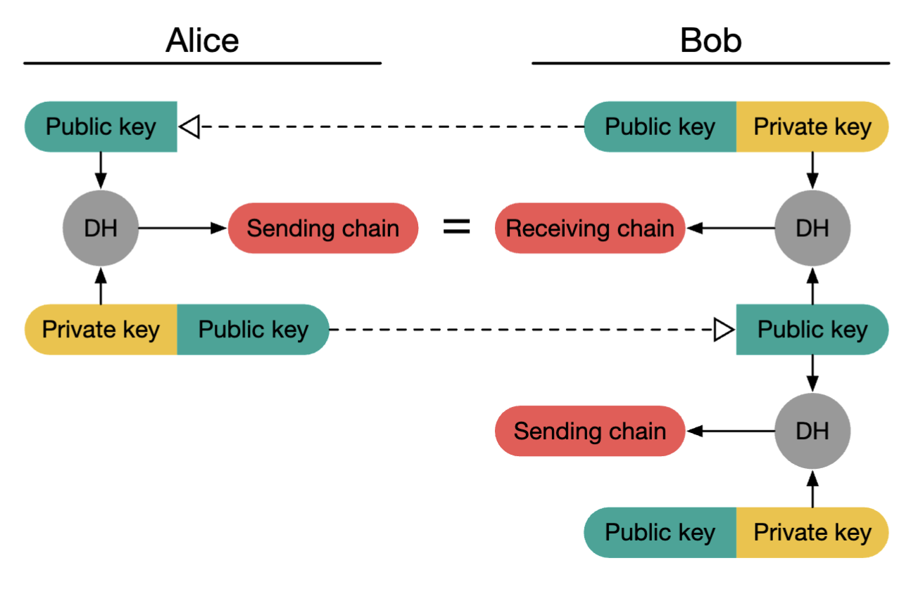
As the parties take turns performing DH ratchet steps, they take turns introducing new sending chains:

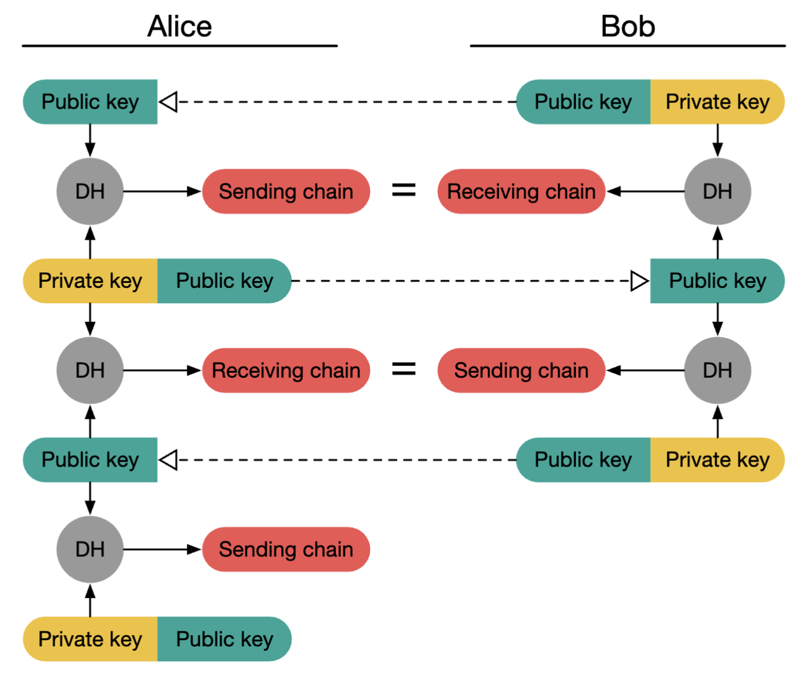

However, the above picture is a simplification. Instead of taking the chain keys directly from DH outputs, ==the DH outputs are used as KDF inputs to a root chain, and the KDF outputs from the root chain are used as sending and receiving chain keys. Using a KDF chain here improves resilience and break-in recovery.== 

So a full DH ratchet step consists of updating the root KDF chain twice, and using the KDF output keys as new receiving and sending chain keys:

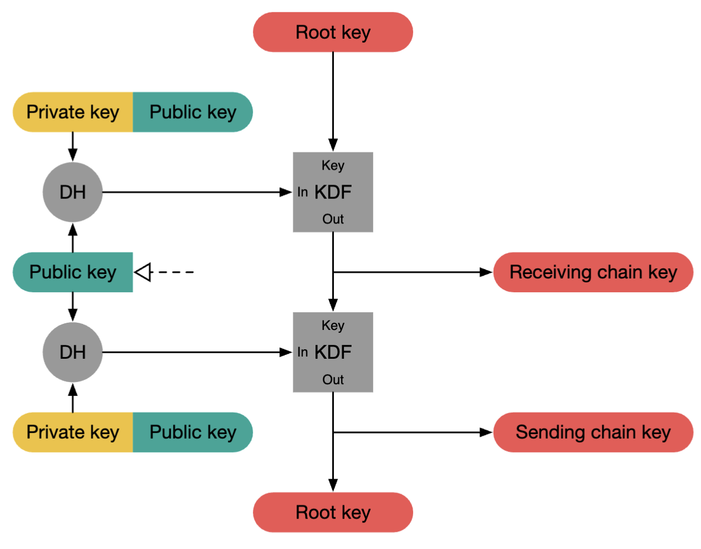

> *Meri note: so my understanding is that if you ignore the KDF chain it looks a bit like a more traditional public key encryption idea where you use somebody's public key to encrypt messages you want to send to them. The public key you received from someone is like an instruction of how they will be able to receive messages from you. They just need to combine the corresponding private key with your current public key and pass that into the KDF chain to get the receiving chain key. Then the next time they want to send messages they are using your updated public key they just received.*
> 
> *The DH ratchet is what provides [[Post-compromise security]]. Your DH ratchet only advances when you receive a new public key from the other person - so ==PCS happens on the turn taking, not on each message==*

### 2.4. Double Ratchet 
Combining the symmetric-key and DH ratchets gives the Double Ratchet: 
- When a message is sent or received, a symmetric-key ratchet step is applied to the sending or receiving chain to derive the message key. 
- When a new ratchet public key is received, a DH ratchet step is performed prior to the symmetric-key ratchet to replace the chain keys. 
In the below diagram ==Alice has been initialized with Bob’s ratchet public key and a [[The X3DH Key Agreement Protocol|shared secret]] which is the initial root key==. As part of initialization Alice generates a new ratchet key pair, and feeds the DH output to the root KDF to calculate a new root key (RK) and sending chain key (CK):

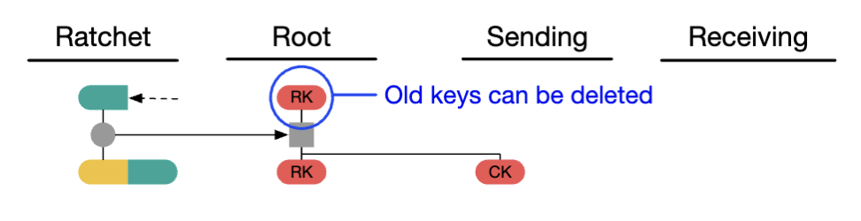
When Alice sends her first message A1, ==she applies a symmetric-key ratchet step to her sending chain key, resulting in a new message key== (message keys will be labelled with the message they encrypt or decrypt). The new chain key is stored, but the message key and old chain key can be deleted:

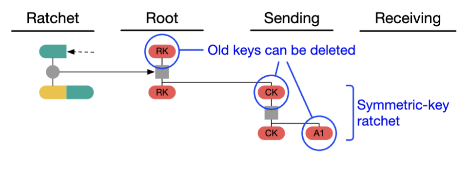
If Alice next receives a response B1 from Bob, ==it will contain a new ratchet public key (Bob’s public keys are labelled with the message when they were first received)==. Alice applies a ==DH ratchet step to derive new receiving and sending chain keys. Then she applies a symmetric-key ratchet step to the receiving chain to get the message key for the received message==:

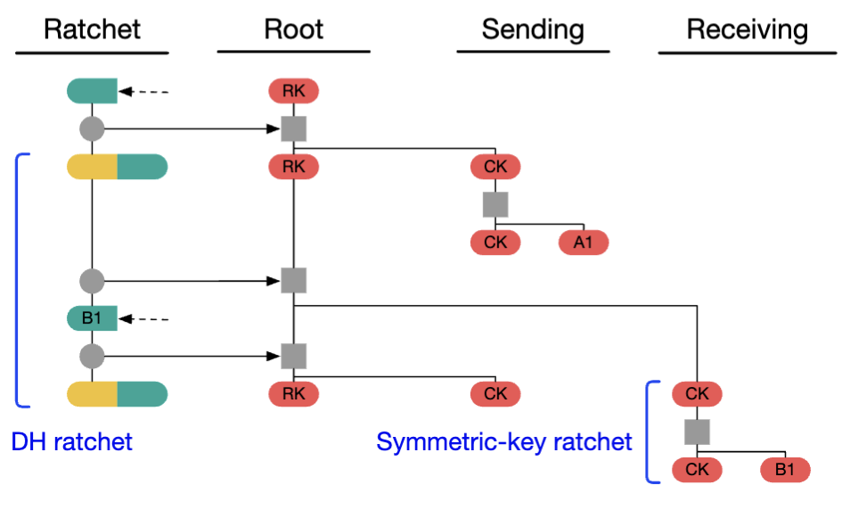
Suppose Alice next sends a message A2, receives a ==message B2 with Bob’s old ratchet public key==, then sends messages A3 and A4. ==Alice’s sending chain will ratchet three steps, and her receiving chain will ratchet once==:
> *Meri note: receiving B2 with Bob's old ratchet public key implies that perhaps he sent it before receiving A2*

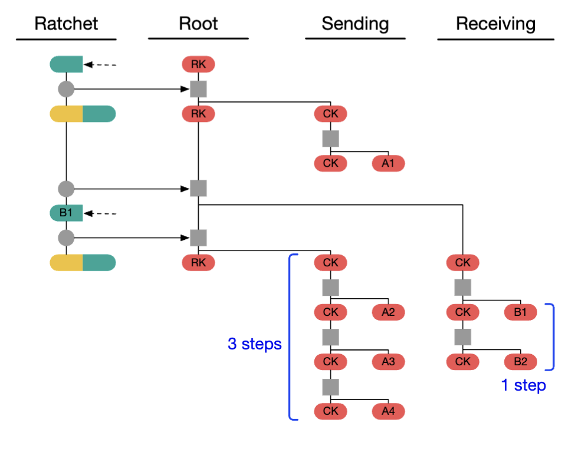

Suppose Alice then receives messages B3 and B4 with Bob’s next ratchet key, then sends a message A5. Alice’s final state will be as follows:
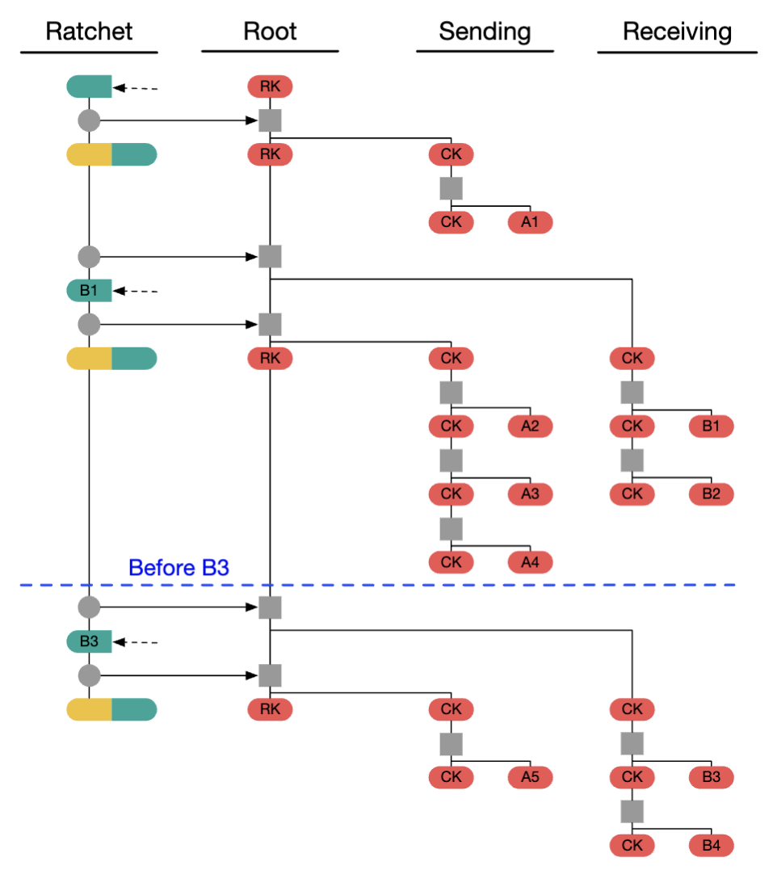

### 2.6. Out-of-order messages
The Double Ratchet handles lost or out-of-order messages by including in each message header the message’s number in the sending chain (N =0,1,2,. . . ) and the length (number of message keys) in the previous sending chain (PN ). This enables the recipient to advance to the relevant message key while storing skipped message keys in case the skipped messages arrive later. 

On receiving a message, if a DH ratchet step is triggered then the received PN minus the length of the current receiving chain is the number of skipped messages in that receiving chain. The received N is the number of skipped messages in the new receiving chain (i.e. the chain after the DH ratchet). 

If a DH ratchet step isn’t triggered, then the received N minus the length of the receiving chain is the number of skipped messages in that chain. 

For example, consider the message sequence from the previous section when messages B2 and B3 are skipped. Message B4 will trigger Alice’s DH ratchet step (instead of B3 ). Message B4 will have PN =2 and N =1. On receiving B4 Alice will have a receiving chain of length 1 (B1 ), so Alice will store message keys for B2 and B3 so they can be decrypted if they arrive later:

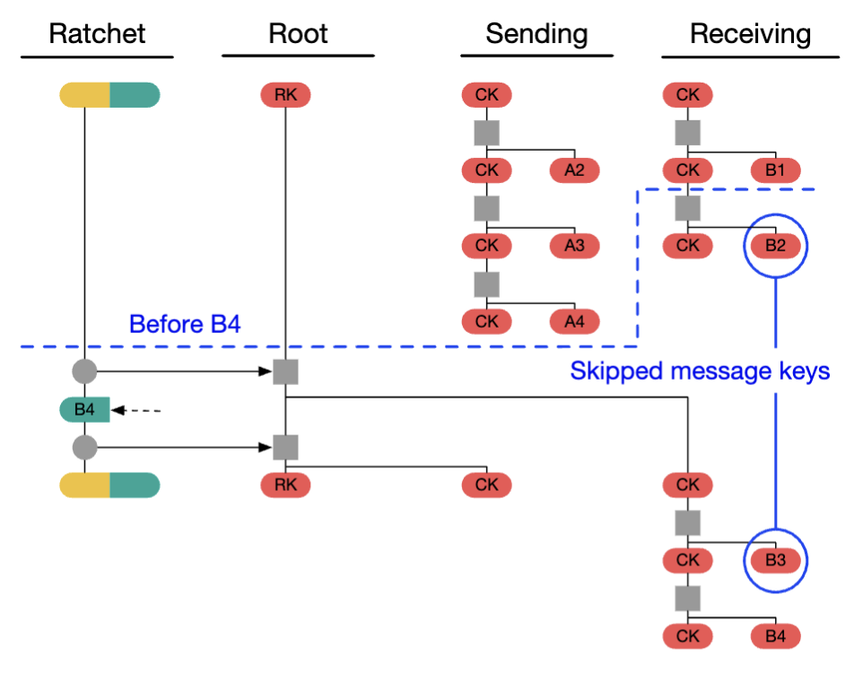
# PDF

See also [[The Double Ratchet - Security Notions, Proofs, and Modularization for the Signal Protocol]]
References:
1. [[The X3DH Key Agreement Protocol]]
...

20. [[A Formal Security Analysis of the Signal Messaging Protocol]]