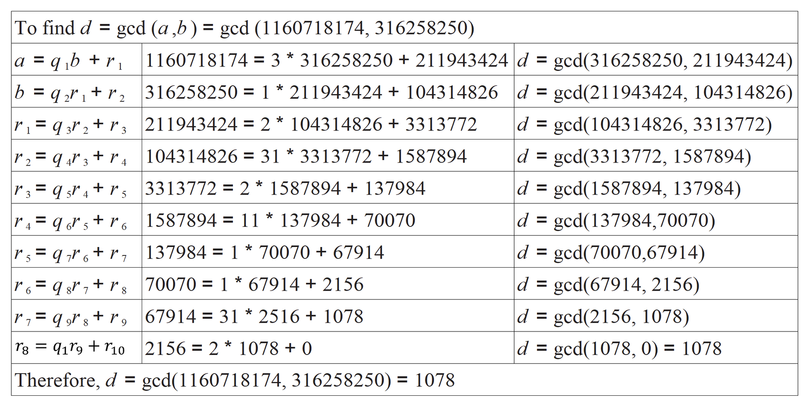

$$d=gcd(a,b)=gcd (1160718174, 316258250)$$

The Euclidean Algorithm is an algorithm that aims to find the Greatest Common Divisor (GCD) for two positive integers. The reason for the use and effectiveness of this algorithm is that when working with cryptography we often need large integers that are also prime. The primality aspect is extremely important as this is generally a requirement for most cryptographic algorithms. As such, by extension of this algorithm, we can further stipulate that two numbers are **relatively prime** if the only number that divides them is 1.

$$gcd⁡(a,b)=max⁡⌊k⌋ , \text{such that }k∣a \text{ and }k∣b$$

**Note:** It is important to note that when working with cryptography algorithms we always ensure to keep the GCD as a positive integer.

From the above equation and the division algorithm, we can further stipulate the following:

- gcd(a, 0) = a, where a is any non-zero integer.
    

## The Euclidean algorithm

In order to quickly calculate the GCD for two given integers _a_, and _b_, we can apply the Euclidean algorithm as shown below. It is important to note that when performing this algorithm we make some assumptions as follows:

- a > 0 and b > 0
    
- a ≥ b > 0, the order of this is not important but we start the division process with the largest integer.
    

When we apply the Euclidean algorithm, it is an iterative algorithm that repeats until the final residue or remainder is 1. The objective of the algorithm is to represent both integers as part of the division process, if possible. Below we outline the mathematical representation of this algorithm and follow it up using an example.

> [!Meri's note] Meri's note
> We divide the bigger integer by the smaller one, $a/b$. $q_1$ is the quotient of that division, and $r_1$ is the remainder of that division. Then you take the divisor, $b$, and divide that by the remainder $r_1$. This iterates, taking $r_1/r_2$ and so on, $r_{n-1}/r_n$ until $r_n = 0$.

For a given _a_ and _b_, we can obtain the GCD(a,b) = _d_ as follows:

$$a =q_1b +r_1   ∣   0<r_1<b$$

$$b=q_2r_1 + r_2   ∣   0<r_2<r_1$$

$$r_1=q_3r_2 +r_3   ∣  0<r_3<r_2$$

$$...$$

$$r_{n−2}=q_nr_{n−1} +r_n   ∣  0<r_n<r_{n−1}$$

$$r_{n−1}=q_{n+1}r_n +0$$

$$d=gcd⁡(a,b)=r_n$$

Understanding this algorithm, using the division algorithm, we represent both _a_ and _b_ as a representation of some factor q\*r and some remainder r. Each iteration reduces our calculation to obtain the GCD by representing the next calculation as a product of the some q times the previous remainder, producing a new remainder, which is then used in the calculations for the next iteration. This process keeps repeating until the final remainder becomes 0.

**Apply your learning**  
Let's apply this algorithm to the following example to get a better understanding of how the algorithm works.

**Note:** It can be helpful to work on this algorithm by yourself using smaller numbers to ensure that you understand how it works.

Testing myself:

gcd(4281, 987)
4281/987 = 4 r 333
a = 4281 = 4 \* 987 + 333
987/333 = 2 r 321
b = 987 =  2 \* 333 + 321
333/321 = 1 r 12
r1 = 333 = 1 \* 321 + 12
321/12 = 26 r 9
r2 = 321 = 26 \* 12 + 9
12/9 = 1 r 3
r3 = 12 = 1 \* 9 + 3
9 / 3 = 3 r 0
r4 = 9 = 3 \* 3 + 0
d = gcd(4281, 987) = 3

Next: [[Modulo arithmetic]]