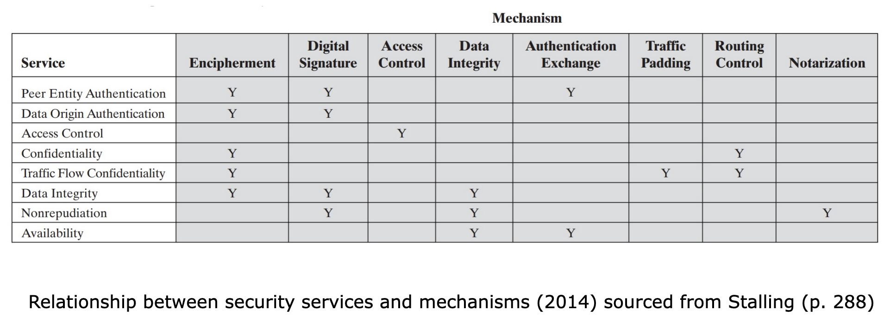

Securing a computing system from an attacker is not a simple task given the nature of computing systems and the number of ways an attacker can take towards compromising a system. Compounding this further is when we introduce a host of computing systems that reside within a single or multiple networks.

The scale of securing these devices can prove to be a mammoth task. As such, in order to ensure that no aspects are overlooked or missed out on when securing these systems, it is vital for organisations to have a plan that clearly outlines the various aspects that need to be addressed as part of a larger plan.

The Open System Interconnect (OSI) Security Architecture, recommendation X.800 (The international telegraph and telephone consultative committee Geneva, 1991), provides a systematic way towards securing computing systems within a corporate environment. This is an internationally recognised standard that has been adopted by industry with various vendors providing products that comply with these standards for security. The OSI security architecture outlines three main aspects that an administrator needs to focus on in order to secure a computing system. These include:

- **Security attack:** The OSI security architecture defines a security attack to be any action that compromises the security of information owned by an organisation. The possible types of security attacks include those we discussed in the previous lesson.  
    
- **Security mechanism:** The OSI security architecture defines a security mechanism to be a process (or a device incorporating such a process) that is designed to detect, prevent, or recover from a security attack.  
    
- **Security service:** The OSI security architecture defines a security service to be services that enhance the security of the data processing systems and the information transfers of an organisation intended to counter security attacks, by making use of one or more security mechanisms to provide the service.
    

# Security services

The OSI security architecture divides security services into six main categories, which are outlined below.

## Authentication

This service provides the assurance that the communication occurring between two systems is authentic. For single messages, the service must ensure the receiver is confident that the sender of the message is authentic. For ongoing communications, the service must first ensure that both sender and receiver are authentic prior to initiating the communications, and during the communication process must ensure that no interference can occur. The OSI security architecture further outlines two authentication services:

- **Peer entity authentication:** This authentication service ensures that the two peers involved in a communication are authentic. Generally used during the establishment of a communication but can also sometimes be used during the communication process.
    
- **Data origin authentication:** This authentication service ensures the data source is authentic. However, this service does not protect against any modification or duplication of the data.
    

## Access control

This service aims to control the access to systems and resources that a system could try to connect to during a communication. In order to enforce access control, the requesting system must be identified to be who they say they are, and then provide the required authentication to access the resource.

## Data confidentiality

This service aims to protect the communication from being passively sniffed or replayed. The service ensures that no listener should be able to identify any aspect of the communication, such as the source, destination, frequency, etc.

## Data integrity

This service aims to protect the data stream between peers during a communication. The service ensures that the data transmitted is received as intended without any modifications, duplications, replays, or reordering.

## Non-repudiation

This service aims to ensure accountability to both peers without either peer being able to deny the sending of a message.

## Availability

This service aims to protect the system to ensure the system is always available when required. However, this service does require the use of other services in conjunction to ensure availability.

# Security mechanisms

The OSI security architecture defines security mechanisms into two main categories.

## Specific security mechanisms

These are mechanisms that are protocol-specific and must be implemented within a specific protocol layer. Some of the mechanisms that fall under this category are:

- **Encipherment:** This mechanism requires the use of mathematical algorithms that are capable of transforming human-readable text into unintelligible text that can only be reversed if the receiver is aware of the encryption key used to transform the text.
    
- **Digital signature:** This mechanism allows the receiver to validate the origin of the message and also validate its integrity.
    
- **Access control:** These mechanisms allow for controlling the access rights to various resources on the system.
    
- **Data integrity:** These mechanisms allow for ensuring the integrity of the data is maintained.
    
- **Authentication exchange:** This mechanism validates the identity of an entity facilitated via an exchange of information.
    
- **Traffic padding:** This technique modifies the data stream of the information by adding extra bits of information, which alters the stream but doesn't change the message. The primary goal of this technique is to make traffic analysis harder.
    
- **Routing control:** This technique facilitates the use of secure routes to exchange information but allow for dynamic reassignment when a security breach is encountered.
    
- **Notarisation:** This technique facilitates the use of a third party that is trusted by both entities communicating so as to facilitate the information exchange process.
    

## Pervasive security mechanisms

These are mechanisms that are not protocol-specific and do not need to be implemented within a specific protocol layer. Some of the mechanisms that fall under this category are:

- **Trusted functionality:** This mechanism facilitates the definition of some secure criteria that can then be perceived to be correct.
    
- **Security label:** This mechanism facilitates for a resource to be ascertained as secure by a binding that outlines a specific security attribute.
    
- **Event detection:** This mechanism facilitates for security-related events to be detected.
    
- **Security audit trail:** This mechanism facilitates for the recording and storage of data related to basic operations, which can then be independently audited if and when a security breach occurs.
    
- **Security recovery:** This mechanism facilitates for recovery actions based on requests from other mechanisms.
    

It is imperative for anyone new to security to understand the basics of the OSI architecture. While we will explore OSI architecture in further detail, our main focus will be on one underlying commonality among some of the mechanisms outlined above—cryptography.

Next: [[Security - Functional requirements and design principles]]