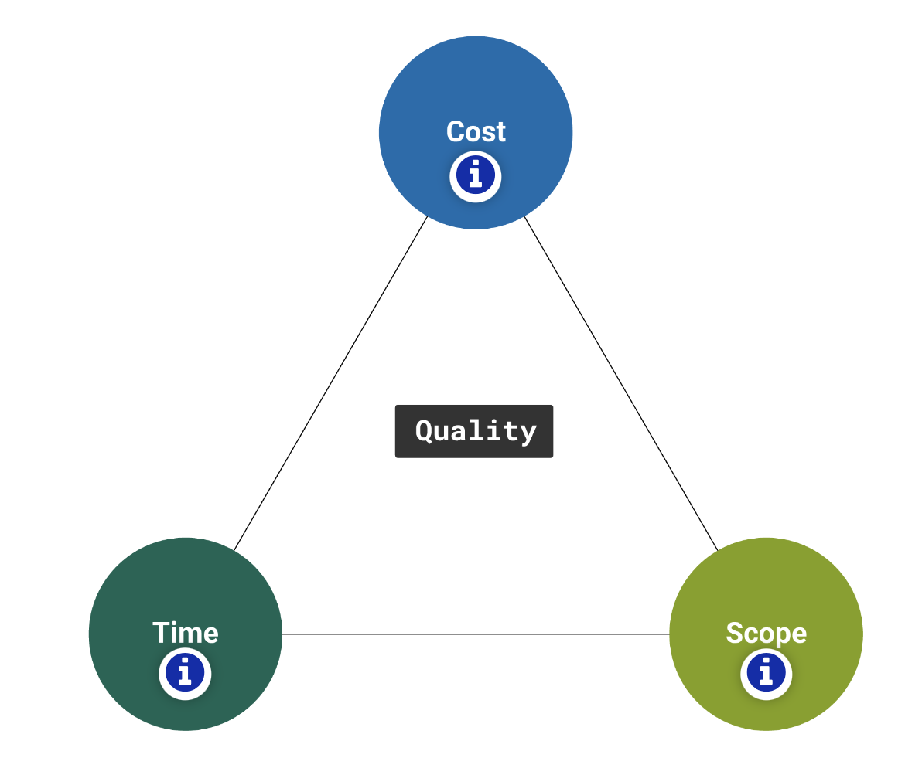

### 1. What is the Project Management Triangle?

The Project Management Triangle, also known as the Triple Constraint or Iron Triangle, is a fundamental concept in project management that represents the three key factors that must be balanced to ensure the successful completion of a project.

Cost

This is the budget allocated for the project. It includes all the financial resources needed to complete the project successfully. Changes in scope or unexpected events can impact the project's cost. Elements of cost might include:

- Financial budget
- Number of team members
- Equipment and facilities
- Key opportunities

Time

This is the schedule or timeframe within which the project must be completed. Projects have deadlines, and meeting those deadlines is crucial for success. Changes in scope or resources can affect the project timeline. Elements of time might include:

- Overall project timeline
- Hours worked on project
- Internal calendars and goalposts
- Time allotted for planning and strategy
- Number of project phases

Scope

This refers to the work that needs to be done to deliver the project. It includes all the features, functions, and deliverables that are required. If the scope increases, it can impact the other two constraints – time and cost. Elements of project scope might include:

- Project complexity
- Quantity of finished product(s)
- Output quality
- Strength (e.g., the number of simultaneous users an app can support)
- Level of detail
- Number and complexity of features

The Project Management Triangle is based on the idea that these three constraints are interdependent. If you change one of the constraints, it will inevitably affect one or both of the other constraints. For example, if you increase the project scope, you may need more time and resources, which can increase costs. Conversely, if you need to finish the project faster, it might require more resources, potentially increasing costs.

The challenge for project managers is to find the right balance between these three constraints to meet project objectives and stakeholder expectations. This concept helps project managers make informed decisions and manage trade-offs effectively during the project life cycle.

##### Explore: What is Scope Creep?

'Scope creep' refers to the gradual expansion or uncontrolled changes in a project's scope – features, requirements, or deliverables—beyond the initially agreed-upon boundaries. It occurs when additional work is introduced without proper evaluation or approval, often leading to increased project complexity, timelines, and costs. Managing and preventing scope creep is crucial for project success, as uncontrolled changes can negatively impact the project's overall goals and objectives.

Exercise caution to prevent 'scope creep' by thoroughly completing project plans and securing approval from project stakeholders for all aspects before initiating production.