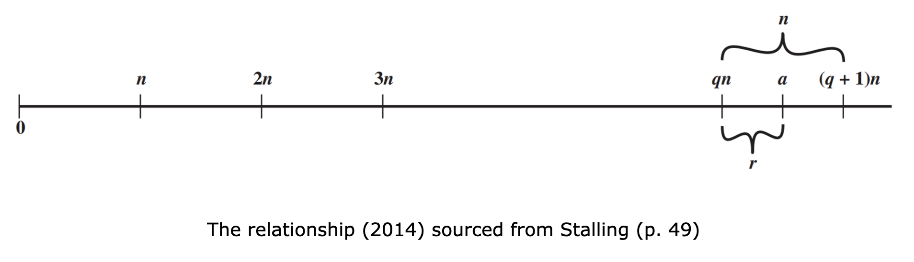

One of the most common ways to reduce large numbers is through the process of division. While this basic arithmetic operation is something we should be familiar with, its application in cryptographic algorithms is of paramount importance. In this lesson, we will outline some very basic concepts pertaining to division and the division algorithm.

## b|a

The _b|a_ notation is used to imply that given a numeric integer value _a_ and a nonzero divisor _b_, _b_ is a divisor of _a_. Based on this logic, we can stipulate the following:

- a = ±1, if a|1
    
- a = ±b, if a|b
    
- b|0, for any b ≠ 0
    
- a|c, if a|b and b|c
    
- b|(mg + nh), if b|g and b|h for some m and n.
    

## The division algorithm

$$a=qn + r ∣ 0≤r<n; q=⌊a/n⌋$$

The equation represents the division theorem, which is often referred to as the division algorithm. This theorem states that given a non-negative integer _a_ and a non-negative division _n_, upon performing a division operation we would option some quotient value _q_ and some remainder of the division _r_.

The equation can be diagrammatically represented as shown below for any _a_ and any _n_.

Next: [[The Euclidean algorithm]]