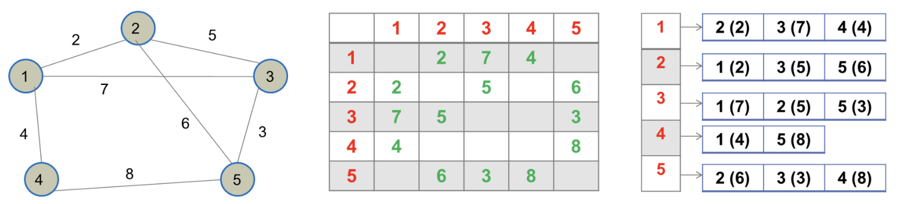

### 4. Brief introduction to time complexity

#### 4.1. Time and space complexities of graphs, adjacency matrices, and adjacency lists

The time complexity of traversing a graph depends on how we store the graph, i.e. the data structure used to store the graph.

In this module, we learned two mechanisms to store a graph: _adjacency matrix and adjacency list._

Look at the following example which shows a simple undirected graph with corresponding adjacency matrix and adjacency list.

Let’s assume that there are V number of nodes and E number of edges in a graph G.

##### Time complexity

**If we store the graph as an adjacency matrix**, notice that we need to traverse one full row of V number of cells in the matrix to find the list of neighbouring vertices of each vertex.

This is because each row corresponds to a vertex in the graph, and each row stores information about the neighbouring vertices of that vertex. Hence, the time complexity of traversing this representation of the data structure is O(V * V) = **O(V ^ 2).** This is called **quadratic time complexity.**

Quadratic time complexity means that the running time of an algorithm grows quadratically with the size of the input. Generally, this is because of nested loops.

**If we use an adjacency list to store the graph**, then all the vertices keep track of its neighbouring vertices and edges. In this case, we can retrieve all the neighbouring vertices by traversing the relevant adjacency list only once. This process takes only a linear time.

If our graph is an undirected graph, we can notice that each edge appears twice in the adjacency list. Hence, the time complexity will be O(V) + O(2E) which is approximated to **O(V + E)**. This is called linear time complexity.

However, if our graph is a directed graph, then the size of the adjacency list has only one instance of each edge. Hence, the time complexity is O(V) + O(E) = **O(V + E).**

##### Space complexity

The space complexity of an adjacency list is the same as the time complexity, i.e. **O(V+E)**, in general. However, if every node is connected to all other nodes, then it will be O(V^2) which is the worst case scenario.

The space complexity of the adjacency matrix is **O(V^2)** since there are V number of rows and V number of columns in the matrix.

Therefore, an adjacency list is more efficient, in terms of storage requirements, for representing a graph.

Graphs can be traversed using breadth-first search (BFS) and depth-first search (DFS). BFS for a graph is similar to breadth-first traversal of a tree. The difference is that the graphs may contain cycles, which ends up visiting the same vertex again and again. For BFS, each vertex is visited only a limited number of times, so it is considered to be more efficient than DFS.

The complexity of graphs depends on the number of edges. Some graphs are very much like trees, i.e. when E is close to V; however, there can be complete graphs where E is close to V^2, which affects the complexity.