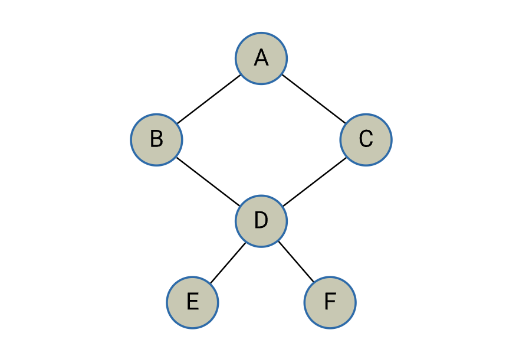

### 3. Planar graphs, Euler graphs, Hamiltonian graphs, and topological sort

#### 3.4. Topological sort and list

Consider a graph representing the prerequisites for a set of units you take in your degree program. Each node represents a unit, and the directed edges represent the prerequisite relationships between the units. We want to find a topological sort to determine the order in which the units should be taken.

##### Graph example

The prerequisites for each unit are outlined below. These relationships are visually represented in the accompanying graph.

- Units: A, B, C, D, E, F
- Prerequisites:

- B depends on A
- C depends on A
- D depends on B and C
- E depends on D
- F depends on D

##### Topological sort and list

A possible topological sort for this graph would be:

A  -> B  -> C ->  D ->  E ->  F

This order respects the prerequisite relationships between the units. For example, B and C depend on A, so A is taken first. Then, D depends on both B and C, so B and C are taken next. E depends on D, so D is taken before E. Finally, F also depends on D, so D is taken before F.

The topological list for this example would be:

- A
- B
- C
- D
- E
- F

This list provides the order in which the units should be taken, ensuring that all prerequisites are satisfied before taking a particular unit.

There are a few other variations of topological sorts for this same graph:

(each one has -> between)

A  C  B  D  E  F

A  B  C  D  F  E

A  C  B  D  F  E