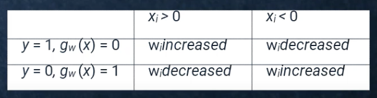

[[Perceptron]]
Each of the m weights affects only one output
so there are m training processes

$\mathbf{x}$ is the **input** vector
$y$ is the **true class label** for the input
$g_\mathbf{w}(x)$ is the **perceptron prediction** for the input
$\alpha$ is a **learning rate constant** that determines how large the updates are

Depending on the activation function the training process will be either

1. Step function Perceptron learning rule
$$w_i \leftarrow w_i + a(y-g_\mathbf{w}(\mathbf{x})){x}_i$$

2. Gradient descent rule for sigmoid perceptron
$$w_i \leftarrow w_i + 
\alpha (y-g_\mathbf{w}(\mathbf{x})) \times g_\mathbf{w}(\mathbf{x}) \times (1- g_\mathbf{w}(\mathbf{x})) \times {x}_i$$

But fundamentally the same. Weights are updated to push the predicted class towards the actual class.

### Example

For initial weights $\mathbf{w} = [0,0,0]$ where $\mathbf{w}_0$ is the bias
input vector $\mathbf{x} = [1, 2]$
actual class label $y = 1$
predicted label $g_\mathbf{w}(x) = 0$
learning rate $\alpha = 1$

add bias to front of input x = [1,1,2]

w_0 = 0 + 1 x (1-0) x 1 = 1
w_1 = 0 + 1 x (1-0) x 1 = 1
w_2 = 0 + 1 x (1-0) x 2 = 2

updated weight vector [1,1,2]

### Test
𝑤=(1.0,0.5,0.1)𝑇, learning rate 𝛼=0.5, and activation function 𝑔 given by 𝑔(𝑥)=1 if (∑𝑖=1𝑖=3𝑤𝑖×𝑥𝑖)>0, and 𝑔(𝑥)=0 otherwise

| X1  | X2  | x3  | class |
| --- | --- | --- | ----- |
| 2   | 4   | 3   | 1     |
| 5   | 9   | 7   | 0     |
| 2   | 9   | 5   | 0     |
| 5   | 4   | 3   | 1     |

i can't see a bias weight - no bias

prediction
$$ p = g(\mathbf{w}_j \cdot \mathbf{a}) = g\left(\sum_{i=0}^n w_{i, j} a_i\right) $$

learning
$$w_i \leftarrow w_i + a(y-g_\mathbf{w}(\mathbf{x})){x}_i$$

first line prediction
w*x = 2 x 1.0 + 4 x 0.5 + 3 x 0.1 = 2 + 2 + 0.3 = 4.3
g(4.3) = 1 if sum of weights x inputs is positive which it is so 1

w_1 <- 1.0 + 0.5(1 - 1)2 = 1.0

second line 
wx = 5 x 1.0 + 9 x 0.5 + 7 x 0.1 = 5 + 4.5 + 0.7
g(x) = 1, prediction = 0 so there is a difference therefore weights all need to be updated

1.0, 5
w_1 <- 1.0 + 0.5(0-1)5 = 1 - 2.5 = -1.5

0.5, 9
0.5 + 0.5(-1)9 = 0.5 - 4.5 = -4

0.1, 7
0.1 + 0.5(-1)7 = 0.1 - 3.5 = -3.4

NEW WEIGHT VECTOR
[-1.5, -4, -3.4]

| 2   | 9   | 5   | 0     |
| --- | --- | --- | ----- |
wx = 2*-1.5 + 9*-4 + 5*-3.4 = negative 
0-0=0
keep going

| 5   | 4   | 3   | 1     |
| --- | --- | --- | ----- |
wx = 5 x -1.5 + 4 x -4 + 3 x -3.4 = -7.5 + -16 + -10.2 = -33.7

-1.5, 5
-1.5 + 0.5(1 - 0)5 = -1.5 + 2.5 = 1

-4, 4
-4 + 0.5(1)4 = -4 + 2 = -2

-3.4, 3
-3.4 + 0.5(1)3 = -3.4 + 1.5 = -1.9

1, -2, -1.9-