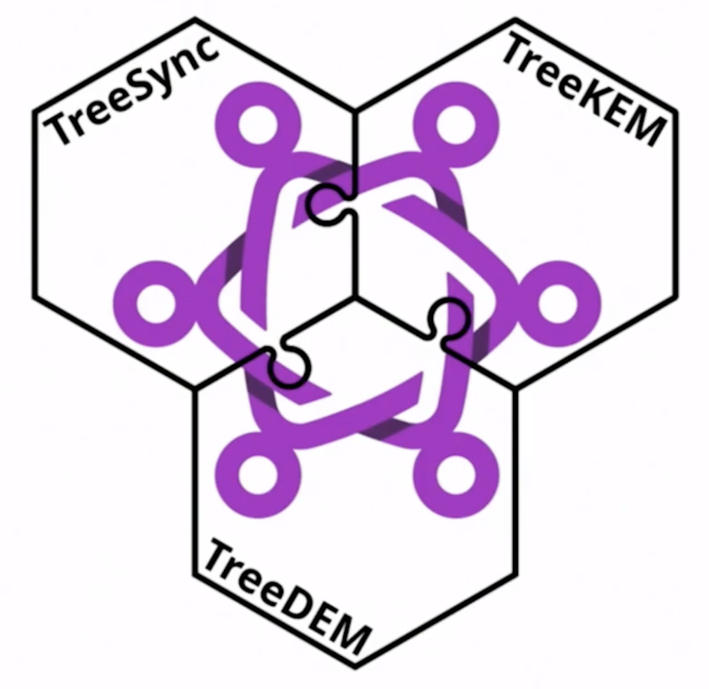
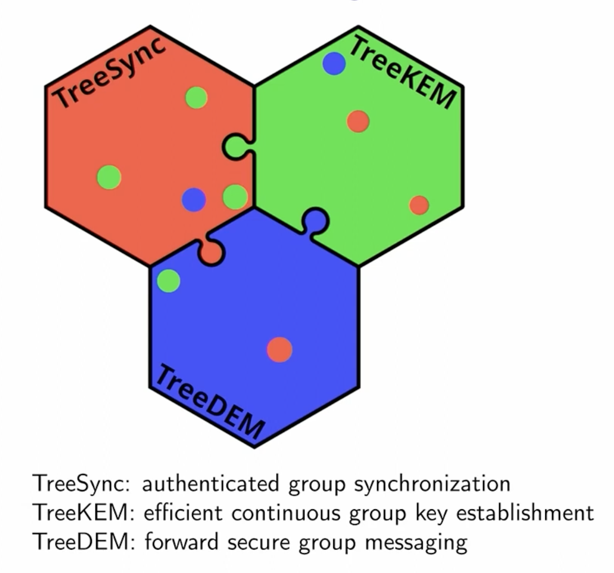

---
aliases:
  - "TreeSync: Authenticated Group Management for Messaging Layer Security"
type: paper
year: "2023"
author:
  - Théophile Wallez
  - Jonathan Protzenko
  - Benjamin Beurdouche
  - Karthikeyan Bhargavan
---
Talk on this paper by Théophile Wallez: [End-to-End Encrypted Group Chats with MLS: Design, Implementation and Verification](https://youtu.be/18x3RsmRrV0?si=clkEEpSdh-VBeIgS&t=569):

