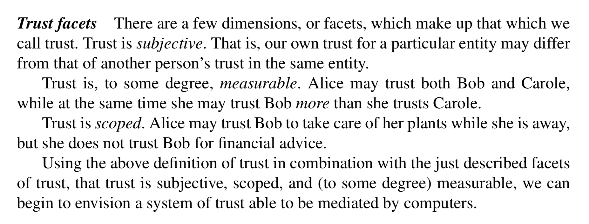
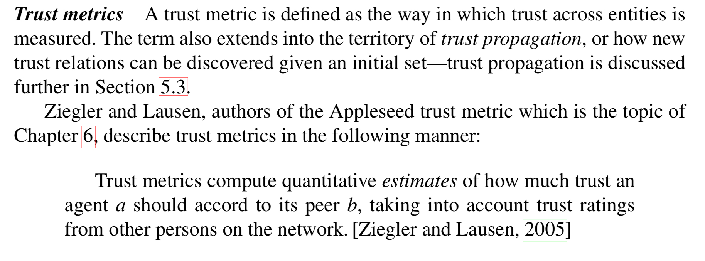

## Abstract
This thesis introduces [[TrustNet]], a flexible and distributed system for deriving, and interacting with, computational trust. The focus of the thesis is applying TrustNet as a tool within distributed chat systems for implementing a subjective moderation system. Two distributed chat systems, Secure Scuttlebutt and [[Cabal]], are discussed, the latter having been extended with a proof of concept implementation of the proposed system. The concept of ranking strategies is also introduced as a general purpose technique for converting a produced set of rankings into strategy-defined subsets. This work proposes a complete trust system that can be incorporated as a ready- made software component for distributed ledger technologies, and which provides real value for impacted users by way of automating decision-making and actions as a result of assigned trust scores.

1. Introduction 9 
	2. 1.1 Overview . . . . . . . . . . . . . . . . . . . . . . . . . . . . . . 10 
	3. 1.2 Contributions . . . . . . . . . . . . . . . . . . . . . . . . . . . 11 
2. Public-key Cryptography 13 
	1. 2.1 Digital signatures . . . . . . . . . . . . . . . . . . . . . . . . . 14 
	2. 2.2 Public-key-based Identity . . . . . . . . . . . . . . . . . . . . . 15 
	3. 2.3 Uses in distributed peer-to-peer systems . . . . . . . . . . . . . 16 
3. [[Distributed systems]] 18 
	1. 3.1 The CAP Theorem . . . . . . . . . . . . . . . . . . . . . . . . . 19 
	2. 3.2 Eventual Consistency . . . . . . . . . . . . . . . . . . . . . . . 21 
	3. 3.3 Message Passing . . . . . . . . . . . . . . . . . . . . . . . . . . 21 
	4. 3.4 Append-only logs . . . . . . . . . . . . . . . . . . . . . . . . . 22 
	5. 3.5 Kappa Architecture . . . . . . . . . . . . . . . . . . . . . . . . 24 
	6. 3.6 Interleaving logs . . . . . . . . . . . . . . . . . . . . . . . . . . 26 
	7. 3.7 Looking to distributed chat systems . . . . . . . . . . . . . . . . 31 
4. Chat systems 32 
	1. 4.1 Moderation . . . . . . . . . . . . . . . . . . . . . . . . . . . . . 33 
	2. 4.2 Distributed chat systems . . . . . . . . . . . . . . . . . . . . . . 37 
	3. 4.3 [[Subjective moderation]] . . . . . . . . . . . . . . . . . . . . . . . 45 
5. [[Trust]] 48 
	1. 5.1 Definitions . . . . . . . . . . . . . . . . . . . . . . . . . . . . . 49 
	2. 5.2 Related Work . . . . . . . . . . . . . . . . . . . . . . . . . . . 50 
	3. 5.3 [[Computational Trust]] . . . . . . . . . . . . . . . . . . . . . . . . 52 
6. [[Appleseed]] 58 
	1. 6.1 Overview . . . . . . . . . . . . . . . . . . . . . . . . . . . . . . 59 
	2. 6.2 Algorithm . . . . . . . . . . . . . . . . . . . . . . . . . . . . . 62 
	3. 6.3 Drawbacks . . . . . . . . . . . . . . . . . . . . . . . . . . . . . 71 
7. [[TrustNet]] 73 
	1. 7.1 Overview . . . . . . . . . . . . . . . . . . . . . . . . . . . . . . 74 
	2. 7.2 Architecture . . . . . . . . . . . . . . . . . . . . . . . . . . . . 78 
	3. 7.3 Experiment design . . . . . . . . . . . . . . . . . . . . . . . . . 80 
	4. 7.4 TrustNet Example . . . . . . . . . . . . . . . . . . . . . . . . . 83 
8. Evaluation & Results 86 
	1. 8.1 Evaluation . . . . . . . . . . . . . . . . . . . . . . . . . . . . . 87 
	2. 8.2 Results . . . . . . . . . . . . . . . . . . . . . . . . . . . . . . . 89 
	3. 8.3 Moderation Comparison . . . . . . . . . . . . . . . . . . . . . . 90 
	4. 8.4 Varying the parameters . . . . . . . . . . . . . . . . . . . . . . 91 
9. Discussion 94 
	1. 9.1 On Privacy . . . . . . . . . . . . . . . . . . . . . . . . . . . . . 94 
	2. 9.2 On The Difficulty of Simulating Trust . . . . . . . . . . . . . . . 94 
	3. 9.3 On Increased Attack Incentives . . . . . . . . . . . . . . . . . . 95 
	4. 9.4 On the Importance of Naming . . . . . . . . . . . . . . . . . . . 95 
	5. 9.5 Other Use Cases of TrustNet . . . . . . . . . . . . . . . . . . . 96 
	6. 9.6 Conclusion: Subjective Moderation & The Future of TrustNet . . 96 
A. Simulator parameters 98 
Bibliography 99

https://cblgh.org/dl/trustnet-cblgh.pdf#page48
[[trustnet-cblgh.pdf]] p.48