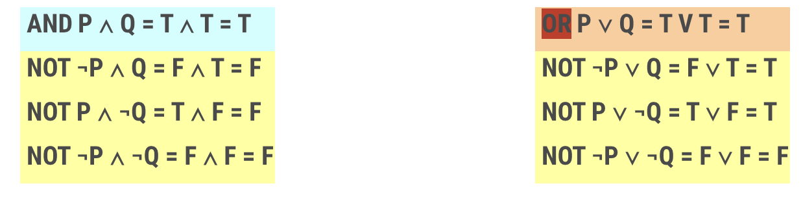
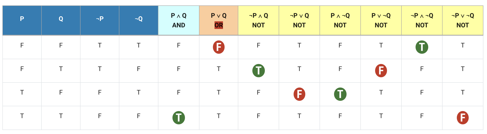
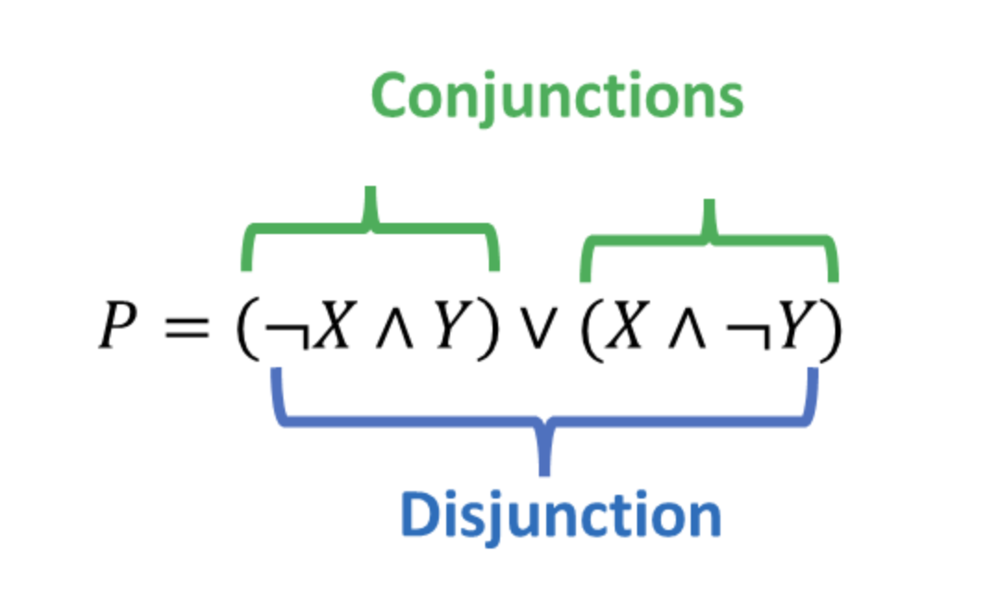

#### 2.1. Constructing a truth table

On this page, you will learn how to construct a truth table.

A truth table is a mathematical table used in logic which contains the breakdown of all the possible truth values returned by a logical expression. A truth value is typically represented by true or false, or 1 or 0.

Look at the same example we explored earlier. 

P = The sky is blue,  
Q = The grass is green.

Let’s draw a truth table now.

Observe the pattern of true (T) and False (F) instances in each column in the following table. AND operation produces a 'TRUE' result only when both P and Q are TRUE. Similarly, OR operation produces only a 'FALSE' outcome when both P and Q are FALSE.

#### 2.2. Premises, conclusions and conjunctive normal forms

In this part, you will learn how to construct premises, conclusions in propositional logic and how to construct an answer in conjunctive normal form.

In our day-to-day life, we come across various types of statements. They could be just opinions like 'I prefer tea over coffee, but my friend prefers coffee' or logical statements like 'The sun rises from the east, and the planets are circular in shape'.

The resultant statement can be true or false once we combine logical statements. Thus, there are two types of compound statements in logic functions: conjunctions and disjunctions.

A conjunction implies that both statements are true, while disjunction implies that at least one statement is true. With a conjunction, statements are connected by the word 'and', while with disjunction, statements are connected by the word 'or'. As we saw earlier, the respective symbols are ∧ for conjunction and ∨ disjunction.

Given two logical statements, P and Q, the results can be summarised as follows:

|**Name**|**Meaning**|**Notation**|**Truth Value**|
|---|---|---|---|
|**Conjunction**|P and Q|P ∧ Q|True if both P & Q are true,  False otherwise|
|**Disjunction**|P or Q|P ∨ Q|False if both P & Q are false,  Ture otherwise|

Conjunction/disjunction (2023) adapted from Faculty of Information Technology

Assume we have a scenario as follows. There are two statements, X and Y, and their compound statement is P, represented by the table below. Notice what a conjunction and a disjunction means through this example.

| **X** | **Y** | **P** |            |
| ----- | ----- | ----- | ---------- |
| F     | F     | F     |            |
| ==**F**== | ==**T**== | ==**T**== | ==**¬X ∧ Y**== |
| ==**T**== | ==**F**== | ==**T**== | ==**X ∧ ¬Y**== |
| T     | T     | F     |            |

