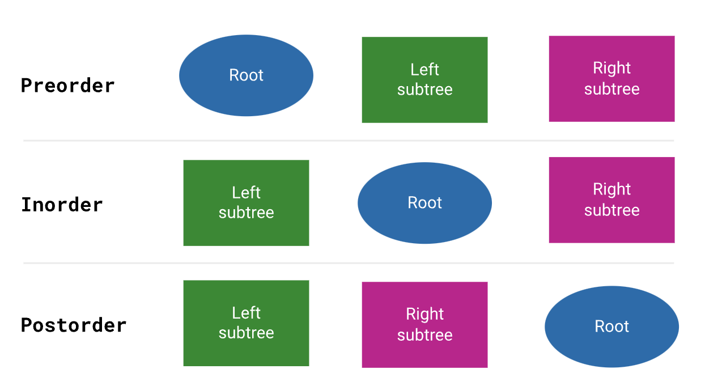
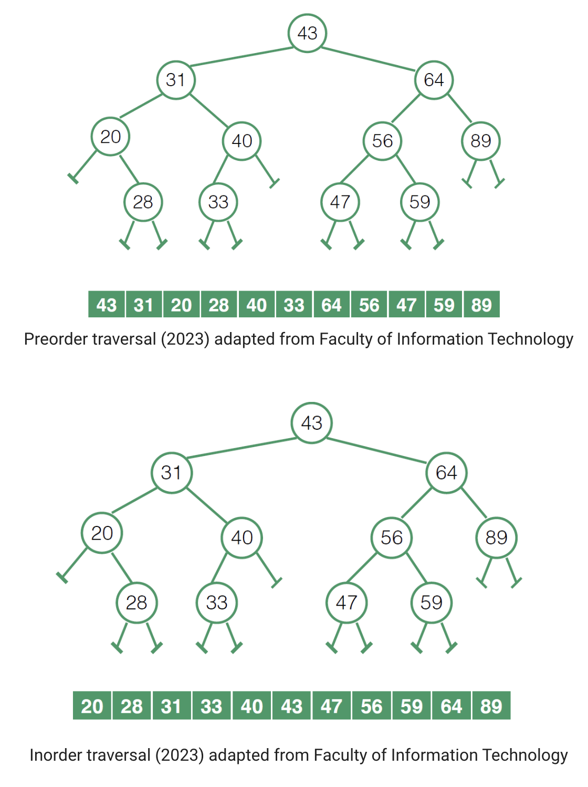
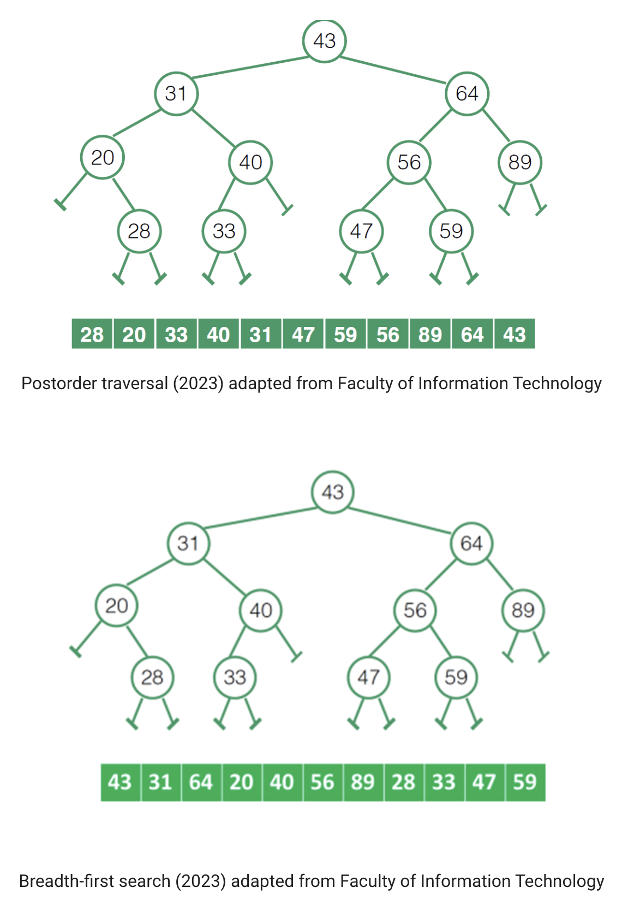
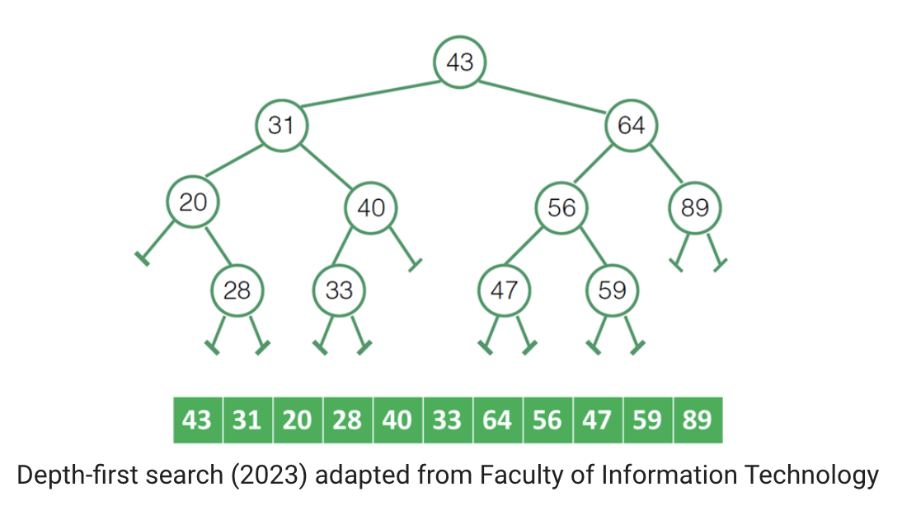
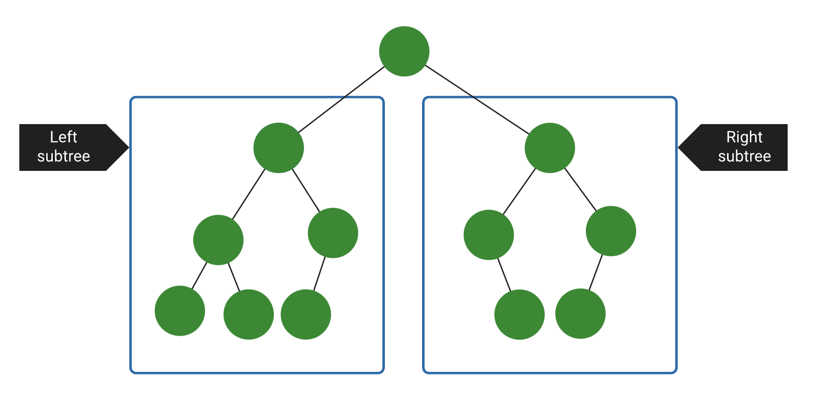

#### 2.1. Types of traversal

The following figure identifies terminologies for traversals:

- **Preorder traversal**—traverse from the root to the left subtree then to the right subtree (Root, Left, Right).
- **Postorder traversal**—traverse from the left subtree to the right subtree then to the root (Left, Right, Root).
- **Inorder traversal**—traverse from the left subtree to the root then to the right subtree (Left, Root, Right).
- **Breadth-first search (BFS)**—traverses the graph horizontally. It begins at the root of the graph and traverses all the nodes at a single depth level before moving on to the next depth level.
- **Depth-first search (DFS)**—traverses the graph vertically. It starts with the root node of the graph and investigates each branch as far as feasible before backtracking.

Examples

#### Calculating the size of a tree

Size of a tree = size(left subtree) + 1 + size(right subtree)

What is the worst case time complexity of the depth-first traversal algorithm that runs on an n-vertex graph that is represented by an adjacency matrix structure?

Answer: O(n^2)