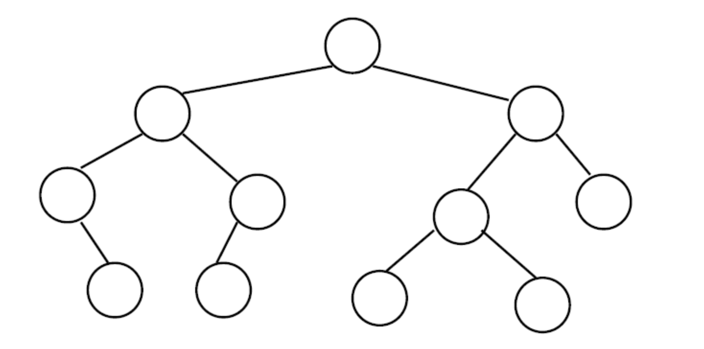
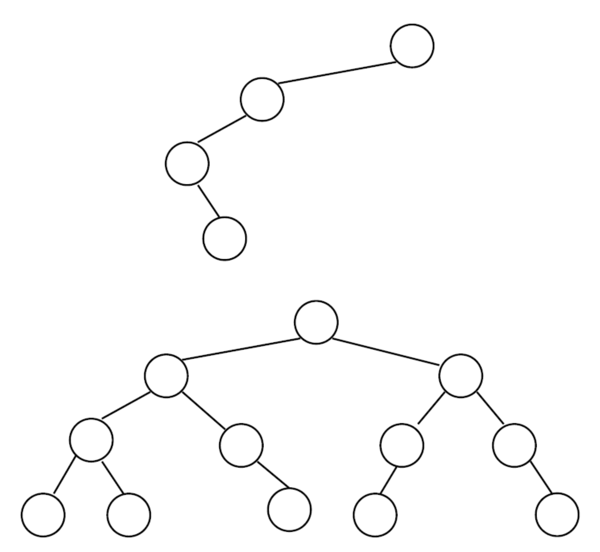
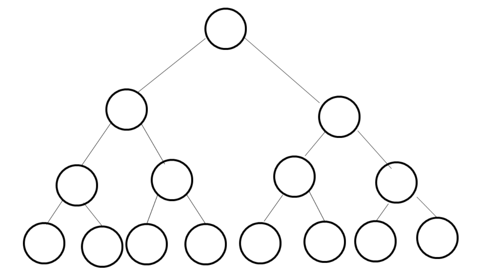

#### 1.2. Types of trees

The following are some of the different types of trees:

- **General tree**—a parent node of a general tree can have any number of child nodes.
- **Binary tree**—a node of a binary tree can have a maximum of two child nodes.
- **Balanced tree**—occurs if the height of the right sub-tree and the left sub-tree is equal or differs at most by 1.

The following binary tree shows that every node has at most two children i.e. every sub-tree is a binary tree.

A simple binary tree:

Balanced vs unbalanced binary tree

**Note:** In a balanced binary tree, |height(left sub-tree) – height(right sub-tree)| ≤ 1 for every node.

In a **perfect binary tree**, each parent has two children and all the leaves are at the same level.

The height of a binary tree can be determined as follows:

- In a perfect binary tree with N nodes, the height is 𝑂(log𝑁)𝑂(log⁡𝑁).
- The height of a balanced binary tree is 𝑂(log𝑁)𝑂(log⁡𝑁).
- The height of an unbalanced binary tree is 𝑂(𝑁)𝑂(𝑁).