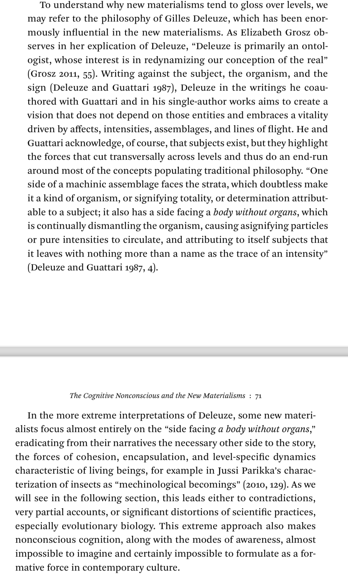

https://press.uchicago.edu/ucp/books/book/chicago/U/bo25861765.html
[[Unthought_Katherine_Hayles.pdf]]

[[Gilles Deleuze]] [[A Thousand Plateaus]]

# Index
actor-network-theory (ANT), 115, 116, 118
actors. See cognizers
adaptability, 29–30, 31, 34, 118
aesthetic strategies, and speculative realism, 193-95
affective capitalism, 173, 191
[[affect]]s:
- as illuminated in novels, 198;
- relation to nonconscious cognition, 197
Affleck, Ben, 144
agency:
- [[distributed agency]], 83–84, 120, 131-39;
- punctuated agency, 32, 142;
- of systems capable of self-organizing, 81-82;
- and technical cognitive systems, 131
[[agential realism]], 69
agents (material forces and objects), 32
AIG (American International Group), 153, 155
algorithms:
- interpretation in, 210;
- word frequency algorithms, 207. 
- See also high-frequency trading (HFT) algorithms
Al-Qaeda, 140
American transcendentalists, 61
anaerobic bacteria, merging with respiring bacteria as survival strategy, 72
Anthropocene, 34, 83
Appadurai, Arjun, Banking on Words, 145
arbitrage, 149, 151, 152
Archipelago, 158
Arkin, Ronald C., 38, 136, 140
Arnuk, Sal, 159, 164, 166, 171
artificial intelligence, general, 191, 202
Artificial Life, 21-22
Ash, James, 163
==assemblages, vs. networks, 118.== See also cognitive assemblages, human-technical
atmospheric media, 172
"attentional blink," 54
Augmented Reality, 125
Auletta, Gennaro, Cognitive Biology, 25-26, 28
automated trading:
- defined, 220n3 (Ch. 6);
- history of, 156-62. 
- See also high-frequency trading (HFT) algorithms
Automated Traffic Surveillance and Control system, Los Angeles, 121-23; 
- as cognitive assemblage, 123;
- interaction of technical cognitions with human cognitions, 122-23, 203;
- political assumptions of system, 123
automatic writing, 86
autonomous trading algorithms. 
- See high-frequency trading (HFT) algorithms
autonomous weapons, and shift in conduct of warfare, 137-38. 
- See also drone assemblages; UAVs (unmanned aerial vehicles)
[[Autopoiesis and Cognition]] (Maturana and Varela), 20-21
Ayache, Elie, The Blank Swan, 144-48

[[Alain Badiou|Badiou, Alain]], 194
Baker, R. Scott, Neuropath, 86
Baldwin effect, 72
[[Karen Barad|Barad, Karen]], 68-70;
- notion of “agential realism,” 69;
- notion of “intraaction,” 68, 69, 75
Barsalou, Lawrence:
- on cognitivist paradigm, 13;
- and modal brain simulations, 48, 88, 180;
- theory of grounded cognition, 12, 48-49
Batch auctions, 167, 168-70, 175, 203
Bee communication, 74-75
Beer, Gillian, Darwin’s Plots, 18-19
Belief, in the traditional view and in cognitive biology, 16
Bell curve, 146, 148
Benjamin, Medea, Drone Warfare, 132
[[Jane Bennett|Bennett, Jane]], 3, 83-84
Bentham, Jeremy, 37
Berger, Peter, 220n4
[[Lauren Berlant|Berlant, Lauren]], 184, 195-97, 221n1
Berry, David, 32, 174
Best, Stephen, 209
Bickle, John, and Elaborate Practical Reasoning, 43
Big Bang, 69
Binary codes, 22
Biological and technical cognition, interpenetration of, 11, 19
Bird, Christopher, 17
Black, Fisher, 145, 150
Black noir, 193-94
Black-Scholes values, 149
Black swan events, 143, 162
Blindsight, neurological phenomenon of, 101-2, 219n5 (Ch. 5)
Bogost, Ian, 63
Bohr, Niels, 68
Bolton, Matthew, 137
Borges, Jorge Luis, “Pierre Menard, Author of the Quixote,” 144-45
Born, Brooksley, 147
Braidotti, Rosi: “The Ethics of Be-coming Imperceptible,” 77-79;
- and sustainable subject, 77-78, 203-4
Brain-Machine-Interfaces (BMI), 12
Branding, 172-73
Brenner, et al., 17-19
Brenner, Robert, 154
Bretton Woods agreement, 153
Brigham, Chris, 124
Bryan, Dick, 154
Bryant, Brandon, 140
BSM (Black, Scholes, and Merton differential equation), 145-46, 148-50, 152
Buchanan, Mark, 161-62
Buddhist tradition, and meditative practices, 61-63
Budish, Eric, 167
Buffett, Warren, characterization of derivatives, 147
Burke, Kenneth, 200
Burn, Stephen J., 86
Burroughs, William, Naked Lunch, 104
BZ (Belousov-Zhabotinsky) reaction, 81

Cage, John, 212
Calude, C. S., 190
Carpenter, John, 194
Cellular automata, and cognition in biological cells, 21
Chaitin, Gregory J., and Omegas, 187-88, 190, 202
Chamayou, Grégoire:
- drone theory, 38-39;
- on suicide bombers, 140
Chamovitz, Daniel, 18
Changeux, Jean-Pierre, 54
Chever, Adam, 124
Chicago Board Options Exchange, 149
Children of Men (film), 194
Chilean School of Biology of Cognition, 20
Chinese Room experiment, 97
CHOICEFW (free will), 35, 37
CHOICEII (interpretation of information), 35, 37
Clark, Andy, 21, 165
climate change, 83
codependent arising, 62
Coeckelbergh, Mark, 135
[[cognition]]:
- capabilities not present in material processes, 29, 31, 34, 118; 
- defined, 22, 118; 
- dynamic, 51–52; 
- ==emergence from context-specific interactions, 21;== 
- extension in cognitive biology to all life forms, 15–16; 
- presence in both biological life-forms and technical systems, 14; 
- as a process, 25, 51; 
- traditionally associated with human thought, 15, 39, 66. 
- See also nonconscious cognition(s); technical cognitive systems
cognition (human), tripartite framework of, 27–30, 40
[[cognitive assemblages]], 
- ==human-technical, 11–12, 117–19;== 
- and affective forces, 178; 
- and computational media, 174; 
- digital assistants, 124–26; 
- drone assemblages, 37, 132–33, 135–37; 
- and ethical interventions, 35–40, 135–37, 204–5; 
- and financial derivatives, 142; 
- flow of information through a system and choices that modify and interpret the flow, 116; 
- and historical present, 195–97; 
- infrastructures as, 120–23; 
- interaction of human interpretations with technical systems, 1, 118, 203; 
- interactions across full range of human cognition, 118; 
- and intuition, 180–81, 201; 
- novels and, 197–201; 
- operation at multiple levels and sites, 118; 
- operation of mediators within, 116; 
- ==political nature of, 178;== 
- roles of humanities in thinking about, 204–5; 
- and social signaling and somatic surveillance, 126–28; 
- as transformative, 37–39, 119; 
- and the unknowable, 189–93; 
- utopian potential of, 4–5, 202–16
cognitive biology, and cognition, 14–16, 66
cognitive nonconscious, the, usage, 2, 11–12. 
- See also nonconscious cognition(s)
cognitive science: 
- cognitivism as dominant paradigm, 12; 
- paradigm of brain as a computer, 56–57
cognitive technologies. See technical cognitive systems
[[cognitivist paradigm]]: 
- contrasted with embodied/embedded view, 13, 49; 
- dominance in 1990s and twenty-first century, 12
cognizers: 
- inclusion of both technical and human in the cognitive nonconscious, 2; 
- vs. noncognizers, 30–32; 
- as transformative actors, 116
Collateralized Debt Obligations (CDOs), 153, 155
colocation, 157
computational media: 
- ability to interact with humans within cognitive assemblages, 174; 
- cognitive capability to simulate any other system, 33; 
- as cognitive technology, 34, 174; 
- evolutionary advantage over every other technology, 33–35; 
- e-waste, 34–35; 
- impact upon humanities, 208; 
- and incompleteness of control, 203; 
- and interpretation, 25; 
- and level-specific dynamics, 70
[[consciousness]]: 
- evolutionary role, 55; 
- requires fast-response information processing of nonconscious cognitions, 215; 
- simulations and representations in, 47–49; 
- slow uptake and limited processing ability, 10, 44, 50; 
- tendency to focus on the individual, 91, 106. See also core consciousness; higher consciousness
consciousness, costs of: 
- anthropocentric bias, 45, 106; 
- expressed in history of Western thought, 86; 
- misrepresentation of anomalous situations, 44; 
- slowness relative to perception, 10, 44, 50. 
- See also McCarthy, Tom, Remainder; Watts, Peter, Blindsight
context: 
- and emergence of cognition, 21; 
- and meaning, 23, 26; 
- and non-conscious cognition, 13; 
- provided by novels, 21
continuous limit order book (CLOB) trading, 167–68
Conway, John, game of “life,” 22
Corballis, Michael C., The Wandering Mind, 61
core consciousness: 
- awareness of self and others shared by humans and non-humans, 9, 41; 
- connection with the cognitive nonconscious, 45; 
- and “new unconscious,” 10; 
- process of arising through maps of body states, 46–47
Cramton, Peter, 167
credit default swaps, 152–53
“Critical Studies in Finance Capital,” 176–77
Customary International Humanitarian Law Database, 134
cybernetic paradigm, 202
Czyzewska, Maria, 50

Damasio, Antonio: 
- Descartes’ Error, 86; 
- and the proto-self, 10, 45–46, 219n4; 
- and re-representation, 46, 49; 
- on the self, 42–43; 
- on tendency of consciousness to focus on the individual, 91, 106
Danielewski, Mark, Only Revolutions, 205
“dark pools,” 157–58
Darwin, Charles, The Origin of Species, 18–19
data environments, 190, 192
Datek, 156
Defense One website, 137
Dehaene, Stanislas: 
- “Conscious and Nonconscious Processes: Distinct Forms of Evidence Accumulation?”, 52–54; 
- and global workspace, 53–54, 70; 
- and nonconscious processing of subliminal stimuli, 49
[[Gilles Deleuze|Deleuze, Gilles]], 70, 190. See also Deleuzian paradigm
Deleuzian paradigm: 
- and [[assemblage]]s, 70–71, 75, 115, 117; 
- conflict with Darwinian organism, 76–77; 
- [[deterritorialization]]s, 73–74, 77; 
- and force, 80–83; 
- lack of empirical verification, 79–80; 
- and [[new materialisms]], 70–71; 
- and renunciation of subjects, 219n3; 
- “royal sciences” in contrast to “minor sciences,” 79–80
de Moivre, Abraham, 148
Dennett, Daniel, 42, 44
Derby, Matthew, 104
derivatives. See financial derivatives
[[Jacques Derrida|Derrida, Jacques]], 98
determinism, 34
[[deterritorialization]]s, 73–74, 77
Dharasana Salt Works, India, 140
digital assistants: 
- and homogenization of behavior, 125; 
- and neurological changes in users, 119
digital humanities: 
- and identification of patterns not previously detected by human reading, 209–10; 
- recursive process of human conscious analysis and technical cognition, 5, 208, 210–11, 214–15; 
- and widening of scope of humanistic inquiry, 206
digital media: 
- long-lasting effects of minimal exposure to on human neurology, 30, 125. 
- See also digital assistants
digital search engines, 32
[[distributed agency]]: 
- and technical autonomy, 131–39
Dresp-Langley, Birgitta, 55
Dreyfus, Hubert L.: 
- and “absorbed coping,” 57–59; 
- debate with John McDowell, 56–60
drone assassinations, 132
drone assemblages: 
- evaluation of ethical issues regarding through cognitive assemblage approach, 135–37; 
- US Air Force deployment of, 133. 
- See also UAAVS (unmanned autonomous aerial multivehicle systems, or swarms); UAAVs (unmanned autonomous aerial vehicles); UAVs (unmanned aerial vehicles)
drone pilots, 38–39, 140
Dupuy, Jean-Pierre, 12
Dyer, Michael, 105
“dynamic replication,” 146

Eagleman, David: 
- Incognito, 215
Edelman, Gerald: 
- and coherence, 43; 
- and functional cluster index (CI), 47; 
- reentrant signaling, 55; 
- Theory of Neuronal Group Selection (TNGS), 45, 46–47
[[efficient-market hypothesis]] (EMH): 149, 164–65, 166
Ekman, Ulrik, 123
embodied/embedded paradigm: 13, 15–16, 21, 49, 61–62
[[The Embodied Mind|Embodied Mind, The]] (Varela, Thompson, and Rosch), 21, 61–63
Emerson, Ralph Waldo, 61
enactive cognitive science, 21, 62–63
endosymbiosis, theory of, 71, 72, 81
environmental monitoring systems, 32
epigenetics, 72
==[[epistemic complexity]], 16==
equilibrium model:
- assumptions underlying, 146, 148–49;
- and “theological unconscious,” 148
Ernst, Wolfgang, Memory and the Digital Archive, 219n5
error, importance of in discovery of new concepts, 190–93, 197
ethical interventions:
- cognitive assemblage approach, 35–40, 135–37, 204–5;
- to finance trading, 166–67, 169, 175
eukaryotic cells, 71
Euronext, 158
evolution:
- [[new materialisms]] and, 71–76;
- role of consciousness and [[nonconscious cognition]], 55;
- social signals and, 128
evolvability, 30, 31, 34, 118
expeditionary warfare, 132, 135
experimental axiomatics, 190, 192

face-recognition systems, 120, 131
Fazi, Beatrice, 203
feedback loops, 150–52, 155–56, 162
finance trading:
- automated trading, history of, 156–62;
- systematic reengineering of, 165–69;
- transition from mixed human-machine phase to new all-machine phase, 162.
- See also high-frequency trading (HFT)
“Financial Black Swans Driven by Ultrafast Machine Ecology” (Johnson et al.), 162
financial derivatives:
- and [[cognitive assemblages]], 142;
- complex temporalities of, 143–47;
- and credit default swaps, 152–53;
- and dynamic replication, 146;
- exponential growth of from 1970s onward, 154–55;
- as form of writing, 144–45;
- modeling of price using probabilities, 145–46;
- nature as future contracts, 143–44;
- over-the-counter (OTC) derivatives, 147;
- and strike price, 144, 145;
- and subprime mortgages, 152–53, 155;
- and temporal folding, 152
financial economy:
- and the humanities, 169–75;
- increasing percentage of total economic activity, 155.
- See also finance trading; financial derivatives; high-frequency trading (HFT); stock market; stock market crises
finite-state machine, 185
Fish, Stanley, 210, 211
[[Mark Fisher|Fisher, Mark]], [[Capitalist Realism]], 194–95
Fitbit bracelet, 35
Flanagan, Owen, 42
flexibility, 29, 31, 34, 118
fMRI (functional magnetic resonance images) scans, 48, 53, 86
force:
- and new materialisms, 80–83
Foveon-equipped Sigma DP digital image sensor, 63
Fredkin, Edward, 23, 24
Freeman, Walter J., 13, 49
Freud, Sigmund, and the unconscious, 27, 148, 207, 217n2
Friedman, Norman, 132, 137
functional cluster index (CI), 47
future anterior, 144

Gandhi, Mohandas, 140
general artificial intelligence, 191, 202
gene regulation, 72
Geneva Conventions, 134, 135
Gensler, Gary, 151
Gianella, Eric, 210
Gibson, William, Pattern Recognition, 196
Giscard d’Estaing, Valéry, 230n1
Gladwell, Malcolm, Blink, 54
Gleick, James, 22
Global Minotaur, 154
global workspace, 53–54, 61, 70
Gödel, Kurt, incompleteness theorem, 186, 188
Goldsmith, Kenneth, “uncreative writing,” 211–12
Goodman, Steve, 172–73
Goodwin, Brian C., 14
Great Depression of 1929–39, 150
Great Lakes sea-rocket plants (cakile edentual), 20
Great Recession, 154
[[Elizabeth Grosz|Grosz, Elizabeth]]:
- on Darwin’s continuum of humans with animals, 76–80;
- on [[Gilles Deleuze|Deleuze]], 70;
- on force, 80;
- “A ==Politics of Imperceptibility==,” 77;
- and sexual selection, 76–77
grounded cognition, theory of, 12, 48–49
[[Félix Guattari|Guattari, Félix]], 70, 75, 79–80, 116, 117, 190, 219n3
Guillory, John, 208

Haddon, Mark, The Curious Incident of the Dog in the Night-Time, 86
Hansen, Mark B. N., Feed-Forward, 44, 172–74, 175, 176, 192, 203
Harman, Graham, 63
[[Martin Heidegger|Heidegger]], Martin, 170
Heisenberg, Werner, 68
Her (film), 126
higher consciousness:
- and excesses of consumerist culture, 91;
- generation of inner narratives that interpret actions of the self and create coherence, 9–10, 42, 43, 45;
- and thinking, 2;
- unique to humans and some primates, 41
high-frequency traders:
- and claims against cost of “sniping,” 167, 168;
- increasing dependence on “maker and taker” fees, 158–59;
- largest customers of exchanges by 2009, 158
high-frequency trading (HFT):
- consequences of technical autonomy, 143;
- and continuous limit order book (CLOB) trading, 167–68;
- defined, 220n3 (Ch. 6);
- effect on average time a stock is held, 157;
- and frequency of “black swan” events, 143, 162;
- generation of purely speculative profits, 164;
- introduction of instabilities, 159–60;
- temporal gap between human and technical cognition leading to autonomy for technical agency (“punctuated agency”), 142;
- Ultrafast Extreme Events (UEEs), 164, 169
high-frequency trading (HFT) algorithms:
- and advancement of vampiric capitalism, 171–72;
- “arms speed race” toward faster infrastructures, 165–68;
- constant interactions with other algorithms resembling propaganda warfare, 163–64;
- designed specifically to create informational inequalities, 165;
- the Disruptor, 159–60;
- do not require human agency to act, once created, 171, 172;
- and the flash crash of May 2010, 155–62, 166;
- human-algorithm interactions, 163–65;
- microtemporal strategies inaccessible to humans, 144, 172;
- operation outside realm of human possibility, 131;
- and recursive feedback loops, 155–56;
- “sniffing,” 157, 163;
- “spoofing” algorithms, 164;
- and volume-weighted average price (VWAP), 163–64
Hilbert, David, 188, 189
Hill, Thomas, 50 
Hiroshima, 135 
historical present, and cognitive assemblages, 195–97
Horowitz, Eli, 104 
human-algorithm interactions, complex ecologies of, 163–65
human and primate brains, mirror neuron circuits in, 12–13
human emotion, and technical cognition, 139–41
humanistic critique, and human cognitive ecologies, 39–40
Humanities: 
- and deconstructive theory, 117; 
- differential value placed on interpretation and description, 206–209; 
- enlarging the mind of, 205–206; 
- impact of computational media upon, 208; 
- and interventions in finance capital, 169–77; 
- isolation of from the sciences and engineering due to traditional understandings of interpretation, 213–14; 
- need to broaden concepts of meaning and interpretation to include functions of nonconscious cognitions, 207–8, 213–14; 
- roles in thinking about cognitive assemblages, 204–5; 
- traditional concern with meanings relevant to humans in human-dominated contexts, 26, 213. 
- See also digital humanities
Human Rights Watch, 134, 137
Hunsader, Eric Scott, 161

index options, 149
inflection point, 203, 204, 221n1 (Ch. 8)
information, processual and qualitative view of, 23–24
information compression techniques, 23
information processing: 
- vs. goal-directed behavior, 52; 
- and nonconscious cognition, 50–52
infrastructures: 
- and technical cognition, 120–23; 
- as technological unconscious, 119
Instinet, 156, 157
[[insurgency]], 135
intelligence vs. cognition, 51
international humanitarian law, 134
International Human Rights Clinic (IHRC), Harvard Law School, 134, 137
==Internet, as transformative cognitive assemblage, 119==
interpretation: 
- in algorithmic analyses, 210; 
- nonconscious cognition and, 24, 126; 
- range of depicted in novels, 199 
"intraaction," 68, 69, 75 
intuition, and cognitive assemblages, 180–81, 201 
Investors Exchange (IEX), ethical approach to finance trading, 166–67, 169, 175 
irony, 200 
Islamic State, 140, 220n2 (Ch. 6) 
Island (electronic pool), 156, 157, 158 

James, William, 15, 42 
Jameson, Fredric, 212 
Jenson, Deborah, 220n3 
Jockers, Matthew, 210 
Johnson, Neil, 162, 163, 164 
Johnston, John, 185 
Jonze, Spike, 126 

Kabat-Zinn, Jon, 60–61 
Katsuyama, Brad, 165–66, 169–70, 203 
Kelly, Kevin, What Technology Wants, 33 
Keynes, John Maynard, 151 
==[[knowledge]]:== 
- ==in the traditional view and in cognitive biology, 16== 
Kouider, Sid, 49, 54 
Kováč, Ladislav, 14–16 
Krishnan, Armin, 134 
Kruse, Mark, 68–69 

Lange, Ann-Christina, 163–64 
language learning systems, 32 
[[Bruno Latour|Latour, Bruno]]: 
- on effects of human-technical assemblages on both ends and means, 36–37, 13; 
- on empirical support, 79; 
- Laboratory Life (with Woolgar), 220n3; 
- on production of power by mediators, 116; 
- Reassembling the Social, 115; 
- "sociology of the social," 115, 116–17; 
- on technical artifacts as mediators in human behavior, 35–36; 
- and temporal unfolding in technical artifacts, 143 
laws of war, 120 
Le Guin, Ursula, The Left Hand of Darkness, 1 
Lenoir, Timothy, 210 
Lethem, Jonathan, Motherless Brooklyn, 86 
Levinas, Emmanuel, 36 
Levine, Joshua, 156 
Lewicki, Pawel, 50 
Lewis, Michael, Flash Boys, 165–66 
Libet, Benjamin, 44 
lie detector tests, 129 
limit orders, 158 
literary descriptive techniques, 33 
Lockheed Martin RQ170 Sentinel drone, 133 
log-normal distribution, 146, 150 
Long-Term Capital Management (LTCM), 
- failure of, 147, 150–52, 153 
Lyon, Pamela, 15

MacKenzie, Donald, 148, 149–52, 153, 163, 164, 165 
Madhyamika schools, 62 
Magnani, Lorenzo, 218n9 
“maker/taker” policy, 158–59 
Making of a Fly, The, 155–56 
Malabou, Catherine, 218n7 
Marcus, Ben, The Flame Alphabet, 104 
Marcus, Sharon, 209, 210 
Margulis, Lynn, 71 
Marshall, Kate, “Novels by Aliens,” 212 
“Martens Clause,” 134 
[[Karl Marx|Marx, Karl]], 159 
mass extinction, sixth, 31 
material processes: 
- differences between those whose actions are deterministic and those whose actions can lead to more complex outcomes, 81; 
- distinction between adaptive and nonadaptive systems, 81; 
- foundation from which cognition occurs, 28–29, 31, 66; 
- limitations of, 29, 31, 34, 118; 
- and nonconscious cognition, 67, 75 
mathematics, and formal symbol manipulations, 12 
[[Humberto Maturana|Maturana, Humberto]], 14, 20–21, 47 
Mauer, Bill, 148, 149–50 
Maxwell, James Clerk, 179 
McCain Conference on Military Ethics and Leadership, Tenth Annual, 137 
McCarthy, Tom, Remainder, 4, 219n2; 
- absence of technical cognition, 109; 
- addiction to trauma, 94–95; 
- consciousness vs. power of matter, 87–89, 108; 
- and real simulations, 95–96; 
- reenactment of the dysfunctions of consciousness, 89–92; 
- time manipulation as compensation for inability to integrate temporal events, 92–94 
McDowell, John: 
- debate with Hubert Dreyfus, 56–60; 
- and importance of rational experience, 57–60; 
- Mind and World, 56 
meaning: 
- and context, 23, 26; 
- and the self, 43 
==meaning-making, in both technical and biological systems, 26–27== 
media archaeology, 219n5 
medical systems, expert, 39 
meditative practices, 60–63; 
- breathing, 62; 
- ==and emptiness or sunyata (absence of self), 62== 
Meillassoux, Quentin, 148, 194 
MeMachine, 129–31, 220n2 
Meriwether, John E., 150, 151 
Merton, Robert, 146, 148–49, 150, 152
metaphor, 200 
metonymy, 200 
Metzinger, Thomas, 219n3 (Ch. 4); 
- “Phenomenal Self-Model” (PSM) and “Phenomenal Model of the Intentionality Relation” (PMIR), 41–42 
“military necessity,” 134–35 
Mind, Reason, and Being-in-the-World (Dreyfus), 56–57 
mindfulness, 60–61 
mirror neurons: 
- and empathy and interpretations of intentions, 48, 128; 
- in human and primate brains, 12–13 
Mitchell, Tom, Never-Ending Language Learning (NELL) project, 124, 210 
MIT Media Lab, 126 
mnemonic control, 172–73 
Moffett, Kevin, 104 

Nagasaki, 135 
Nagel, Thomas, 63 
Nanex, 157, 159, 161, 162, 164 
Nasdaq: 
- effects of ECNs on, 157; 
- transformation from quotation service to licensed national exchange, 158 
national debt, U.S., 154 
Nealon, Jeffrey, Plant Theory, 217n4 
NELL (Never Ending Language Learning program), 124, 210 
neocleous, Mark, 159 
networks, 118 
neurofiction, 86 
neuron, etymology of term, 17 
neuronal processes: 
- computational view of, 13; 
- importance of levels in, 70 
neurons, with excitatory axons, 53, 70 
“Neuroscience and Modern Fiction” (Modern Fiction Studies, 61.2, Summer 2015), 86 
[[new materialisms]]: 
- ==decentering of human subject, 65, 219n3;== 
- and Deleuzian paradigm, 70–71; 
- and evolution, 71–76; 
- and force, 80–83; 
- limitations of, 65–66; 
- little acknowledgment of cognitive processes, 66; 
- little acknowledgment of level-specific dynamics, 70–71; 
- matter as “lively” rather than passive, 65; 
- and [[ontology]], 65, 68–71; 
- and survival, 76–80; 
- and transformation, 65, 83–85 
“new” unconscious, 10, 27, 217n2 
Nicolelis, Miguel, 12 
Nixon, Richard M., 153
[[nonconscious cognition]](s): 
- and bottom-up and top-down communications, 53–54, 70; 
- bridging human, animal, and technical cognitions, 67, 79, 201; 
- and complex information processing, 50–52; 
- countervailing narrative to Deleuzian concepts, 67, 80; 
- creation of sensory or nonverbal narrative, 10, 217n1; 
- and designs of neoliberal capital, 191; 
- empirical confirmation of, 80; 
- essential to consciousness, 1, 10, 50, 55, 59–60, 66, 214, 215; 
- evolutionary role, 55; 
- as a humanistic concept, 56–60; 
- in human/technical hybrids, 141; 
- importance in social networking and group decision making, 128; 
- importance of context to, 13; 
- importance of information processing in, 49–52; 
- inaccessible to consciousness, 27, 51; 
- integration of sensory inputs, 28; 
- integration of temporal events into perceived simultaneity, 93; 
- interaction with consciousness, 52–56; 
- mediation between material processes and modes of awareness, 67, 75; 
- and new materialisms, 69–70, 82, 84; 
- parallels to in non-Western and alternative traditions, 60–64; 
- and pattern recognition and interpretation, 24, 50–51, 52, 55, 126; 
- prevention of consciousness from being overwhelmed, 10, 28, 56, 59; 
- processing of emotional cues in face and body postures, 55; 
- processing of somatic information to create integrated body states, 27, 45–46, 126; 
- relation to affects, 197; 
- staging in theater of consciousness, 211–12; 
- structural and functional similarities in biological organisms and technical systems, 13; 
- usage, 11
nonconscious cognition(s), in technical systems: 
- externalizations of human cognitive processes, 25; 
- interpretation within contexts, 24–25; 
- recursive interconnections with other technical systems, 24, 215–16. 
- See also technical cognitive systems.
novels, and cognitive assemblages, 197–201
nuclear weapons, 135, 139
Núñez, Rafael, 13, 49
NYSE, transformation into for-profit corporation, 158

obstetric ultrasound, and new ethical considerations, 36
Omegas, 187–88, 190, 202
onticity, 15–16
ontology, and new materialisms, 68–71
Opie, Jonathan, 15
over-the-counter (OTC) derivatives, 147

Parikka, Jussi: 
- application of Deleuzian ideas to insects, 71, 74–75; 
- and computer simulations on insect swarms, 81
Parisi, Luciana: 
- Abstract Sex, 71–74; 
- Deleuzian orientation, 72–73; 
- and general artificial intelligence, 191, 202; 
- and importance of error in discovery of new concepts, 190–93; 
- on mnemonic control, 172–73; 
- privileging of nonlinear dynamics, 81; 
- on the significance of Chaitin’s Omegas, 190, 202–3
particle physics, 69
Patterson, Scott, 148, 156–59, 160
Paycheck (film), 144
Peirce, C. S., 190
Pentland, Alex (“Sandy”), 119–20, 126–29
Perloff, Marjorie, 211–12
PET scans, 86
Pinker, Steven, 104, 126
planetary cognitive ecology: 
- and cognitive assemblages, 3–5, 205; 
- and cognitive technologies, 19; 
- and human cognition, 39
plant neurobiology, 17
plants: 
- kin recognition, 20; 
- plant intelligence, 17–18, 20, 219n4 (Ch. 4); 
- sessile lifestyle, 20
plant signaling: 
- and claims for plant intelligence, 16–20; 
- parallels to animal neurobiology, 17
Plato, 17
Pollan, Michael, 17, 18, 20
posthumanism, 217n6
“postracial” novels, 193–94
post-traumatic stress disorder, 140
Power, Matthew, 140
Powers, Richard, The Echo Maker, 86
pragmatism, 63
prehensions, 172–73, 192
psychoanalytic unconscious, 27, 148, 207, 217n2
punctuated agency, 32, 142

quantum mechanical theories, 68–69, 218n2

Rafferty, Michael, 154
Ramachandran, V. S., The Tell-Tale Brain, 48
recursion, 47
Regan, Tom, 36
Reg NMS (National Market System, SEC), 157–58, 162
representation, major function of proto-self, 47–48
re-representations, and simulation, 48–49
[[reterritorialization]], 73–74
Riddell, Allen, 205
robot weapons, 38, 131
Rosch, Eleanor:
- [[The Embodied Mind]] (with Varela and Thompson), 21, 49, 61–63; 
- “Reclaiming Concepts,” 13
Rotman, Brian, 147
Rowland, Jennifer, 220n4

Sacks, Oliver:
- The Man Who Mistook His Wife for a Hat, 86; 
- case of the “Disembodied Lady,” 87–88, 98
Saldívar, Ramón: 
- on “postracial” novels, 193–94; 185, 199, 221n1
Saluzzi, Joseph, 159, 164, 166, 171
satyagrahis (resisters), 140
Scholes, Myron, 145, 150, 152, 153
science studies, and description, 209
Searle, John: 
- [[Chinese Room]] experiment, 97
Secret Life of Plants, The (Tompkins and Bird), 17
Securities and Exchange Act of 1934, 167
Securities and Exchange Commission (SEC): 
- investigation of flash crash of May 6, 2010, 161–62, 166; 
- National Market System (Reg NMS), 157–58, 162; 
- Order-Handling Rules and Electronic Communication Networks (ECNs), 157
Security Information Processor (SIP feed), 158
self: 
- sense of, 43
self-driving cars, 120, 131
self-organizing systems, 81
“self-reproducing automata,” 22
Sergent, Claire, 54
Serres, Michel, 143
[[Claude Shannon|Shannon, Claude]]: 
- theory of information, 22–23
Sharkey, Noel, 137
Shaviro, Steve, 3
Shim, John, 167
Silent History, The (Horowitz, Derby, and Moffett), 104
Simondon, Gilbert, 23–24
simulations: 
- and Barsalou’s theory of [[grounded cognition]], 48, 88, 180; 
- essential to communication between proto-self and consciousness, 49; 
- and grasp of abstract concepts, 48–49; 
- modal brain, 88, 180; 
- and re-representations, 47–49; 
- and social interactions, 48
Singer, Peter, 134, 135
smart technologies, 2
Smith, Barbara Herrnstein, 220n3
“sniffing,” 157, 163
social signals: 
- on the evolutionary scale, 128; 
- and human-technical cognitive assemblages, 126–28; 
- importance to human sociality, 127
sociometer, 126–29
somatic markers: 
- assembly into body maps, 27, 45–46, 126
somatically embedded in body, 126
somatic surveillance, 129–31
speculative realism, 63, 193–95, 212
“spoofing” algorithms, 164
Spread Network, 167
Stafford, Barbara, 220n3
Stewart, Garrett, 200
Stiegler, Bernard: 
- concept of “long circuits,” 170–71; 
- concept of tertiary retention, 170–71; 
- and dynamic of poison and cure, 125–26; 
- framework for understanding coevolution of humans and technology, 83, 170–71, 175, 176, 219n6
Stockdale Center “Ethics and Emerging Military Technologies” program, 137
stock market: 
- demise of efficient market hypothesis, 164–65; 
- institution of new order types, 158–59; 
- original impetus for, 159; 
- shattering into private markets, 157–58.
- See also finance trading; financial economy; high-frequency trading (HFT)
stock market crises: 
- crash of October 1987, 149–50, 152; 
- crash of 2007–8, 152–55; 
- and feedback loops, 150–52, 153; 
- flash crashes, 160–62; 
- and flight to quality, 151; 
- Long-Term Capital Management (LTCM), 147, 150–52, 153; 
- and volatility smile (smirk, skew), 150.
- See also financial derivatives
Stone, Christopher D., 19
strike price, 144, 150
stub quote, 160
Suarez, Daniel: 
- Kill Decision, 138–39
subcortical processors, 53–54
[[subject]]: 
- decentering of in new materialisms, 65, 219n3; 
- sustainable, 77–78, 203–4; 
- in the traditional view and in cognitive biology, 16
subliminal processing, 49, 53–54
- distinguished from preconscious processing, 54–55
subprime mortgages, 152–53, 155;
- Collateralized Debt Obligations (CDOs), 153, 155
suicide bombers, 140
superportfolio, 152
surface reading, 209
surrealism, 86
surveillance and communication satellites, 32, 39
survival, and new materialisms, 76–80
sustainable subject, 77–78, 203–4
swarm behavior, financial algorithms, 163
swarms (UAAVS), 133, 138, 220n5
synecdoche, 200
systems at equilibrium, and linear differential equations, 80–81

Taleb, Nassim: 
- “Black Swan” argument, 146
technical cognitive systems, 20–25
- as autonomous actors, 14, 32, 120
- designed to prevent human consciousness from being overwhelmed by information, 11
- differences and similarities to human cognitive ecology, 39
- employing CHOICEII, 39
- and ethics, 35–40
- externalizations of human cognitive processes, 25
- and human emotion, 139–41
- and infrastructures, 120–23
- interpenetration with human cognitive systems, 1, 11, 19, 32, 109–10, 122–23, 203, 210–11, 216
- and nonconscious cognitive processes, 24–25, 215–16
- operation of many through signals inaccessible to direct human 
- perception, 26, 172, 192
- and planetary cognitive ecology, 141
- processing of information faster than human consciousness, 11, 25
- as responsible actors, 36–37
- trend toward agency and autonomy, 131
- unexpected effects of, 36
technological unconscious, 119, 173–74
tertiary retention, 170–71
thalamocortical system, 46
“theological unconscious,” 148
Thing, The (film), 194
thinking: 
- and cognition, 14–16; 
- defined as thoughts and capabilities associated with higher consciousness, 2
Thompson, Evan, 21, 49, 61–63
Thompson, William (Lord Kelvin), 179
Tompkins, Peter, 17
Tononi, Giulio, 43, 46, 47
trade deficit, U.S., 154
trading algorithms, automated. See high-frequency trading (HFT) algorithms
traffic networks, sensing and acting, 39
transformation: 
- and cognitive assemblages, 37–39, 119; 
- and new materialisms, 65, 83–85
Trends in Plant Science, 17–18
tsunami, 3
Turing, Alan, 185–88, 203, 216
Turing machine: 
- and halting problem (Entscheidungsproblem), 185–87, 194, 221n3; 
- theoretical model, 221n2, 221n4
Turquoise (trading platform of London Stock Exchange), 165

UAAVS (unmanned autonomous aerial multivehicle systems, or swarms): 
- defined, 220n5; 
- low cost of building, 138
- “auction” strategy, 133–34
UAAVs (unmanned autonomous aerial vehicles): 
- civilian uses of, 132; 
- communications with remote pilot, 133; 
- defined, 220n5; 
- inability to distinguish between combatants and civilians, 134; 
- transition from pilot-operated to autonomous swarms, 120. See also 
UAAVS (unmanned autonomous aerial multivehicle systems, or swarms)
UAV Global Hawk, 133
UAVs (unmanned aerial vehicles): 
- civilian uses of, 132; 
- communications with remote pilot, 133; 
- defined, 220n5; 
- threat of unlimited warfare, 139. 
- See also UAAVS (unmanned autonomous aerial multivehicle systems, or swarms); UAAVs (unmanned autonomous aerial vehicles)
Uncertainty Principle, 68
“unthought.” See nonconscious cognition(s)

[[Francisco Varela|Varela, Francisco]], 14, 20-21, 47, 49, 61-63
Velmans, Max, 101-2, 219n5 (Ch. 5)
Verbeek, Peter-Paul, 35-36, 218n9
video-game player, and “envelope” phenomena, 163
visual masking, 49
VIV, 124-26, 215-16
volatility smile (smirk, skew), 150
volume-weighted average price (VWAP), 163-64
von Frisch, Karl, 74
von Hagen, Gunther, Körperwelten (Body Worlds), 129
von Neumann, John, 22

Waddell & Reed Financial, 159-60, 161, 162, 163
“waggle” bee dance, 74-75
Wall, Cynthia Sundberg, 33
“The Warning” (PBS documentary), 147
Watts, Peter, Blindsight, 4, 219n3 (Ch. 4), 219n5 (Ch. 4)
- advanced technology without consciousness, 105-8
- costs of consciousness, 102, 103-5
- difference between authenticity and reconstruction, 98
- interpenetration of human with technical cognition as “new normal,” 109-10
- modification of human and non-human consciousness, 98-100
- and neuroscience, 96-98
wave-particle duality, 68, 75
Weaver, Warren, 22
Weiner, Norbert, 12
Weiskrantz, Lawrence, 101-2
Whitehead, Alfred North:
- prehensions, 172, 192
- processual philosophy, 172, 203
Whitehead, Colson, The Intuitionist, 4, 178-201, 221n1
- intuitionism operating as cognitive assemblages, 180-81
- and limitations of nonconscious cognition, 180-87
- metaphor of “racial uplift,” 182, 199, 204
- polito-aesthetic strategies 193-95
- symbolization of the limits of knowledge, 188-89
- two distinct modes of cognition, 179
Whitehead, Colson, Zone One, 212
[[Norbert Wiener|Wiener, Norbert]], The Human Use of Human Beings, 202, 203
Williams, Raymond, 34, 195
Wilson, E. O., 127
Wolfe, Cary, 217n6
Woolgar, Steve, 220n3
word frequency algorithms, 207

X-47B Stealth UAAV, 133

Yaroufakis, Yanis, 153-55, 230n1
Yu, Edward, 121-23

Zenko, Micah, 139
Zermelo-Fraenkel set theory, 194
