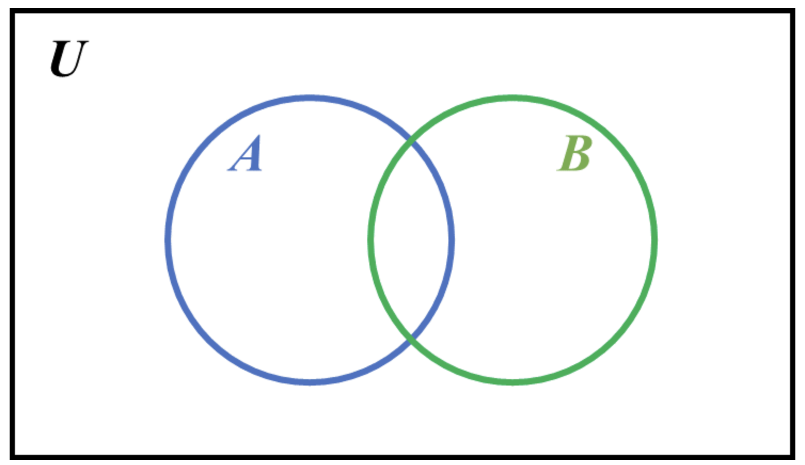
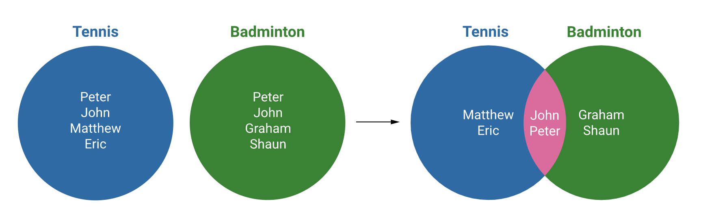

Venn diagrams help us to show the relationships among things or finite groups of things. They aid in the visualisation of concepts and relationships. They present complex information in simple graphical representation. They help us to retain facts and information easily.

By using Venn diagrams, the operations on sets can be visualised effectively. A simple Venn diagram is as follows:

For example, let's assume that students in a class participate in 2 sports, Tennis and badminton, which can be visualised in the following figure (left-hand side). However, if required, the visualisation can be simplified further using a Venn diagram on the right-hand side to clearly show the names of the students participating in both sports.

