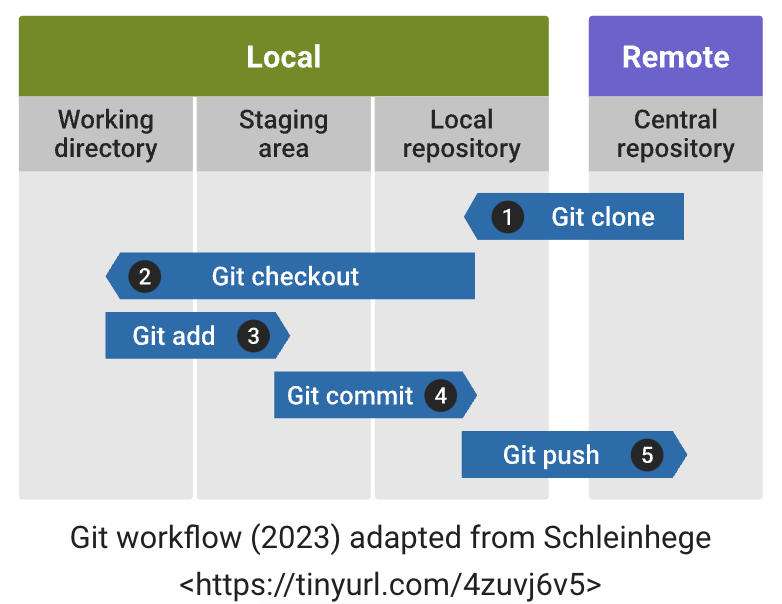

### 1. Introduction to VCS

**Version Control Systems (VCS)**, also known as source control or revision control systems, are tools used in software development to manage and track changes to source code over time. These systems enable collaboration among multiple developers working on the same project by providing a mechanism to keep track of different versions of files and to coordinate changes made by different team members.

The key functionalities of a Version Control System include:

| Functionality          | Details                                                                                                                                                                                                                                                        |
| ---------------------- | -------------------------------------------------------------------------------------------------------------------------------------------------------------------------------------------------------------------------------------------------------------- |
| History tracking:      | VCS keeps a record of every change made to the source code, allowing developers to view and revert to previous versions if necessary. This history includes details such as who made the change, when it was made, and what changes were implemented.          |
| Branching and merging: | VCS allows developers to create branches, which are separate lines of development, to work on specific features or fixes without affecting the main codebase. Once a feature is complete, the changes from a branch can be merged back into the main codebase. |
| Collaboration:         | Multiple developers can work on a project simultaneously without interfering with each other's changes. The VCS manages conflicts that may arise when two developers modify the same file or code section.                                                     |
| Concurrency:           | VCS supports concurrent development by providing a way for developers to work on different aspects of a project simultaneously. Changes made by one developer can be integrated with the work of others.                                                       |
| Backup and recovery:   | VCS serves as a backup mechanism. If there is data loss or a mistake is made, developers can revert to a previous state of the code.                                                                                                                           |
There are two main types of version control systems: Centralized Version Control Systems (CVCS) and Distributed Version Control Systems (DVCS).

In CVCS, there is a central server that stores the versioned files, and developers check out files from this central repository to make changes. Examples include CVS (Concurrent Versions System) and Subversion (SVN).

In DVCS, each developer has their own copy of the entire repository, including the complete history. This allows for more flexibility and offline work. Examples include Git, Mercurial, and Bazaar.

Git has become one of the most widely used distributed version control systems and is extensively used in the open-source community and in many corporate settings.

### 2. Git workflow

Git is a distributed version control system (DVCS) widely used for tracking changes in source code during software development. It was created by Linus Torvalds in 2005 to manage the development of the Linux kernel. Git is free and open-source software, and it has become the de facto standard for version control in the software development industry. The image on this page provides a visual representation of Git workflow.

##### Popular Git commands

The following is a list of popular Git commands:

- git init: Initializes a new Git repository.
- git clone: Creates a copy of a remote repository on your local machine.
- git add: Adds changes to the staging area in preparation for a commit.
- git commit: Commits the changes in the staging area to the repository.
- git pull: Fetches changes from a remote repository and merges them into the current branch.
- git push: Pushes local changes to a remote repository.