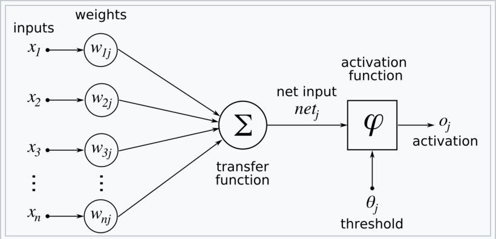

[Wikipedia](https://en.wikipedia.org/wiki/Backpropagation)

**Definition**: 
Backpropagation (short for "backward propagation of errors") is an algorithm used to compute the gradient of the loss function with respect to each parameter in a neural network.

**Purpose**: 
It efficiently calculates the gradients required for gradient descent to update the parameters of the neural network.

**How It Works**:
1. **Forward Pass**: Compute the output of the neural network for a given input by propagating the input forward through the network.
2. **Compute Loss**: Calculate the loss using the network's output and the true labels.
3. **Backward Pass**: Compute the gradient of the loss with respect to each parameter by propagating the error backward through the network. This involves:
   - Calculating the gradient of the loss with respect to the output layer's parameters.
   - Propagating the gradients backward through each hidden layer using the chain rule of calculus to compute the gradients for the preceding layers.
4. **Gradient Calculation**: The result is the gradient of the loss function with respect to each parameter in the network.

## Monash notes

We have two rules depending on whether the weight we adjust connects to the **output layer** or between **two hidden layers**. Computing the loss concerning each of the weights in the network gives us the following two identities for updating weights.

- Weight adjustment hidden unit 𝑗⟶ **output** unit 𝑘
$$\Delta_k \leftarrow (y_k - a_k)g'(in_k)$$
$$w_{j,k} \leftarrow w_{j,k} + \alpha \times a_j \times \Delta_k$$
- Weight adjustment input/hidden unit 𝑖⟶ **hidden** unit 𝑗
$$\Delta_j \leftarrow g'(in_j)\sum_k w_{j,k}\Delta_k$$
$$w_{j,k} \leftarrow w{i,j} + \alpha \times a_i \times \Delta_j$$

You’ll also see that computing the update for layers earlier in the network requires computing the weight adjustments, be that Δ𝑘 or Δ𝑗, for deeper layers in the network.

#### Back-propagation algorithm

We compute the delta values for the units at the output layer and then proceed backwards from the output until the earliest hidden layer is reached, propagating delta values and updating weights as we go.  

1. Compute the Δ values for the output units using the observed error.
2. Starting with the output layer, for each layer in the network, do until the earliest hidden layer is reached
	1. Propagate the Δ values back to the previous layer.
	2. Update the weights between the two layers.
	

# Derivation

The gradient descent method involves calculating the derivative of the loss function with respect to the weights of the network. This is normally done using backpropagation. Assuming one output neuron, the squared error function is
$$E = L(t,y)$$
Where $L$ is the loss for the output $y$ and target value $t$ for a training sample

For each neuron $j$ its output $o_j$ is
$$o_j = \varphi(net_j) = \varphi \left ( \sum_{k=1}^n w_{kj} x_k \right )$$

where the activation function $\varphi$ is nonlinear and differentiable over the activation region (the ReLU is not differentiable at one point). A historically used activation function is the [[sigmoid]]:

$$\varphi(z) = \frac{1}{1+e^{-z}}$$
which has a convenient derivative of:
$$\frac{\delta \varphi}{\delta z} = \varphi (z) (1-\varphi(z))$$

The input $net_j$ to a neuron is the weighted sum of outputs $o_k$ of previous neurons. If the neuron is in the first layer after the input layer, the $o_k$ of the input layer are simply the inputs $x_k$ to the network. The number of input units to the neuron is $n$. The variable $w_{kj}$ denotes the weight between neuron $k$ of the prev layer and $j$ of the current layer.
## Finding the derivative of the error

Calculating the [[Partial Derivatives|partial derivative]] of the error with respect to a weight $w_{ij}$ is done using the [[Chain Rule]] twice:
$$\frac{\delta E}{\delta w_{ij}} = \frac{\delta E}{\delta o_j}\frac{\delta o_j}{\delta w_{ij}} = \frac{\delta E}{\delta o_j}\frac{\delta o_j}{\delta net_j}\frac{\delta net_j}{\delta w_{ij}}$$

In the last factor of the right-hand side of the above, only one term in the sum $net_j$ depends on $w_{ij}$, so that

$$\frac{\delta net_j}{\delta w_{ij}} = \frac{\delta}{\delta w_{ij}}\left ( \sum_{k=1}^n w_{kj}o_k \right ) = \frac{\delta}{\delta w_{ij}} w_{ij}o_i = o_i$$

If the neuron is in the first layer after the input layer, $o_i$ is just $x_i$.

The derivative of the output of neuron 𝑗 with respect to its input is simply the partial derivative of the activation function:

$$\frac{\delta o_j}{\delta net_j} = \frac{\delta \varphi(net_j)}{\delta net_j} $$
Using the sigmoid:
$$\frac{\delta o_j}{\delta net_j} = \frac{\delta}{\delta net_j} \varphi(net_j) = \varphi(net_j)(1 - \varphi (net_j)) = o_j(1-o_j)$$
This is the reason why backpropagation requires that the activation function be [differentiable](https://en.wikipedia.org/wiki/Differentiable_function "Differentiable function"). (Nevertheless, the [ReLU](https://en.wikipedia.org/wiki/ReLU "ReLU") activation function, which is non-differentiable at 0, has become quite popular, e.g. in [AlexNet](https://en.wikipedia.org/wiki/AlexNet "AlexNet"))

The first factor is straightforward to evaluate if the neuron is in the output layer, because then $o_j = y$ and
$$\frac{\delta E}{\delta o_j} = \frac{\delta E}{\delta y}$$

If half of the square error is used as loss function we can rewrite it as
$$\frac{\delta E}{\delta o_j} = \frac{\delta E}{\delta y} = \frac{\delta}{\delta y}\frac12(t-y)^2 = y-t$$

## Notation for earlier in the wikipedia article i thought would be relevant to above section but actually wasnt really

$x$: input (feature of vectors)
$y$: target output
	For classification, output will be a vector of class probabilities (e.g., (0.1,0.7,0.2), and target output is a specific class e.g. (0, 1, 0)
$C$: loss function or 'cost function'
$L$: number of layers
$W^l = (w^l_{jk})$: the weights between layer $l-1$ and $l$ where $w^l_{jk}$ is the weight between the $k$th node in layer $l-1$ and the $j$th node in layer $l$
$f^l$: activation functions at layer $l$ 
$a^l_j$: activation of the $j$th node in layer $l$
