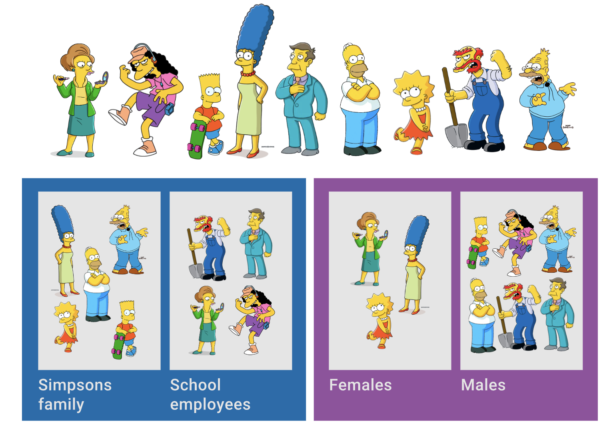
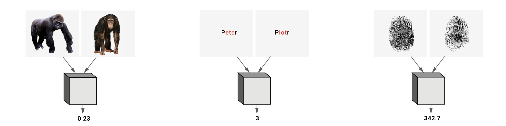
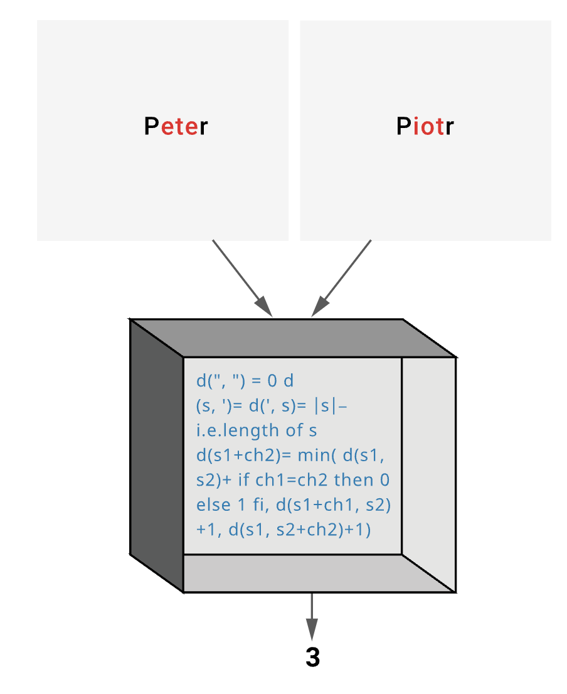
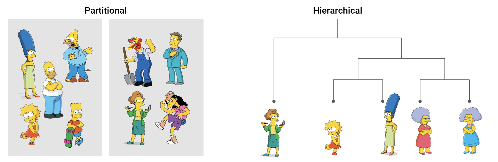

#### What is clustering?

The goal for a clustering algorithm is to organise data into classes such that data points in the same group have a high degree of similarity, intra-class similarity, and data points in different groups have a low degree of similarity. 

Clustering is effectively **finding class labels** and the **number of classes** directly from the data.

#### Natural Grouping

Clustering is subjective. How should we group this set of Simpsons characters if we wanted to form two natural groups? 

Both groupings presented here would be quite natural, and in fact both are valid.

#### Similarity

Similarity is hard to define, but… we know it when we see it. How can we quantify similarity?

#### Distance measures

Through **distance functions**. We can define the similarity or dissimilarity of objects using a function that computes some distance between them.

Such a distance function should return a real number, with larger values indicating greater dissimilarity.

The following examples illustrate how distance functions can work. If we define O1 and O2 as two objects from the universe of possible objects. The distance (dissimilarity) between O1 and O2 is a real number denoted by D(O1,O2)

We see a function of two variables in one of these black boxes. We also require that function D have the following required properties.

- Symmetry 𝐷(𝐴,𝐵)=𝐷(𝐵,𝐴)
- Constancy of Self-Similarity 𝐷(𝐴,𝐴)=0 (i.e. the distance between any object and itself must be 0)
- Positivity (Separation) 𝐷(𝐴,𝐵)=0𝑖𝑓𝑓𝐴=𝐵 (ie the only time D=0 is when the objects are the same)
- Triangle Inequality 𝐷(𝐴,𝐵)≤𝐷(𝐴,𝐶)+𝐷(𝐵,𝐶)

#### Two types of clustering

Two common types of clustering are **partitional** and **hierarchical**.

Partitional clustering constructs various partitions and then evaluates them by using some criterion.

Hierarchical clustering creates a hierarchical decomposition of the set of objects using some criterion.

Next: [[k-means clustering]]