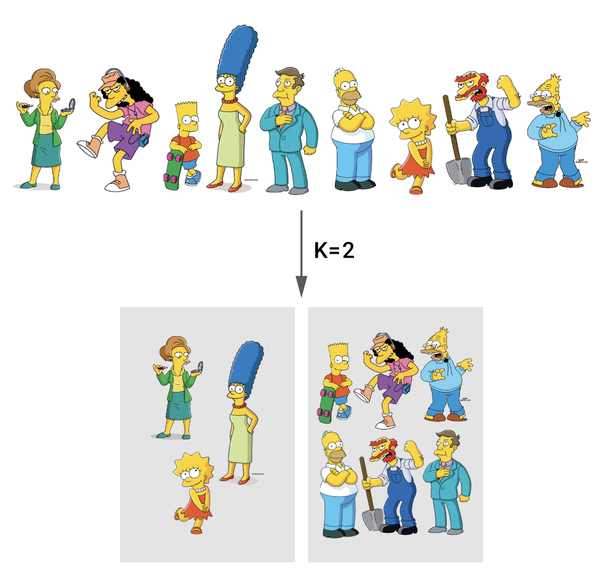
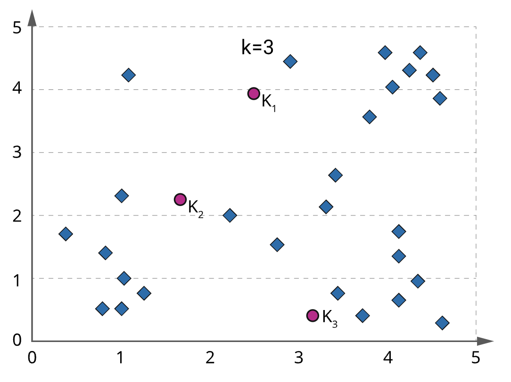
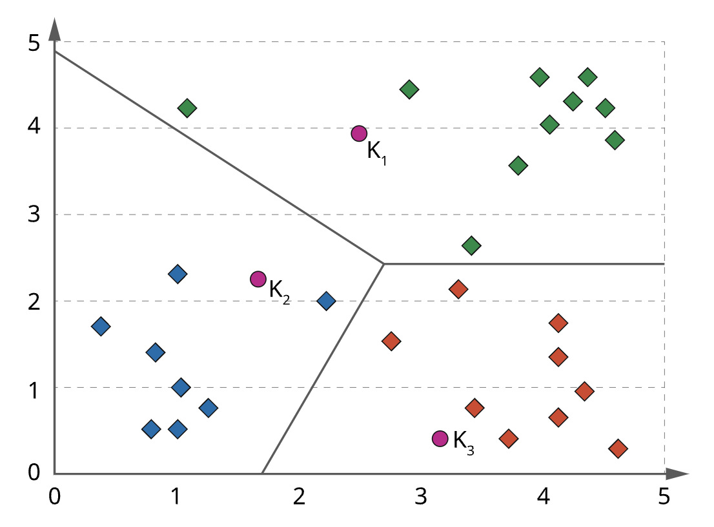
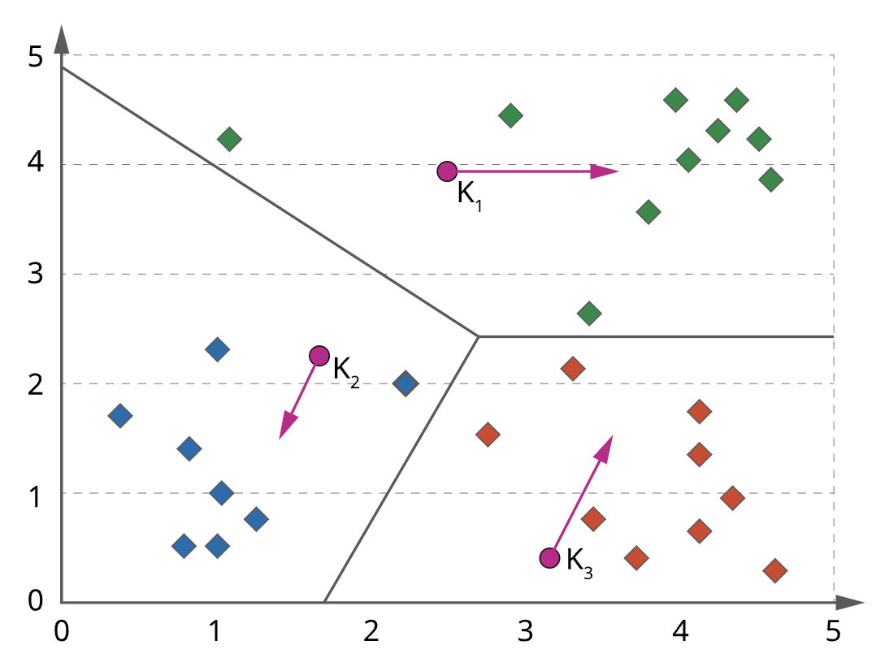
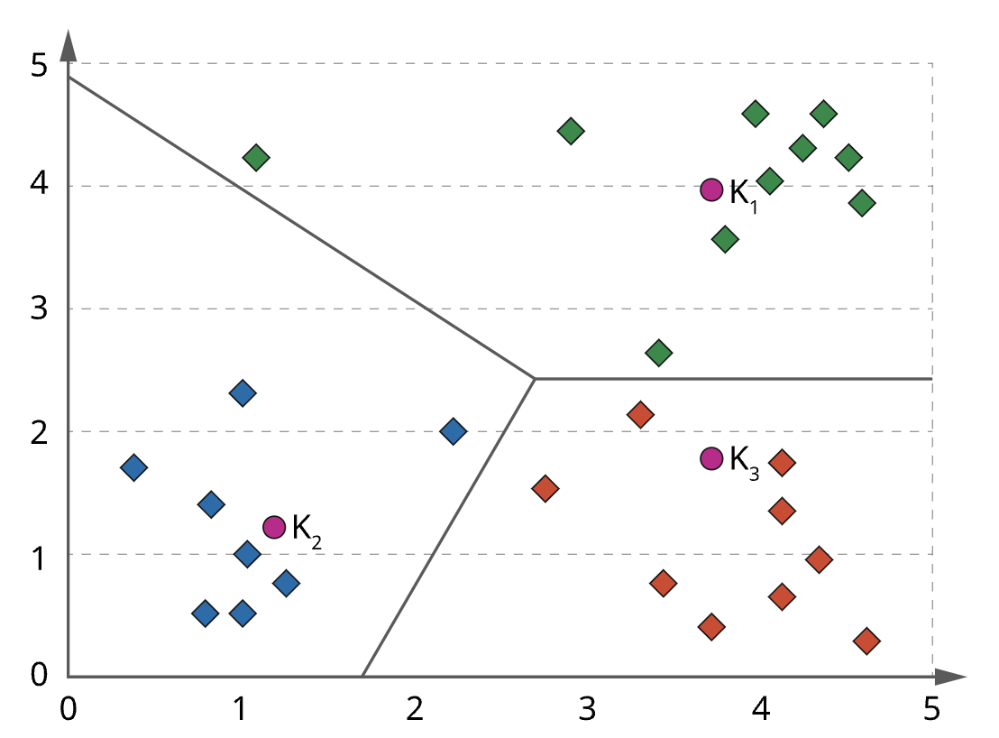
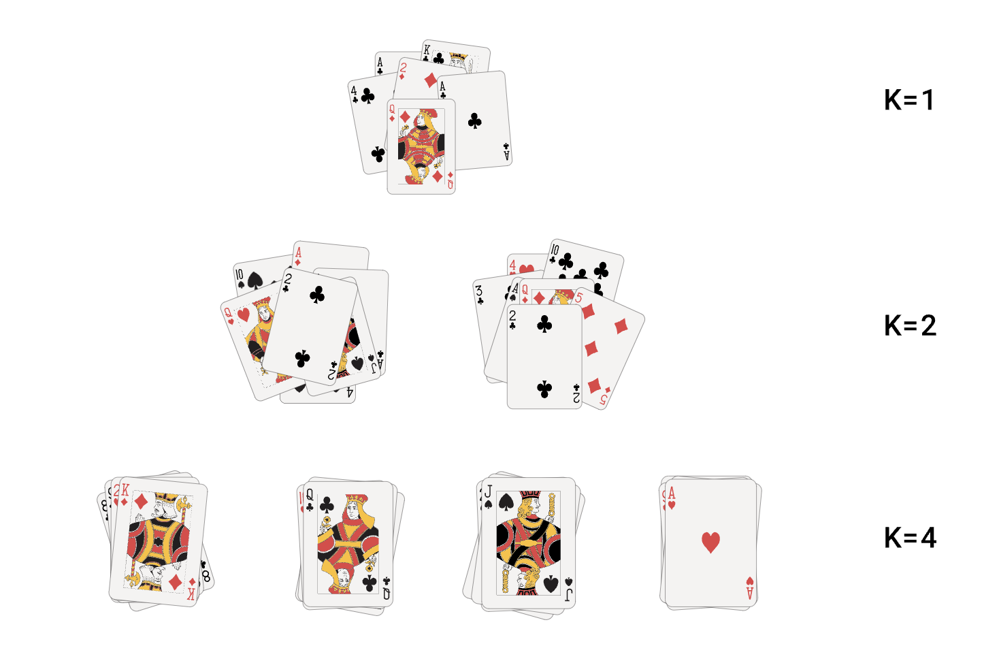
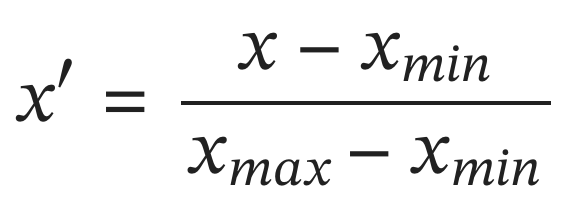

#### K-means algorithm

The K-means algorithm is an algorithm where each instance of the training data is placed into **exactly one** cluster, and clusters don’t overlap. 

**Only one set** of clusters is produced, and the user will need to specify the **value of K** before the algorithm runs.

The following example shows the user input of K=2, resulting in the output of two clusters.

#### Squared error

The K-means algorithm creates **K cluster centroids** and iteratively moves them until they converge. 

The following illustration demonstrates that distance to each cluster centroid 𝐶𝑖 is measured using Euclidean distance in 𝑛 dimensional space.

The overall objective for the K means algorithm is to minimise the sum of the distance from each point to its assigned cluster centroid.

#### K-means algorithm

The K-means algorithm can be described as follows: 

1. Assuming a value of 𝐾 is chosen, **initialise the K cluster centroids**, potentially randomly. 
2. **Assign each point** to a cluster by finding the **closest centroid**. 
3. **Re-estimate** each cluster centroid as the mean of all points in the cluster. 
4. If no points have moved the cluster, then the algorithm is finished.
5. (Otherwise) return to Step 2

In the next images, we see graphically what steps 1 to 5 of the algorithm look like with some example data spread in 2D space:

#### Step 1

We’re using K=3, so, first of all, three centroids are initialised.

#### Step 2

Next, each point is assigned to a cluster based on which centroid is closest.

#### Step 3

Then the location of each centroid is shifted to be the mean of the points assigned to it.

#### Step 4

We would, at this point, return to step 2 and repeat until no points change the cluster.

## Normalisation

#### The meaning of K

Clusters describe the underlying structures in data, but structures in data can exist at different levels. There is often no _a priori_ reason to select a particular value for 𝑘. 

As shown in the following illustration, we should consider several 𝑘 values instead. We can do this by starting from 𝑘=1 and incrementing until we see no improvement in the algorithm. We will also likely see different values of 𝑘 leading to different clusterings.

#### Normalisation

One problem with the K means algorithm is that attributes with large magnitudes will dominate the distance comparisons.

Consider the following example. The age is closer to centroid 1 than centroid 2, and the income is only slightly closer to centroid 2 than 1. Due to the larger magnitude of difference in income, though, the data point would be assigned to cluster two.

- Example: in which cluster do we put **age=25 income=$30,000**?

- **Centroid 1:** age=26 income=$25,000.
- **Centroid 2:** age=80 income=$34,500.

A solution is to **normalise the data** so that all values end up **between 0 and 1**. This can be done by subtracting the minimum of a data set from each data point and dividing by the difference between the maximum and minimum in the data set.

