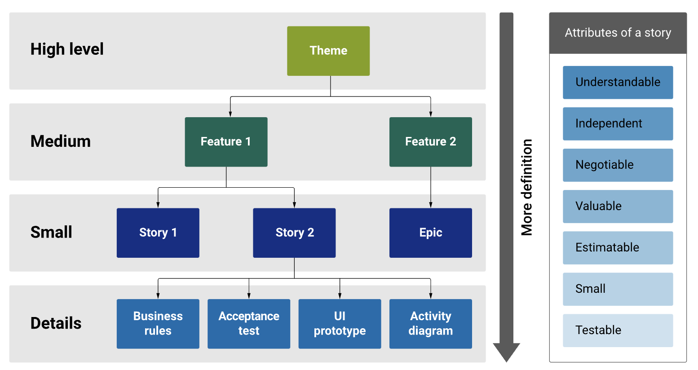

### 1. Requirement analysis

Requirement documentation is a formalised set of documents that outlines the specific requirements and specifications for a project, system, product, or process. These documents are a crucial part of the requirements engineering process in software development, engineering, and various other fields. The primary purpose of requirement documentation is to clearly define what needs to be achieved or delivered, providing a foundation for project planning, design, implementation, testing, and evaluation. 

There are several different types of requirements, which can be summarised as follows:

| Type                        | Description                                                                                                                                                                                                   |
| --------------------------- | ------------------------------------------------------------------------------------------------------------------------------------------------------------------------------------------------------------- |
| Functional requirements     | These describe what a system or product should do and the features it should have. They specify the expected behavior and interactions between various system components.                                     |
| Non-functional requirements | These detail quality attributes such as performance, security, scalability, usability, and reliability. They provide constraints and criteria that the system must meet but are not specific functionalities. |
| Business requirements       | These document the high-level goals and objectives of the project from a business perspective, including the reasons for undertaking the project and expected benefits.                                       |
| User requirements           | These capture the needs and expectations of end-users and stakeholders, ensuring that the system or product aligns with their goals and preferences.                                                          |
| System requirements         | These describe the technical specifications and constraints related to the hardware and software components of the system, including interfaces with other systems and data sources.                          |

### 2. Effective Agile requirement documentation

In Agile Scrum, the emphasis is on working software over comprehensive documentation. While there is still documentation in the form of user stories and the product backlog, it is typically more concise and flexible, allowing teams to respond to changes and feedback rapidly. It's essential for the product owner and development team to maintain open communication and continuously refine requirements based on the evolving understanding of the product and its users. In Agile Scrum, requirements are structured into six levels of detail. These levels are detailed below: 

|Level of detail|Description|
|---|---|
|Vision|The vision is a high-level statement that describes the overall purpose and objectives of the project or product. It provides a clear and concise description of what the project aims to achieve. A well-defined vision helps align the team and stakeholders toward a common goal.|
|Goals|Goals are specific, measurable, and time-bound objectives that support the project's vision. They break down the vision into actionable steps and provide a clear direction for the project team. Goals should be aligned with the vision and can help measure progress toward the vision's realisation.|
|Outcomes|Outcomes are the desired results or impacts that the project intends to achieve. They represent the changes or benefits that the project or product will bring to its users, stakeholders, or the organisation. Outcomes are often tied to the goals and vision.|
|Epic / Themes|Epic/Themes are high-level, strategic objectives or areas of focus within a project or product. They represent broad, overarching goals that guide the development efforts. Themes are often associated with the product vision and the business objectives.|
|Features|Features are more specific and functional components or capabilities of a product that contribute to achieving a theme or goal. They are typically larger and more substantial than user stories but smaller than themes.|
|User Stories|User stories are small, self-contained units of work that describe a single piece of functionality or a specific requirement from an end user's perspective. They are often written in a simple format: 'As a [type of user], I want [an action] so that [I can achieve a goal].' User stories are a way to break down features and themes into actionable tasks. The INVEST principles are guidelines used to evaluate and write effective user stories. INVEST is an acronym that stands for: Independent, Negotiable, Valuable, Estimable, Small, and Testable.|

##### Explore: An example of the six levels of detail for the LMS case study

Returning to the case study example from [Topic 1](https://learning.monash.edu/mod/book/view.php?id=2735740&chapterid=458511) in this module, the following gives an example of the six levels for a Learning Management System.

|Level of detail|Monash's LMS example|
|---|---|
|Vision|'To revolutionise online education by providing a user-friendly and comprehensive LMS platform that empowers educators and learners to achieve their full potential through personalised, interactive, and data-driven learning experiences.'|
|Goals|'Our primary goal is to increase student engagement and improve learning outcomes by 20% within the next academic year.'|
|Outcomes|'The expected outcome of our LMS implementation is a significant reduction in dropout rates, a 15% increase in student retention, and improved student satisfaction scores.'|
|Epic / Themes|'Enhanced Learning Experience': This epic involves redesigning the LMS user interface to improve the onboarding experience for both educators and learners. It aims to simplify the platform's navigation and make it more intuitive, thereby enhancing the overall user experience.|
|Features|_**Feature 1:**_ 'Streamlining Course Creation'  **_Feature 2:_** 'Personalised Learning Pathways'|
|User Stories|**_Feature 1:_ _'_**_Streamlining Course Creation'_  – **As an educator**, I want to be able to easily create and manage quizzes within the LMS so that I can assess my students' understanding of the course material.  **Acceptance Criteria:**  - The platform should allow educators to upload various file types, including documents, videos, and presentations.  - Educators should be able to create quizzes with different question types and set due dates for assignments.  - There should be an intuitive interface for organising course materials and modules.  **_Feature 2:_ '**_Personalised Learning Pathways' –_ **As a student**, I want the LMS to recommend personalised learning pathways based on my strengths, weaknesses, and learning preferences, so I can optimise my study time and improve my understanding of the subject matter.  **Acceptance Criteria:**  - The platform should gather data on learners' performance and use it to suggest additional resources, quizzes, or review materials. - Learners should have the option to choose their preferred learning style, such as video tutorials, interactive simulations, or text-based resources. - Recommendations should adapt as the learner progresses through the course.|

### 3. Writing user stories and acceptance criteria

#### User stories

User stories are succinct descriptions, using non-technical language, of actions a user would want to take with a system. Get started on this topic by watching the following video:

video

User stories should be very short and written from the perspective of the client. Rehkopt (2021) summarises user stories as 'an informal, general explanation of a software feature written from the perspective of the end-user.' Its purpose is to articulate how a software feature will provide value to the customer and they are written with the following structure:

As a **user**, I want **goal** \[so that] **benefit**.

When writing a user story, it is important to understand the benefit of it. You shouldn't be writing something that doesn't fit on an index card or post-it note. Here is an example of what you may write for a user story: 

As a **survey participant**, I want **an indication of progress** so that **I know how much I have left to complete**.

A nice property of user stories is that since they are phrased in terms of need, it is usually easy to write tests for them. As the audience for user stories is both the clients and the developers, the client should be heavily involved in producing the user stories. They should be written in the client’s language with terminology appropriate to their business as it is important the client understands the user stories since Agile methodologies typically involve the client repeatedly choosing user stories to be implemented next. 

It is common to annotate user stories with an estimation of the time required to implement the desired features. Sometimes this will be estimated in hours or days, but more commonly an abstract measure is used. Some software engineering teams prefer to use discrete categories of t-shirt sizes, such as XS, S, M, L, XL, while others assign a number of story points to each user story. Regardless of the exact measure used, these annotations allow the team to think about and discuss the relative difficulty of implementing tasks.

If development teams are able to do this estimation fairly consistently, they will get a good idea of how many points of work of stories they can complete in a normal week, which helps for future planning.

#### INVEST mnemonic

A handy guide to the production of user stories is the [INVEST mnemonic](http://en.wikipedia.org/wiki/INVEST_%28mnemonic%29) (Wikipedia 2021):

The INVEST principles

|Letter|Meaning|Description|
|---|---|---|
|**I**|Independent|User stories should be self-contained.|
|**N**|Negotiable|User stories should be able to be easily revised or replaced, such as with a different user story that satisfies the same outcome.|
|**V**|Valuable|A user story must be beneficial to end users.|
|**E**|Estimable|A user story should correspond to functionality for which implementation effort can be estimated.|
|**S**|Small|User stories must be small enough to be considered and scheduled independently.|
|**T**|Testable|The user story must provide enough information to verify that it has been implemented satisfactorily. Some tasks or requirements may not be concerned with user-centric functionality. You can either phrase these in terms of the user, write them as developer stories, or just track them internally.|

  

INVEST mnemonic (2021) created by Monash Online

**Watch** the following video to learn more about these principles:

video

#### Acceptance criteria

Acceptance criteria define a user story's boundaries and confirm when the software is working as intended, i.e. when the story is completed. Simply put, it is the criteria that test's whether the user story is implemented as expected. For some examples, watch the following video.

video