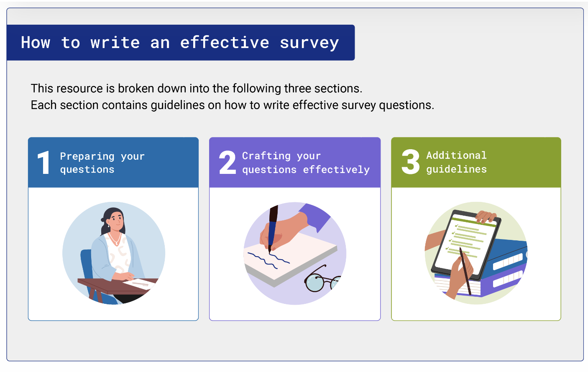
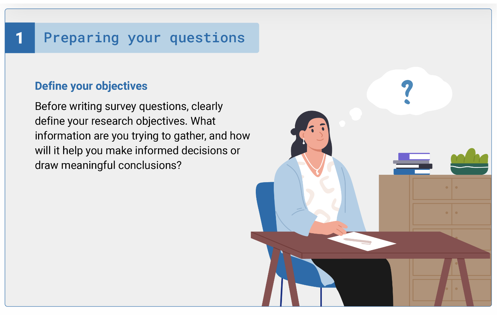
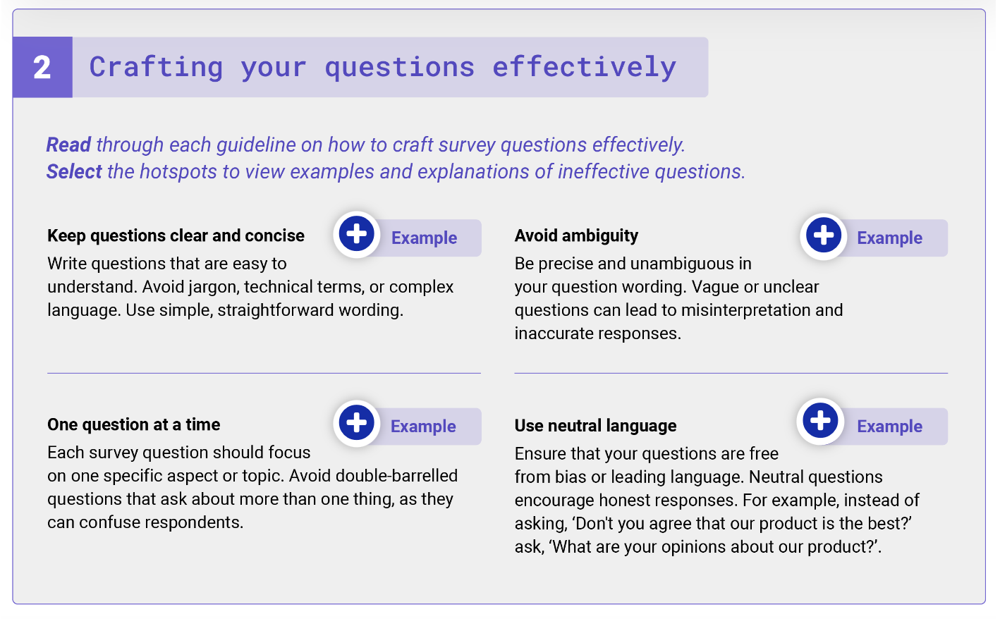
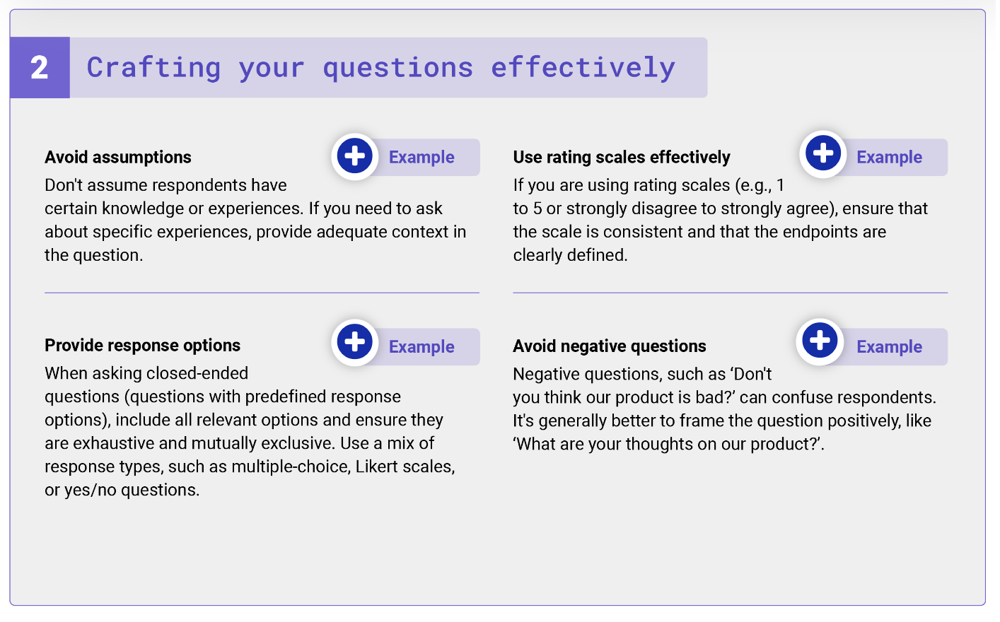
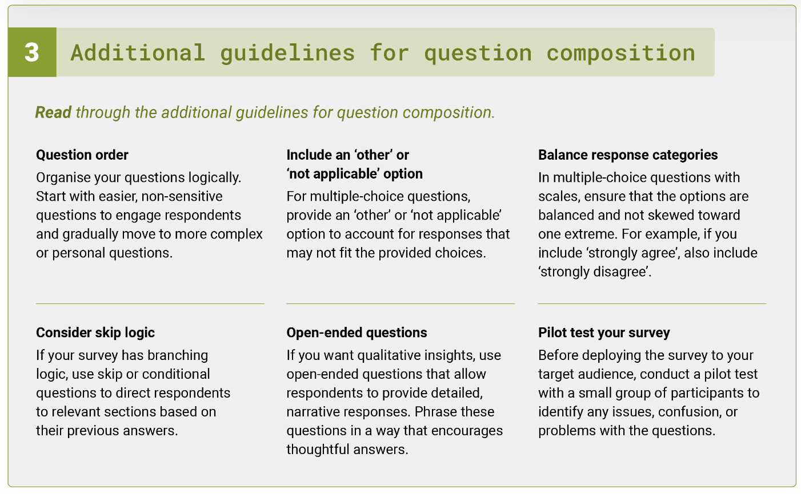

### 1. Requirement elicitation techniques

Requirement elicitation techniques are methods and strategies used to gather information, needs, and requirements from stakeholders and users during the early stages of a project. These techniques are essential in the field of requirement engineering to ensure that the final product or system aligns with stakeholders' expectations. In general, in an Agile software development team, a business analyst or a product owner will engage with stakeholders to elicit the business, users, and technical requirements. There are various requirement elicitation techniques, including:

|Technique|Description|
|---|---|
|**Interviews**|Conducting one-on-one or group interviews with stakeholders and subject matter experts to gather information and insights about their needs and expectations. This can be structured or unstructured, depending on the context.|
|**Surveys and questionnaires**|Distributing surveys or questionnaires to a wide range of stakeholders to collect quantitative and qualitative data. This is particularly useful when dealing with a large number of potential contributors.|
|**Workshops and focus groups**|Organising interactive workshops or focus groups where stakeholders can collaborate, share their ideas, and discuss their requirements. These sessions promote discussion and idea generation.|
|**Observation**|Directly observing users in their natural environment to gain a better understanding of their behaviour, work processes, and pain points. This technique is especially valuable for understanding user needs and workflows.|
|**Document analysis**|Reviewing existing documents, reports, manuals, and records to extract relevant information about requirements. This includes studying business process documentation and previous project documentation.|
|**Prototyping**|Creating rough, simplified versions of the system or product to help stakeholders visualise the end result and provide feedback. Prototypes can be interactive or static, depending on the level of detail required.|
|**Brainstorming**|Organising brainstorming sessions where stakeholders are encouraged to generate ideas and requirements without criticism. This technique fosters creativity and can uncover innovative solutions.|
|**Use cases and user stories**|Describing system functionality and requirements through use cases or user stories, often involving scenarios that describe how a system will be used.|
|**Questioning and clarification**|Engaging in ongoing dialogue with stakeholders to ask questions, seek clarification, and dig deeper into their needs and expectations.|
|**Storyboards and scenarios**|Creating visual representations or narratives of how users interact with the system or product to elucidate requirements and user experiences.|
### 2. How to write an effective survey / interview questionnaire

Writing effective survey questions is essential for collecting accurate and meaningful data.

