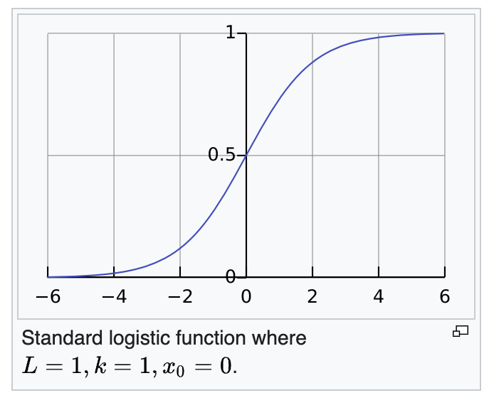

---
aliases:
  - standard logistic function
---

$$\varphi(z) = \frac{1}{1+e^{-z}}$$
has a convenient derivative of:
$$\frac{\delta \varphi}{\delta z} = \varphi (z) (1-\varphi(z))$$
also called the standard logistic function