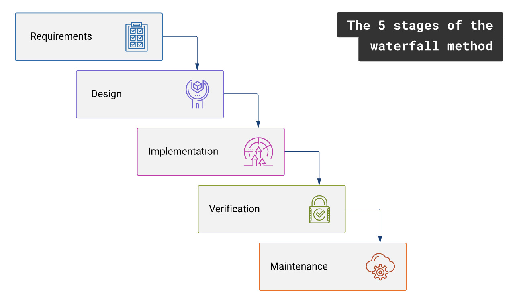
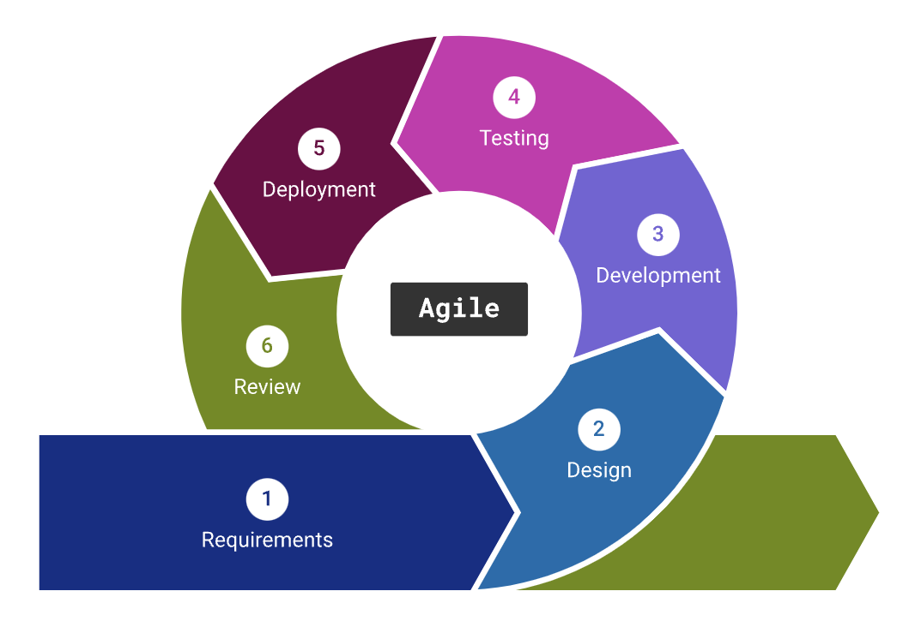
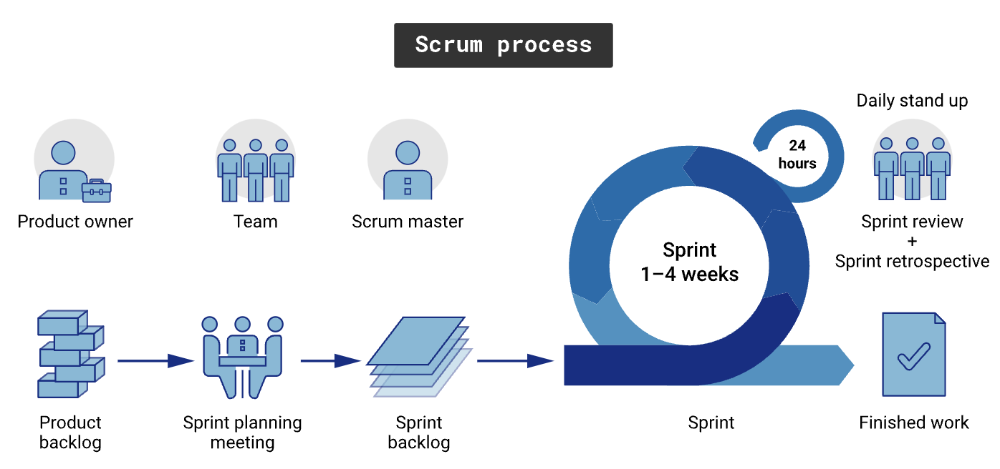
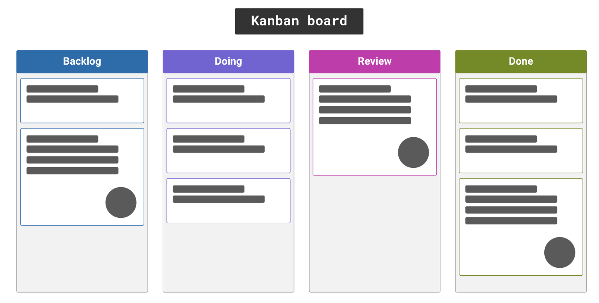
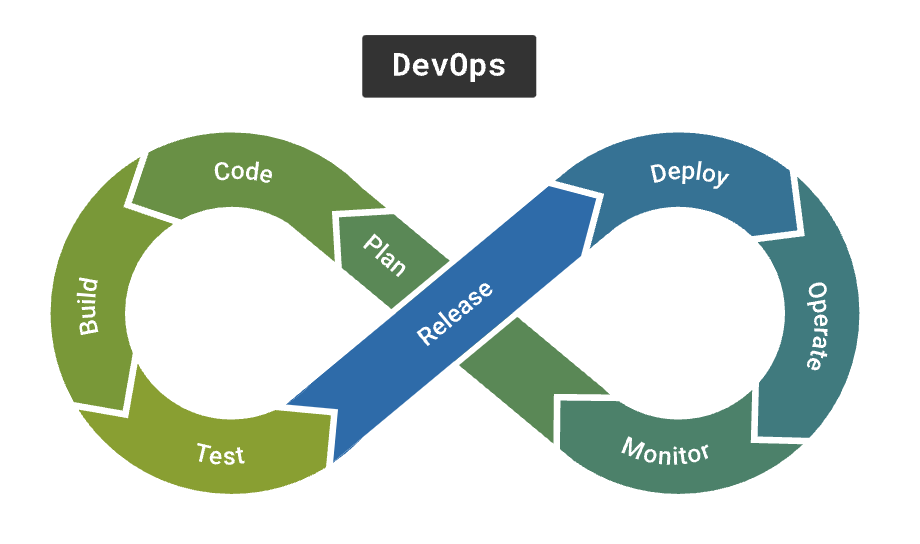

In this topic, we will dive into various software engineering methodologies, including Waterfall, Agile, Scrum, and Kanban. The software development methodologies provide a framework for planning, organising, and managing software development projects. By understanding these methodologies, you'll be able to select the most suitable approach for your projects, ensuring efficient and successful software development.

In this topic book, you will cover the following:

- What are software engineering methodologies?
- Popular software engineering methodologies
- Choosing the right methodology.

### 1. What are software engineering methodologies?

Software engineering methodologies are a set of principles and practices that guide the software development process. They help teams structure their work, manage tasks, and collaborate effectively to deliver high-quality software on time and within budget.

As you continue learning, you'll discover that different methodologies are better suited for different types of projects and organisational structures.

### 2. Popular software engineering methodologies

Let's take a look at some of the most popular software development methodologies and their key features:

#### Waterfall

The Waterfall model is a linear and sequential methodology where each phase of the SDLC is completed before moving on to the next one. This approach is well-suited for projects with well-defined requirements and minimal changes during development. However, it lacks flexibility and can be slow to adapt to changing requirements.

#### Agile

Agile is an iterative and incremental methodology to software development that emphasises flexibility, collaboration, and customer feedback. Agile methodologies, such as Scrum and Kanban, break down the development process into smaller, manageable tasks called 'sprints' or 'iterations'. This allows teams to respond quickly to changes, continuously improve the software, and deliver value to users faster.

#### Scrum

Scrum is a popular Agile framework that organises the development process into short, time-boxed iterations called 'sprints'. Scrum relies on cross-functional teams, regular stand-up meetings, and tools like the product backlog and sprint backlog to manage tasks and track progress. Scrum is well-suited for projects with rapidly changing requirements and promotes adaptability, collaboration, and continuous improvement. Scrum normally uses two-week sprints to get work done (but could be 1–4 weeks). These sprints are planned in advance, executed, and then reviewed at the end of the two-week period. During sprint planning, the team creates a sprint backlog. The team completes these backlog tasks during the sprint, managing the work among themselves. Team members also hold a 15-minute Scrum meeting each day of the sprint. During this time, contributors discuss any potential roadblocks interfering with project success. They also review the previous day’s work and plans for the upcoming day’s tasks. This Scrum meeting ensures the team works collaboratively and stays in sync.

#### Kanban

Kanban is another Agile methodology that focuses on visualising the workflow and limiting work-in-progress to improve efficiency and reduce bottlenecks. It uses a Kanban board to represent tasks, their status, and the flow of work through different stages (i.e. Backlog, Doing, Review, Done). Kanban is an excellent choice for projects that require continuous delivery and for teams looking to optimise their workflow.

#### DevOps

DevOps is a software engineering methodology that emphasises collaboration between development and operations teams, aiming to improve communication, reduce time-to-market, and enhance software quality. DevOps focuses on automating the deployment pipeline, continuous integration, and continuous delivery, making it ideal for projects that require frequent releases and updates.

### 3. Choosing the right methodology

Selecting the most appropriate software development methodology for your project depends on several factors, including project size, scope, requirements, team size, and organisational culture. As you gain experience and learn more about these methodologies, you'll be able to determine the best approach for your specific needs.