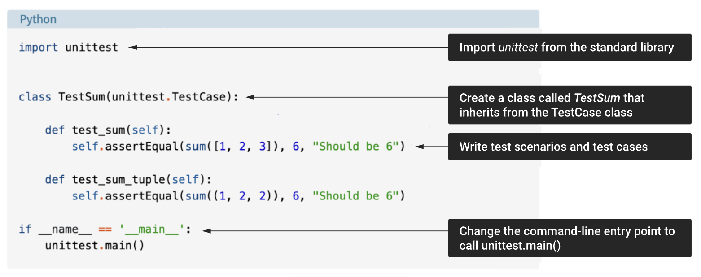

### 1. Assertions

Assertions are statements or expressions in a programming language that are used to test whether a given condition is true or false. They are often employed as a debugging aid to catch issues early in the development process. When an assertion is encountered in the code, the program checks if the specified condition holds true. If the condition is true, the program continues executing without any issue. However, if the condition is false, the assertion triggers an error, halting the program's execution or producing an error message. In Python, the following is an example of assert statements.

|Method|Checks that|
|---|---|
|assertEqual(a, b)|a == b|
|assertNotEqual(a, b)|a != b|
|assertTrue(x)|bool(x) is True|
|assertFalse(x)|bool(x) is False|
|assertIs(a, b)|a is b|
|assertIsNot(a, b)|a is not b|
|assertIsNone(x)|x is None|
|assertIsNotNone(x)|x is not None|
|assertIn(a, b)|a in b|
|assertNotIn(a, b)|a not in b|
|assertIsInstance(a, b)|isinstance(a, b)|
|assertNotIsInstance(a, b)|not isinstance(a, b)|

### 2. Practice 1: Writing your first assert statement

Open a Python terminal and write the following command. The purpose of this command is to check if the sum of the list `[1, 2, 3]` equals 6. Since , this assert statement will pass successfully.

      assert sum(1, 2, 3) == 6, "Should be 6"  

On the other hand, if we modify the test input as follows, we want to assert whether the summation of the list `[1, 1, 1]` equals 6. Since , this test case will fail, raising an assertion error with the message “Should be 6”.

      assert sum(1, 1, 1) == 6, "Should be 6"
      Traceback (most recent call last):
        File "<stdin>", line 1, in <module>
      AssertionError: Should be 6  

In this case, a failed test does not indicate incorrect implementation of the Python code. Instead, the expected output is incorrect. This illustrates an “irrelevant test case” (see Topic 4.2) where the test input and expected output are misaligned with the requirement.

### 3. Practice 2: Writing your first unit testing in Python

**unittest**, also known as PyUnit, is a testing framework in Python that is part of the Python Standard Library. It provides a set of tools for constructing and running tests, making it easier to write test cases and automate the testing process. Here are some key concepts and features of the unittest library.

- The test file must import ‘unittest’ from the Python Standard Library.
- The test class should inherit from the 'unittest.TestCase' class of the ‘unittest’ library.
- Test methods within the test classes are identified by their names starting with 'test_,' and each test case can have multiple test methods.
- unittest allows you to set up preconditions and clean up after each test, making it easier to isolate and control the test environment.
- A unittest test case is a specially named method in a subclass of unittest's TestCase class. All test methods must begin with the word 'test'.
- Pytest automatically discovers test files and test cases without requiring explicit subclassing or naming conventions. unittest, on the other hand, follows a stricter discovery mechanism.