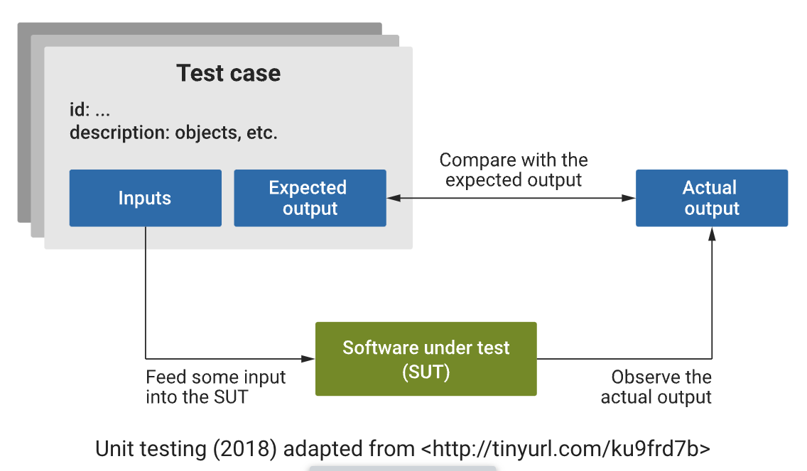

### 1. What is unit testing?

Unit testing is a software testing technique where individual units or components of a software application are tested in isolation to ensure their correctness. A unit is the smallest testable part of an application, typically a function or a method. The purpose of unit testing is to validate that each unit of the software performs as designed.

- #### Isolation
	- Unit tests are designed to be isolated from the rest of the application. This means that each unit is tested independently of the other units, and external dependencies are often replaced with mock objects or stubs to ensure that the focus is solely on the unit being tested.
- #### Automation
	- Unit tests are usually automated, meaning they can be executed by a testing framework or tool without manual intervention. This allows for quick and efficient testing, especially when integrated into a continuous integration (CI) or continuous delivery (CD) pipeline.
- #### Repeatable
	- Unit tests should be repeatable, meaning that running the same test multiple times should produce the same result. This ensures consistency and helps identify issues reliably.
- #### Fast execution
	- Unit tests are designed to be fast, allowing developers to run them frequently during the development process. Fast execution is crucial for maintaining developer productivity and enabling quick feedback on code changes.
- #### Early detection of defects
	- Unit testing helps identify and fix defects early in the development process. By catching issues at the unit level, developers can address problems before they escalate to more complex and harder-to-debug problems.

Unit testing is a fundamental practice in modern software development, often complemented by other testing techniques such as integration testing and system testing. It contributes to the overall reliability, maintainability, and quality of software by ensuring that individual components work correctly and as expected. Popular unit testing frameworks for various programming languages include JUnit (Java), NUnit (.NET), pytest (Python), and Jasmine (JavaScript).

The following diagram demonstrates the unit testing process.

### 2. Characteristics of effective test cases

Effective test cases possess several key characteristics that contribute to their ability to thoroughly and accurately assess the functionality of a system.

##### Relevance

Each test case should be directly tied to the requirements and specifications of the system under test. They need to cover the features and functionalities that are critical to the application.

##### Clarity and simplicity

Each test case should be easy to understand and execute. They should be written in a clear and concise manner, avoiding unnecessary complexity. This helps in reducing the chances of misinterpretation and errors. For example, a test case for a summation function with a test input of \[123456, 123122311231] for an expected output of \[123122434687] is probably not easy to understand with an unclear purpose.

##### Independence

During the development phase, developers write the code for the software using programming languages and frameworks. The design specifications from the previous phase serve as a guide to ensure the code is efficient, modular and maintainable.

##### Non-redundancy

Each test case should not be duplicated within the test suite. For example, a test case of 1 + 1 = 2 would be considered duplicated with 2 + 2 = 4.

### 3. Test case design

Test case design is the process of creating a set of test cases or test scenarios that will be used to verify and validate whether a software application or system behaves as intended. The key components of a test case are as follows:

1. **Test case ID:** A unique ID to represent the case.
2. **Test description:** Details what unit, feature, or function is being tested or what is being verified.
3. **Test input**: The variables and their values in the test case. For an email login, it would be the username and password for the account.
4. **Expected output**: The output expected after executing the test case.
5. **Actual output**: The actual output.
6. **Pass/fail**: Same outputs = Pass, different outputs = Fail.

#####  Apply your learning

Let's consider a simple summation function as an example. Suppose you have a function called _sum_numbers_ that takes a list of numbers as input and returns the sum of those numbers. When designing a test case, the must-have components are 'Test input' and the 'Expected output'. For example, 1 + 1 = 2. In this case, the test input is [1,1], and the expected output is [2]. Applying the above structure, we can create the following test case document.

|Test case ID|Test description|Test input|Expected output|Actual output|Pass/fail|
|---|---|---|---|---|---|
|TC001|Validate summation of positive numbers|[1,1]|[2]|||
|TC002|Validate summation of negative numbers|[-1,-1]|[-2]|||
|TC003|Validate summation of zero numbers|[0,0]|[0]|||

**Note**

- The actual output is the result returned by the function after executing the test case.
- If the result matches the expected output, mark the test case as passed. Otherwise, mark it as failed.

This is a basic example. In a real-world scenario, you would want to create additional test cases to cover different scenarios, such as testing with negative numbers, an empty list, or large numbers. Additionally, you might consider edge cases and boundary values to ensure that the function behaves correctly under various conditions.